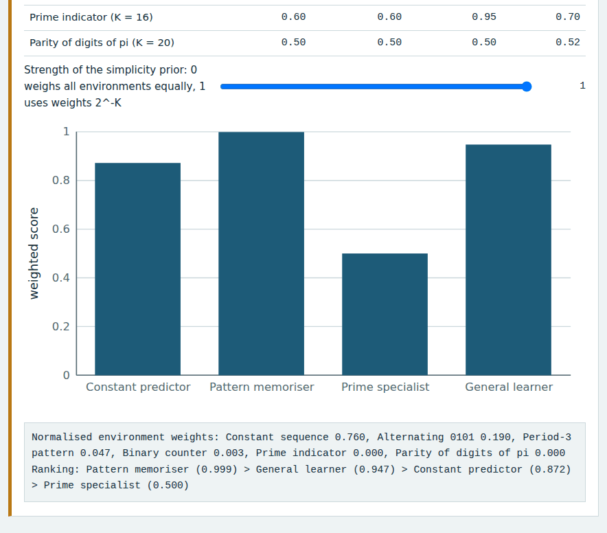
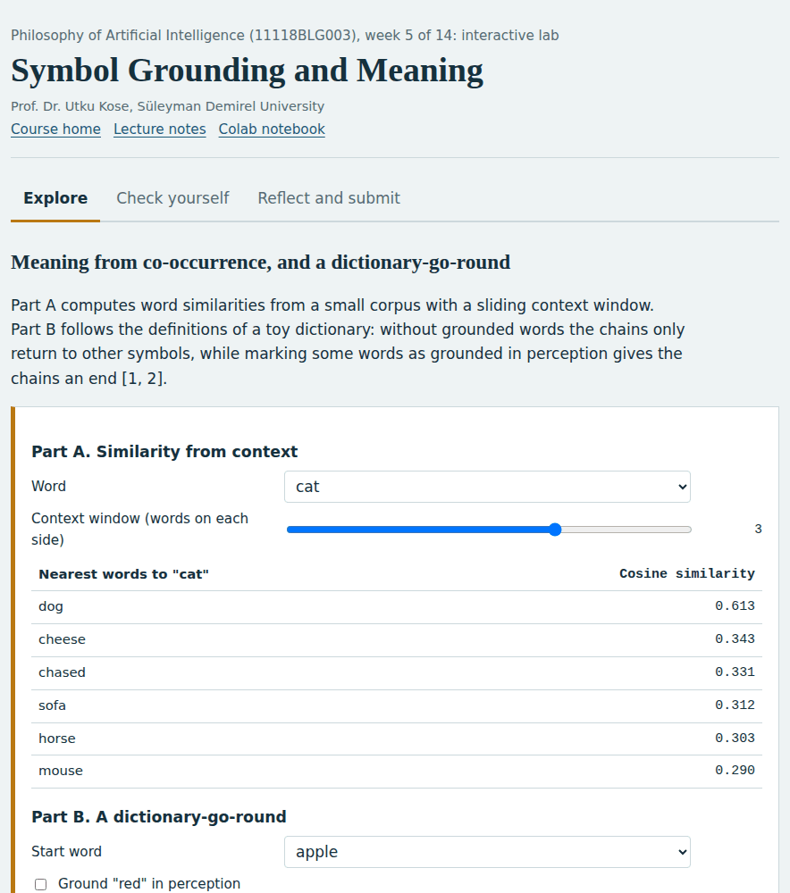
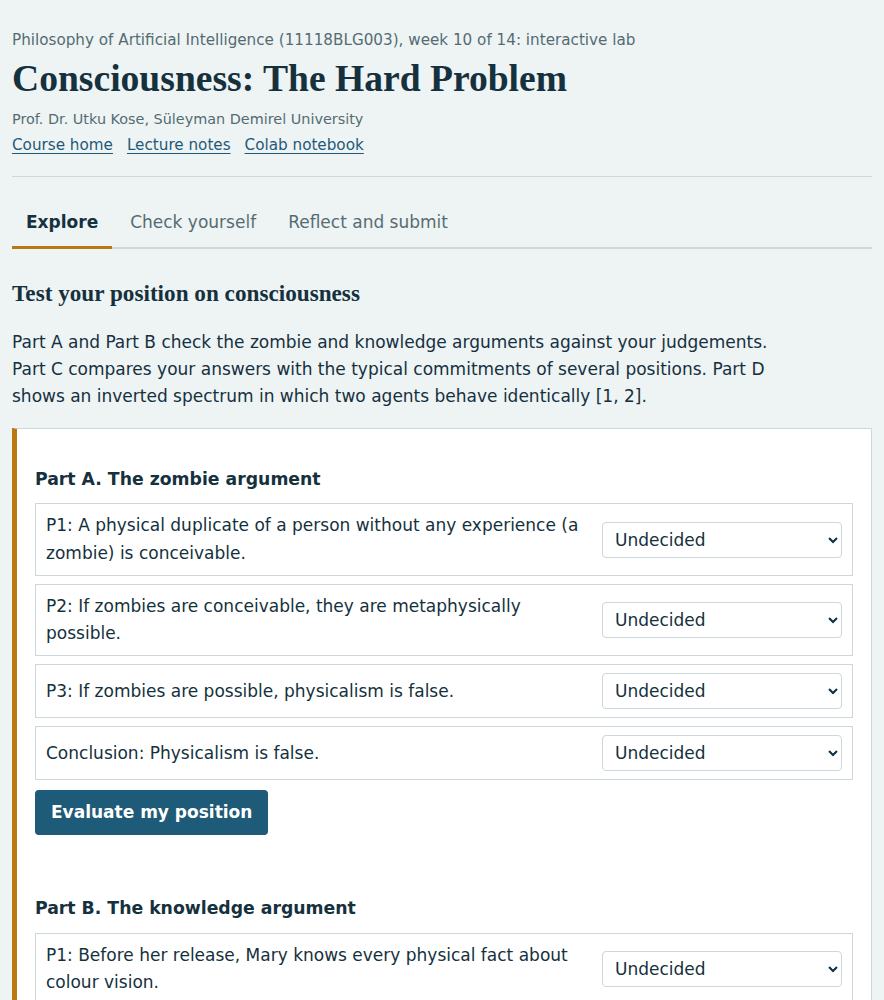

# Philosophy of Artificial Intelligence

**Graduate course 11118BLG003, Süleyman Demirel University**

*A 14-week asynchronous graduate course in which thought experiments become simulations, with lecture notes, interactive labs, Colab notebooks and weekly self-assessment*

          

**This course is updated in line with current developments in the field. Last update: September 2026.**

**Prof. Dr. Utku Kose**

Full Professor, Department of Computer Engineering, Süleyman Demirel University, Isparta, Türkiye  
Founding Director, AI Application and Research Center (YAZEM), Süleyman Demirel University  
Head of the Computer Science Division, Department of Computer Engineering, Süleyman Demirel University  
Additional affiliations: University of North Dakota (USA), Universidad Panamericana (Mexico City, Mexico), Vel Tech University (Chennai, India)  
IEEE Senior Member, ACM Professional Member

[ORCID 0000-0002-9652-6415](https://orcid.org/0000-0002-9652-6415) | [utkukose.com](https://www.utkukose.com) | [github.com/utkukose](https://github.com/utkukose)

[utkukose@sdu.edu.tr](mailto:utkukose@sdu.edu.tr) | [utku.kose@und.edu](mailto:utku.kose@und.edu) | [ukose@up.edu.mx](mailto:ukose@up.edu.mx) | [utkukose@gmail.com](mailto:utkukose@gmail.com)

## About the course

Can machines think, understand, be conscious or create? This course examines the philosophical questions raised by artificial intelligence and the arguments that shaped the field, from Turing's imitation game and Searle's Chinese Room to the symbol grounding problem, the frame problem, Gödelian arguments and the hard problem of consciousness [1, 2, 3, 4]. Classic positions are tested against present systems, in particular large language models, whose performance has reopened questions about understanding, world models, creativity and intentionality [5, 6]. The course is theory-intensive by design, and every week pairs the arguments with interactive simulations and computational experiments.

## Use in other courses

These materials were prepared for the graduate course 11118BLG003 Philosophy of Artificial Intelligence at Süleyman Demirel University. They are openly available: Anyone may use and adapt them in courses of related scope, with attribution, under the CC BY 4.0 licence for content and the MIT licence for code.

## A look inside

Every week has an interactive lab that runs in the browser, a lecture page with knowledge checks and a Colab notebook. Four of the labs are shown below.

<table><tr><td width="50%"> Week 1: What Is Artificial Intelligence? Definitions, Aims and Measures</td><td width="50%"> Week 5: Symbol Grounding and Meaning</td></tr><tr><td width="50%"> Week 10: Consciousness: The Hard Problem</td><td width="50%"> Week 14: Intentionality, the Intentional Stance and Can Machines Think?</td></tr></table>

## Who the course is for

The course is designed for MSc and PhD students in computer engineering, computer science, artificial intelligence, cognitive science and philosophy. Reading basic Python is helpful for the notebooks, but every notebook explains its code. No prior coursework in philosophy is required.

## Course learning outcomes

On successful completion of the course, students are expected to be able to:

1. Distinguish the main definitions and aims of artificial intelligence, including strong and weak AI, and evaluate formal measures of intelligence.
2. Reconstruct the Turing test, the Chinese Room argument and the symbol grounding problem as explicit arguments and assess the main replies.
3. Explain computationalism, functionalism and the physical symbol system hypothesis, and implement the computational models on which they rely.
4. Compare symbolic, connectionist and embodied approaches to intelligence, including the debates on systematicity, the frame problem and common sense.
5. Analyse arguments about the limits of machines, from Gödelian arguments to phenomenological critiques.
6. Evaluate philosophical and scientific theories of consciousness and their use in assessing artificial systems.
7. Assess current debates on understanding, world models, creativity and intentionality in artificial systems with computational experiments.

## How the course works

The course is built for self-regulated learning, in which students plan their work, monitor their understanding and reflect on the outcome [7]. Earlier work on intelligent support for self-learning in computer engineering courses showed the value of matching materials to learners when face-to-face contact is limited [8]. Philosophy is learned by doing it, so every week follows the same cycle: Read the arguments, manipulate them in the lab, rebuild them in code, check understanding and reflect. The self-assessment asks for a confidence rating with each answer, so that confident errors become visible and guide revision.

| Weekly component | Purpose | Format |
|---|---|---|
| Lecture notes | Core concepts with citations to the literature | Markdown page, web page and PDF file |
| Interactive lab | Explore a model, a thought experiment or a trade-off by changing parameters | Single HTML file, works offline |
| Colab notebook | Reproduce the ideas in Python with self-checking exercises | Jupyter notebook for Google Colab |
| Self-assessment | Instant feedback with confidence ratings | Inside the interactive lab |
| Reflection and weekly task | Consolidate learning and build a portfolio | Exported learning log plus task file |
| Research and report assignment | Optional research on the week's theme, written as a short academic report | Report with references in square brackets |
| Midterm and final capstones | Integrate the first and second halves of the course | Capstone pages under `exams/` |

## Weekly schedule

| Week | Topic | Lecture | Lab | Notebook | Lecture notes |
|---|---|---|---|---|---|
| 01 | What Is Artificial Intelligence? Definitions, Aims and Measures | [notes](weeks/week-01/README.md) | [lab](https://utkukose.github.io/philosophy-of-ai-NB-lecture/weeks/week-01/lab.html) |  | [PDF](weeks/week-01/Week01_Lecture_Notes.pdf) |
| 02 | Can Machines Think? The Turing Test and Its Critics | [notes](weeks/week-02/README.md) | [lab](https://utkukose.github.io/philosophy-of-ai-NB-lecture/weeks/week-02/lab.html) |  | [PDF](weeks/week-02/Week02_Lecture_Notes.pdf) |
| 03 | Computation and Mind: Turing Machines, Symbol Systems and Functionalism | [notes](weeks/week-03/README.md) | [lab](https://utkukose.github.io/philosophy-of-ai-NB-lecture/weeks/week-03/lab.html) |  | [PDF](weeks/week-03/Week03_Lecture_Notes.pdf) |
| 04 | The Chinese Room and Its Replies | [notes](weeks/week-04/README.md) | [lab](https://utkukose.github.io/philosophy-of-ai-NB-lecture/weeks/week-04/lab.html) |  | [PDF](weeks/week-04/Week04_Lecture_Notes.pdf) |
| 05 | Symbol Grounding and Meaning | [notes](weeks/week-05/README.md) | [lab](https://utkukose.github.io/philosophy-of-ai-NB-lecture/weeks/week-05/lab.html) |  | [PDF](weeks/week-05/Week05_Lecture_Notes.pdf) |
| 06 | Symbolic and Connectionist AI: Systematicity and Compositionality | [notes](weeks/week-06/README.md) | [lab](https://utkukose.github.io/philosophy-of-ai-NB-lecture/weeks/week-06/lab.html) |  | [PDF](weeks/week-06/Week06_Lecture_Notes.pdf) |
| 07 | Embodiment, Situatedness and the Extended Mind | [notes](weeks/week-07/README.md) | [lab](https://utkukose.github.io/philosophy-of-ai-NB-lecture/weeks/week-07/lab.html) |  | [PDF](weeks/week-07/Week07_Lecture_Notes.pdf) |
| 08 | The Frame Problem and Common Sense | [notes](weeks/week-08/README.md) | [lab](https://utkukose.github.io/philosophy-of-ai-NB-lecture/weeks/week-08/lab.html) |  | [PDF](weeks/week-08/Week08_Lecture_Notes.pdf) |
| 09 | Limits of Machines: Gödelian Arguments and Dreyfus's Critique | [notes](weeks/week-09/README.md) | [lab](https://utkukose.github.io/philosophy-of-ai-NB-lecture/weeks/week-09/lab.html) |  | [PDF](weeks/week-09/Week09_Lecture_Notes.pdf) |
| 10 | Consciousness: The Hard Problem | [notes](weeks/week-10/README.md) | [lab](https://utkukose.github.io/philosophy-of-ai-NB-lecture/weeks/week-10/lab.html) |  | [PDF](weeks/week-10/Week10_Lecture_Notes.pdf) |
| 11 | Machine Consciousness: Theories and Indicator Properties | [notes](weeks/week-11/README.md) | [lab](https://utkukose.github.io/philosophy-of-ai-NB-lecture/weeks/week-11/lab.html) |  | [PDF](weeks/week-11/Week11_Lecture_Notes.pdf) |
| 12 | Understanding and World Models in Large Language Models | [notes](weeks/week-12/README.md) | [lab](https://utkukose.github.io/philosophy-of-ai-NB-lecture/weeks/week-12/lab.html) |  | [PDF](weeks/week-12/Week12_Lecture_Notes.pdf) |
| 13 | Creativity and Machines | [notes](weeks/week-13/README.md) | [lab](https://utkukose.github.io/philosophy-of-ai-NB-lecture/weeks/week-13/lab.html) |  | [PDF](weeks/week-13/Week13_Lecture_Notes.pdf) |
| 14 | Intentionality, the Intentional Stance and Can Machines Think? | [notes](weeks/week-14/README.md) | [lab](https://utkukose.github.io/philosophy-of-ai-NB-lecture/weeks/week-14/lab.html) |  | [PDF](weeks/week-14/Week14_Lecture_Notes.pdf) |

## Assessment and submission

Assessment combines formative and summative components. Each week offers a notebook task, an optional research and report assignment and a self-assessment in the lab. The midterm capstone at the end of Week 7 and the final capstone at the end of Week 14 can each be completed in one of two tracks: a research report in the form of an academic text, or a coding application with a report. During active semesters, components and weights are announced by the instructor at the start of the semester in line with Süleyman Demirel University regulations. The self-assessments are formative and do not count towards the grade.

The weekly task supports self-learning and builds a personal portfolio. When the course is followed with the instructor during an active semester, the task can be sent together with the exported learning log to utkukose@sdu.edu.tr or utkukose@gmail.com for evaluation.

| Capstone | Timing | Formats | Page |
|---|---|---|---|
| Midterm Capstone: Machines, Tests and Meaning | End of Week 7 | Research report, or coding application with report | [open](exams/midterm/README.md) |
| Final Capstone: Minds, Morals and Machines | End of Week 14 | Research report, or coding application with report | [open](exams/final/README.md) |

Deadlines in active semesters: 23:53 (Türkiye time) on the last Sunday of Week 7 for the midterm and of Week 14 for the final, by e-mail to utkukose@sdu.edu.tr or utkukose@gmail.com. A common structure for reports is given in [exams/REPORT_TEMPLATE.md](exams/REPORT_TEMPLATE.md).

## Studying the theoretical topics

The course is theory-intensive, and the interactive labs are designed to support the theory rather than to replace it. Thought experiments become simulations that can be varied: The Chinese Room becomes a rulebook that students operate themselves, Blockhead becomes a combinatorial calculator, Braitenberg's vehicles and Dennett's frame problem robots become running models, and the diagonal argument becomes a table that students complete [2, 9, 10, 11]. Formal measures are computed on small cases, such as a simplicity-weighted intelligence score and an integration measure inspired by integrated information theory [12, 13]. Argument maps let students accept or reject premises and test the consistency of their positions. During active semesters, the asynchronous discussion space of the course hosts structured debates in which students defend assigned positions.

## Running the materials

The notebooks run in Google Colab through the badge in each week, with no installation. For local work on Windows or Ubuntu, create a virtual environment with `python -m venv .venv`, activate it, run `pip install -r requirements.txt` and start `jupyter lab`. The interactive labs are single HTML files: They open directly in a browser, work offline and store answers only in that browser. To publish the course site, enable GitHub Pages under Settings, Pages, with the main branch and the root folder as the source.

## Reference integrity

All references were checked before release. Entries marked `web` in `references/REFERENCES.md` were confirmed against at least two independent online sources, such as the publisher, an indexing service or arXiv. The remaining entries are standard works of the field. As a third, independent check, `tools/verify_references.py` compares every entry with Crossref, arXiv and OpenAlex, and the GitHub Action in `.github/workflows` repeats the check on every push and once a month. Classic books and chapters that are not indexed are listed for manual confirmation. Please report any error through a GitHub issue.

## Citing this course

Citation metadata is provided in `CITATION.cff`. A suggested citation is:

Kose, U. (2026). *Philosophy of Artificial Intelligence* [Open course materials]. GitHub. https://github.com/utkukose/philosophy-of-ai-NB-lecture

## License

Course text, figures and interactive labs are licensed under the Creative Commons Attribution 4.0 International License (see `LICENSE-CONTENT`). Source code in notebooks and tools is licensed under the MIT License (see `LICENSE`).

## References cited on this page

[1] Turing, A. M. (1950). Computing machinery and intelligence. *Mind*, 59(236), 433-460. <https://doi.org/10.1093/mind/LIX.236.433>

[2] Searle, J. R. (1980). Minds, brains, and programs. *Behavioral and Brain Sciences*, 3(3), 417-424. <https://doi.org/10.1017/S0140525X00005756>

[3] Harnad, S. (1990). The symbol grounding problem. *Physica D: Nonlinear Phenomena*, 42(1-3), 335-346. <https://doi.org/10.1016/0167-2789(90)90087-6>

[4] Chalmers, D. J. (1995). Facing up to the problem of consciousness. *Journal of Consciousness Studies*, 2(3), 200-219.

[5] Mitchell, M., & Krakauer, D. C. (2023). The debate over understanding in AI's large language models. *Proceedings of the National Academy of Sciences*, 120(13), e2215907120. <https://doi.org/10.1073/pnas.2215907120>

[6] Jones, C. R., & Bergen, B. K. (2025). Large language models pass the Turing test. arXiv preprint arXiv:2503.23674. <https://arxiv.org/abs/2503.23674>

[7] Zimmerman, B. J. (2002). Becoming a self-regulated learner: An overview. *Theory Into Practice*, 41(2), 64-70. <https://doi.org/10.1207/s15430421tip4102_2>

[8] Kose, U., & Arslan, A. (2017). Optimization of self-learning in computer engineering courses: An intelligent software system supported by artificial neural network and vortex optimization algorithm. *Computer Applications in Engineering Education*, 25(1), 142-156. <https://doi.org/10.1002/cae.21787>

[9] Block, N. (1981). Psychologism and behaviorism. *The Philosophical Review*, 90(1), 5-43. <https://doi.org/10.2307/2184371>

[10] Braitenberg, V. (1984). *Vehicles: Experiments in Synthetic Psychology*. MIT Press.

[11] Dennett, D. C. (1984). Cognitive wheels: The frame problem of AI. In C. Hookway (Eds.), *Minds, Machines and Evolution* (pp. 129-151). Cambridge University Press.

[12] Legg, S., & Hutter, M. (2007). Universal intelligence: A definition of machine intelligence. *Minds and Machines*, 17(4), 391-444. <https://doi.org/10.1007/s11023-007-9079-x>

[13] Tononi, G. (2004). An information integration theory of consciousness. *BMC Neuroscience*, 5, 42. <https://doi.org/10.1186/1471-2202-5-42>

---

**Prof. Dr. Utku Kose**  
Full Professor, Department of Computer Engineering, Süleyman Demirel University, Isparta, Türkiye  
Founding Director, AI Application and Research Center (YAZEM), Süleyman Demirel University  
Additional affiliations: University of North Dakota (USA), Universidad Panamericana (Mexico City, Mexico), Vel Tech University (Chennai, India)  
[utkukose.com](https://www.utkukose.com) | [ORCID 0000-0002-9652-6415](https://orcid.org/0000-0002-9652-6415) | [github.com/utkukose](https://github.com/utkukose)

[utkukose@sdu.edu.tr](mailto:utkukose@sdu.edu.tr) | [utku.kose@und.edu](mailto:utku.kose@und.edu) | [ukose@up.edu.mx](mailto:ukose@up.edu.mx) | [utkukose@gmail.com](mailto:utkukose@gmail.com)

## Acknowledgments

The course draws on the work of the many philosophers and scientists cited in the weekly references. The notebooks and labs rely on open-source software, including NumPy, SciPy, pandas, scikit-learn, Matplotlib and Jupyter, and on Google Colaboratory for cloud execution. Generative AI tools were used as drafting assistants under the author's direction.
