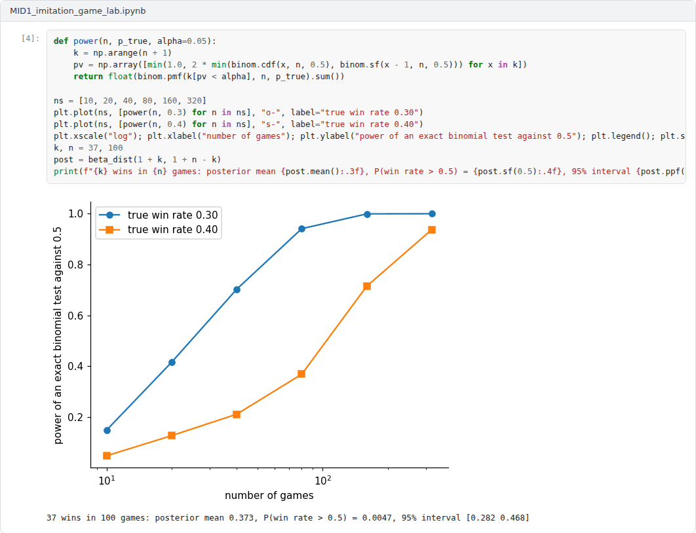
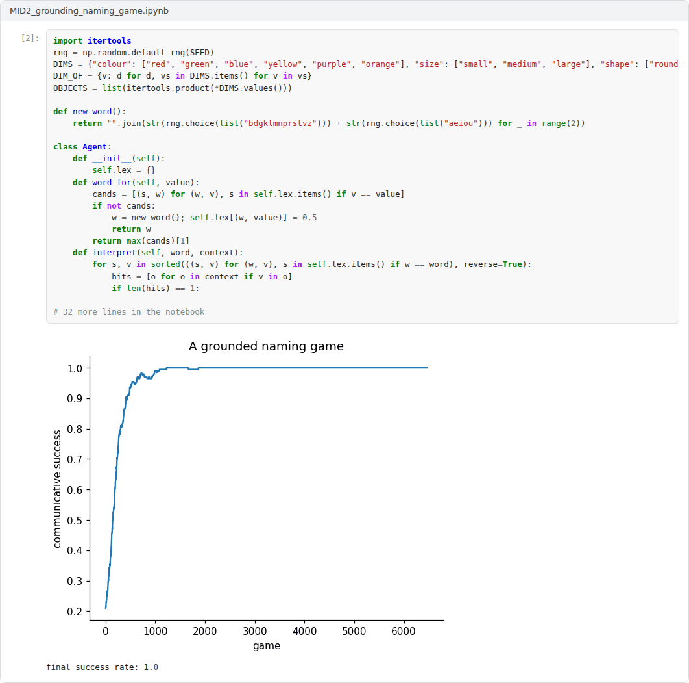
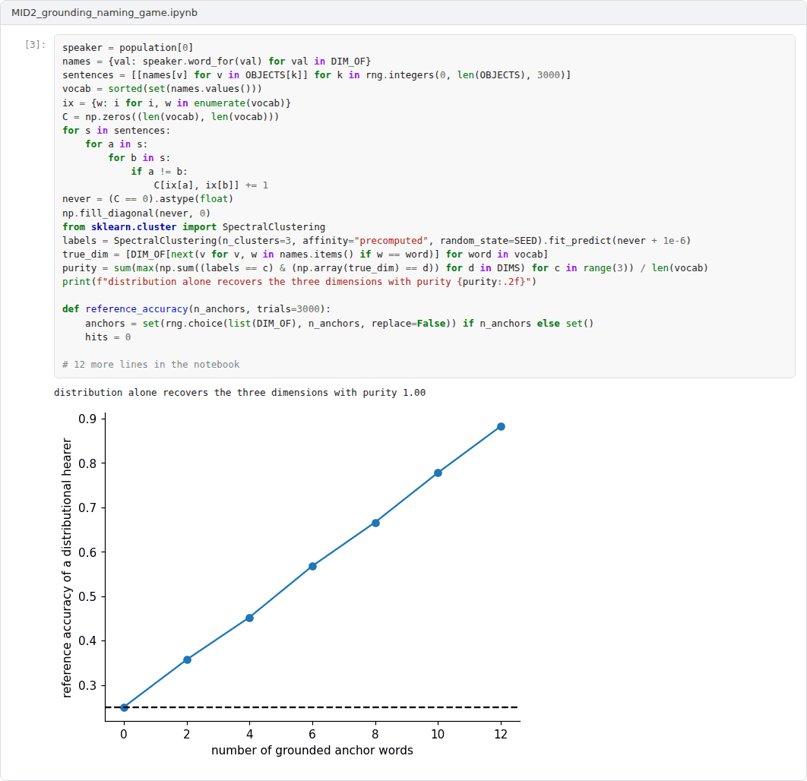
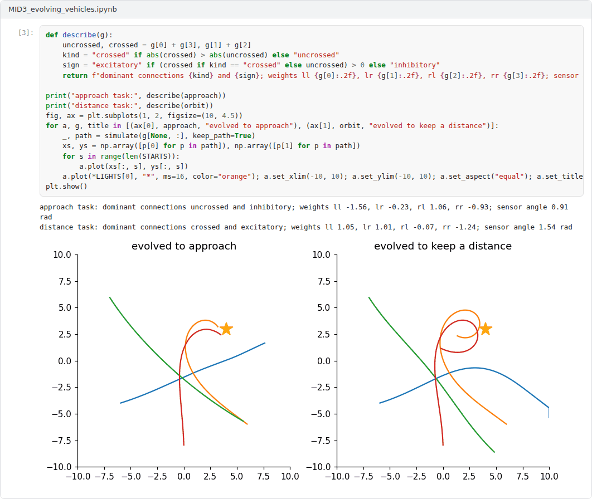

# Midterm Capstone: Machines, Tests and Meaning

**Philosophy of Artificial Intelligence (11118BLG003)**  
Prof. Dr. Utku Kose, Süleyman Demirel University

## Overview

The midterm capstone integrates Weeks 1 to 7: definitions and measures of intelligence, the Turing test, computation and functionalism, the Chinese Room, symbol grounding, systematicity and embodiment [1, 2, 3, 4]. Students choose the research track or the application track.

## Formats

Two tracks are available. In the research track, the capstone is an academic text of 3500 to 5000 words that defends a thesis on one of the suggested topics or on a related topic approved by the instructor, engages with at least ten scholarly sources and addresses the strongest objection to its thesis. In the application track, the capstone extends one of the three example notebooks and is reported in a text of 2500 to 4000 words that connects the computational results to the philosophical question. Each student works individually. The weights below are indicative; in active semesters the instructor confirms them at the start of the semester.

## Suggested research topics

The titles below are starting points. Students may narrow a title or propose a related one that fits the scope of the capstone.

1. Does passing a three-party Turing test show that a system thinks? The 2025 results in the light of Block and French
2. The Chinese Room and large language models: Which reply survives?
3. Symbol grounding without sensors: Can distributional learning fix reference?
4. Multiple realisability and the question of the substrate for artificial minds
5. Systematicity revisited: What meta-learning shows about the challenge of Fodor and Pylyshyn
6. Embodiment as a condition for intelligence: Brooks, the enactivists and disembodied language models
7. Psychologism and behaviourism: Is the way behaviour is produced part of what intelligence is?
8. Measuring intelligence: Legg and Hutter, Chollet and the problem of benchmarks
9. The extended mind and AI tools: Is a language model part of its user's cognitive system?
10. Is computation observer-relative? Searle, Putnam and the mechanistic account

## Advanced application projects

Each project comes with an example Colab notebook that implements a working baseline. The capstone extends the baseline as described, evaluates the extensions and reports the results.

### Project 1: An imitation game laboratory

Two machine witnesses, a pattern-matching program in the style of ELIZA and a Markov chain trained on a small corpus, play three-party games against constructed human replies. A learned interrogator judges the replies from surface cues, and the results are analysed with exact power calculations and Bayesian estimates of the win rate [1, 5, 6].

**Required extensions.** Add a stronger witness, for example a retrieval-based responder or a small language model, and at least two further cues or a text classifier as interrogator. Determine how many games are needed to test Turing's 70 percent criterion reliably, and argue in the report what the win rates can and cannot show, with reference to Blockhead and to subcognitive questions [7, 8].

 Example notebook: `MID1_imitation_game_lab.ipynb`

### Project 2: Grounding through language games

A population of agents invents and aligns a vocabulary for colours, sizes and shapes by playing naming games about objects they perceive. The vocabulary is then studied as text only: Co-occurrence recovers the dimensions of meaning, but reference stays at chance unless some words are grounded [3, 9].

**Required extensions.** Add perceptual noise and continuous features so that categories must be learned rather than given, compare populations of different sizes, and test whether structural information can propagate reference from anchor words to others. Discuss what the results imply for conceptual role semantics and for the vector grounding debate [10, 11].

 Example notebook: `MID2_grounding_naming_game.ipynb`

### Project 3: Evolving Braitenberg vehicles

Instead of wiring vehicles by hand, a genetic algorithm evolves sensor-motor weights and the angle of the sensors for two tasks: approaching a light and keeping a fixed distance from it. The evolved controllers are then analysed in Braitenberg's terms, which illustrates the difference between downhill invention and uphill analysis [12, 13].

**Required extensions.** Add a second light with a different colour and sensors for each colour, evolve controllers that approach one light while avoiding the other, and study how the sensor angle, a property of the body, co-evolves with the wiring. Discuss whether observers' descriptions in terms of fear or love are justified and what the results imply for embodied accounts of cognition [4, 14].

 Example notebook: `MID3_evolving_vehicles.ipynb`

## Report

Both tracks follow the course report template. A research report states its thesis in the introduction, reconstructs the relevant arguments as explicit premises and conclusions, and evaluates them. An application report explains what the simulation or experiment can and cannot show about the philosophical question, presents its results with figures and discusses its limitations. All sources are cited in square brackets.

A common structure for reports is given in the [report template](https://github.com/utkukose/philosophy-of-ai-NB-lecture/blob/main/exams/REPORT_TEMPLATE.md).

## Assessment criteria

| Criterion | Weight | What is assessed |
|---|---|---|
| Thesis and argument | 30% | A clear thesis supported by a valid and well-structured argument. |
| Engagement with the literature | 25% | Accurate reconstruction of the positions and replies discussed in the course and beyond. |
| Critical evaluation and originality | 20% | Objections are anticipated and answered; the text adds a considered view of its own. |
| Evidence and method | 15% | Research track: depth of analysis. Application track: correctness and reproducibility of the notebook. |
| Writing and referencing | 10% | The text is clear, concise and correctly referenced. |

## Submission

This capstone also supports self-learning and can be completed at any pace. When the course is taught actively in a semester, the midterm capstone is sent by e-mail to utkukose@sdu.edu.tr or utkukose@gmail.com no later than 23:53 (Türkiye time) on the last Sunday of Week 7, with the report and all code files attached or linked.

## References

[1] Turing, A. M. (1950). Computing machinery and intelligence. *Mind*, 59(236), 433-460. <https://doi.org/10.1093/mind/LIX.236.433>

[2] Searle, J. R. (1980). Minds, brains, and programs. *Behavioral and Brain Sciences*, 3(3), 417-424. <https://doi.org/10.1017/S0140525X00005756>

[3] Harnad, S. (1990). The symbol grounding problem. *Physica D: Nonlinear Phenomena*, 42(1-3), 335-346. <https://doi.org/10.1016/0167-2789(90)90087-6>

[4] Brooks, R. A. (1991). Intelligence without representation. *Artificial Intelligence*, 47(1-3), 139-159. <https://doi.org/10.1016/0004-3702(91)90053-M>

[5] Weizenbaum, J. (1966). ELIZA: A computer program for the study of natural language communication between man and machine. *Communications of the ACM*, 9(1), 36-45. <https://doi.org/10.1145/365153.365168>

[6] Jones, C. R., & Bergen, B. K. (2025). Large language models pass the Turing test. arXiv preprint arXiv:2503.23674. <https://arxiv.org/abs/2503.23674>

[7] Block, N. (1981). Psychologism and behaviorism. *The Philosophical Review*, 90(1), 5-43. <https://doi.org/10.2307/2184371>

[8] French, R. M. (1990). Subcognition and the limits of the Turing test. *Mind*, 99(393), 53-65. <https://doi.org/10.1093/mind/XCIX.393.53>

[9] Piantadosi, S. T., & Hill, F. (2022). Meaning without reference in large language models. arXiv preprint arXiv:2208.02957. <https://arxiv.org/abs/2208.02957>

[10] Mollo, D. C., & Millière, R. (2023). The vector grounding problem. arXiv preprint arXiv:2304.01481. <https://arxiv.org/abs/2304.01481>

[11] Bender, E. M., & Koller, A. (2020). Climbing towards NLU: On meaning, form, and understanding in the age of data. In *Proceedings of the 58th Annual Meeting of the Association for Computational Linguistics* (pp. 5185-5198). <https://doi.org/10.18653/v1/2020.acl-main.463>

[12] Braitenberg, V. (1984). *Vehicles: Experiments in Synthetic Psychology*. MIT Press.

[13] Pfeifer, R., & Bongard, J. (2006). *How the Body Shapes the Way We Think: A New View of Intelligence*. MIT Press.

[14] Varela, F. J., Thompson, E., & Rosch, E. (1991). *The Embodied Mind: Cognitive Science and Human Experience*. MIT Press.

---

Philosophy of Artificial Intelligence. Prof. Dr. Utku Kose, Süleyman Demirel University. ORCID [0000-0002-9652-6415](https://orcid.org/0000-0002-9652-6415). Content licensed under CC BY 4.0. This course is updated in line with current developments in the field. Last update: September 2026.
