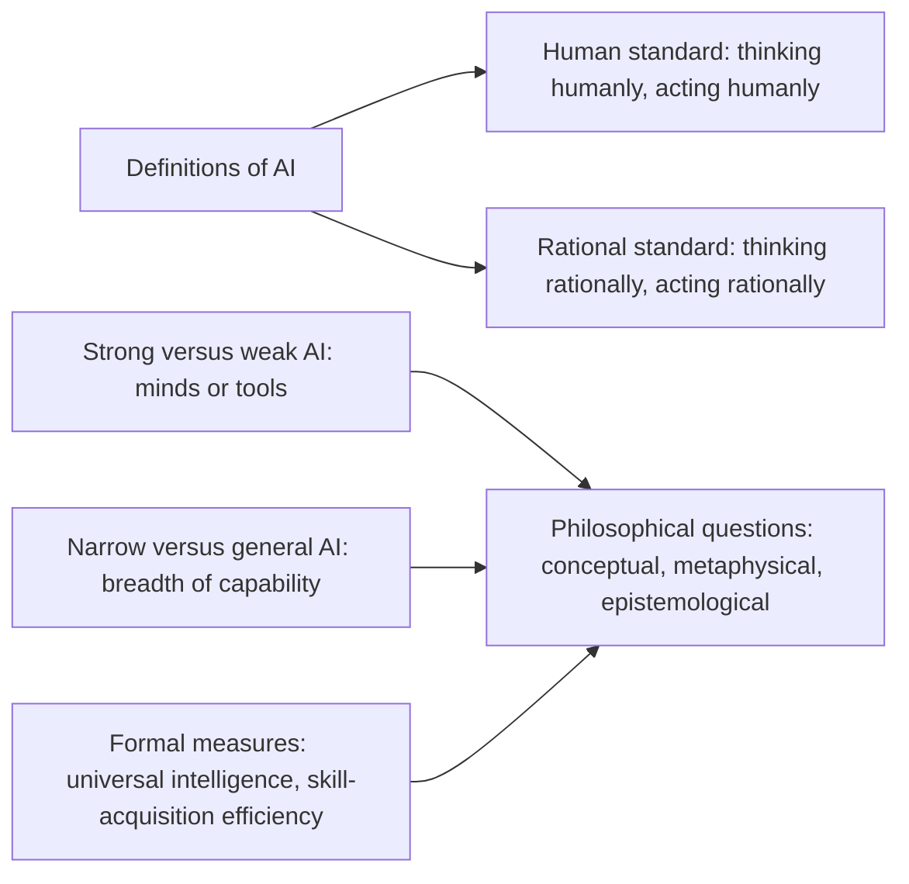
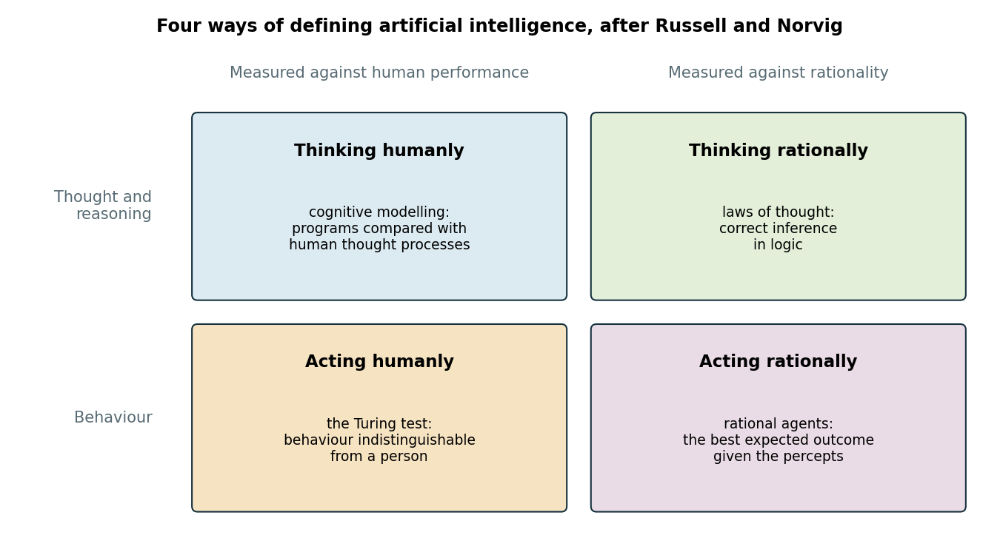
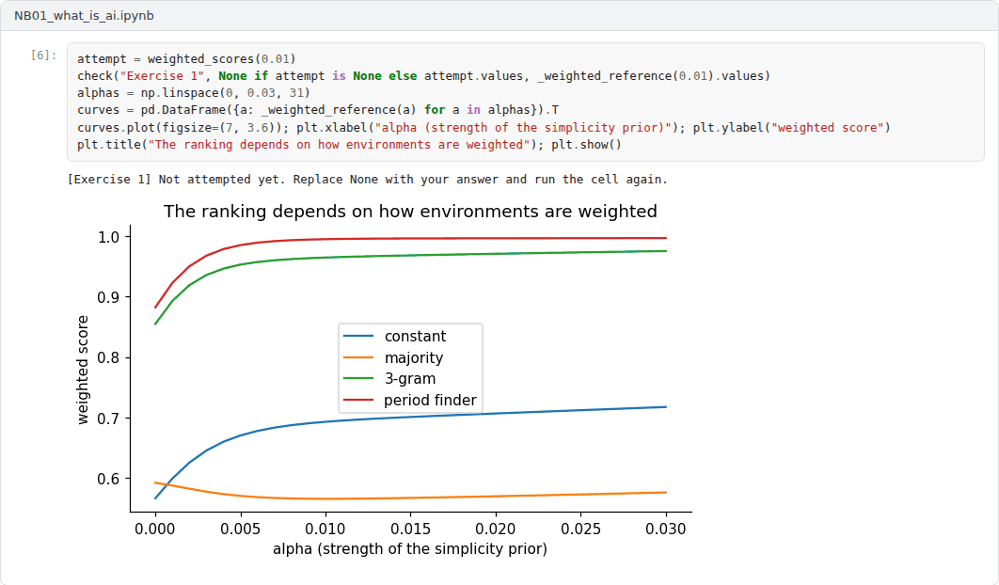

# Week 01: What Is Artificial Intelligence? Definitions, Aims and Measures

**Philosophy of Artificial Intelligence (11118BLG003)**  
Prof. Dr. Utku Kose, Süleyman Demirel University

   

## Overview

Before asking whether machines can think, it helps to ask what artificial intelligence is supposed to be. This week compares definitions of AI, separates strong from weak AI and examines formal attempts to measure intelligence, which make the hidden assumptions of informal definitions explicit [1, 2, 3].

**Estimated study time:** 6 to 8 hours.

## Learning outcomes

By the end of the week, students are expected to distinguish the four approaches in the classification of Russell and Norvig, to explain the difference between strong and weak AI and between both and general AI, to compute a simplicity-weighted intelligence score in the spirit of Legg and Hutter, and to discuss Chollet's view of intelligence as skill-acquisition efficiency.

## Study path

| Step | Activity | Suggested time |
|---|---|---|
| 1 | Read the lecture below or the [PDF version](Week01_Lecture_Notes.pdf) | 90 minutes |
| 2 | Explore the [interactive lab](https://utkukose.github.io/philosophy-of-ai-NB-lecture/weeks/week-01/lab.html) | 45 minutes |
| 3 | Work through the [Colab notebook](https://colab.research.google.com/github/utkukose/philosophy-of-ai-NB-lecture/blob/main/weeks/week-01/NB01_what_is_ai.ipynb) and its exercises | 2 to 3 hours |
| 4 | Take the self-assessment in the lab (tab: Check yourself) | 20 minutes |
| 5 | Write the reflection, export the learning log and complete the weekly task | 60 minutes |

## Week at a glance

## Lecture

### A field defined by an ambition

The proposal for the 1955 Dartmouth summer project, which gave the field its name, rested on the conjecture that every aspect of learning and intelligence can in principle be described precisely enough for a machine to simulate it [4]. The conjecture is philosophical as much as technical: It assumes that intelligence is a matter of describable processes rather than of a particular biological substrate.

Russell and Norvig classify definitions of AI along two dimensions [1]. The first asks whether a definition concerns thought or behaviour. The second asks whether success is measured against human performance or against an ideal of rationality. The result is four approaches. Thinking humanly is the programme of cognitive modelling, which compares programs with human thought processes. Thinking rationally follows the laws of thought tradition, in which intelligence is correct inference. Acting humanly is the approach of the Turing test, which Week 2 examines. Acting rationally, the approach that Russell and Norvig adopt, defines an intelligent agent as one that acts to achieve the best expected outcome. Figure 1.1 summarises the classification.

*Figure 1.1. The classification of definitions of AI by Russell and Norvig along two dimensions: thought versus behaviour and human performance versus rationality [1].*

<b>Check your understanding.</b> What did the 1955 Dartmouth proposal conjecture?

A. That machines would never learn  
B. That every aspect of learning or intelligence can in principle be described precisely enough for a machine to simulate it  
C. That intelligence is a purely biological property  
D. That computers can only calculate numbers  

**Answer: B.** The conjecture framed AI as a research programme defined by an ambition rather than by a method.

### Strong and weak AI

Searle introduced a distinction that frames much of this course [2]. According to weak AI, the computer is a powerful tool for studying the mind, for example by testing hypotheses about cognition with simulations. According to strong AI, an appropriately programmed computer does not merely simulate a mind: It literally has cognitive states and understands. Searle accepted weak AI and rejected strong AI, and his argument is the topic of Week 4.

The distinction is often confused with a different one. Narrow AI performs specific tasks, while general AI would perform well across a wide range of tasks. This is a distinction of capability, not of metaphysics. A system could be general without having a mind in Searle's sense, and a narrow system could in principle be a candidate for strong AI. Keeping the two axes apart prevents a common error, namely inferring conclusions about minds from improvements in performance.

The philosophy of AI therefore asks several kinds of question. Conceptual questions ask what thinking, understanding and intelligence are. Metaphysical questions ask whether a machine could have a mind. Epistemological questions ask how anyone could know. Methodological questions ask what AI research shows about minds in general.

<b>Check your understanding.</b> In Searle&#x27;s terminology, what does strong AI claim?

A. Computers are useful tools for studying the mind  
B. Computers will soon surpass humans in chess  
C. An appropriately programmed computer literally has a mind and understands  
D. Robots must be physically strong  

**Answer: C.** Weak AI treats computers as tools for studying the mind. Strong AI attributes minds to programs.

### Measuring intelligence

Informal definitions leave room for disagreement, so some researchers have tried to formalise intelligence. Legg and Hutter collected many informal definitions and proposed universal intelligence: the expected performance of an agent across all computable environments, where each environment is weighted by two to the power of minus its Kolmogorov complexity [3]. Simple environments therefore count more than complex ones. The measure cannot be computed exactly, because Kolmogorov complexity is not computable, but it can be approximated, and its structure exposes a choice that informal definitions hide: which environments matter, and how much.

Chollet argued that performance on any fixed set of tasks measures skill, which can be bought with prior knowledge or unlimited training data [5]. He proposed to define intelligence as skill-acquisition efficiency: how efficiently a system turns its priors and experience into skill on tasks that require generalisation. His benchmark of abstract reasoning puzzles, ARC, was designed on this principle. The lab of this week shows how the ranking of four agents changes when the weighting of environments changes, which makes the dependence of any intelligence score on its assumptions visible.

<b>Check your understanding.</b> How do Legg and Hutter define universal intelligence?

A. As an agent's ability to achieve goals across a wide range of environments, weighted by their simplicity  
B. As the score on an IQ test  
C. As the number of parameters of a model  
D. As the speed of computation  

**Answer: A.** The measure sums performance over computable environments, with simpler environments weighted more.

### Why definitions matter

Definitions are not neutral. A benchmark score that improves on narrow tasks may be reported as progress towards general intelligence, and a behavioural definition may be read as settling questions about understanding. Each later week of the course tests one of these inferences. Weeks 2 to 4 examine behaviour, computation and understanding. Weeks 5 to 8 turn to meaning, cognitive architecture, embodiment and common sense. Week 9 examines arguments that machines face principled limits. Weeks 10 and 11 address consciousness. Weeks 12 to 14 apply the tools of the course to understanding, creativity and intentionality in present systems.

> **Pause and reflect.** Which of the four approaches best describes the AI systems in your own research? Would your answer change if the systems became much more capable?

<b>Check your understanding.</b> According to Chollet, what should a measure of intelligence focus on?

A. Skill at a fixed set of tasks  
B. Memory capacity  
C. The size of the training set  
D. Skill-acquisition efficiency relative to priors and experience  

**Answer: D.** High skill can be bought with data and priors, so it is not by itself evidence of general intelligence.

## Interactive lab

Part A asks for the approach behind eight descriptions of AI systems. Part B computes a simplicity-weighted intelligence score for four agents in six environments, in the spirit of Legg and Hutter. Change the strength of the simplicity prior and watch the ranking change [1, 3].

[Open the interactive lab](https://utkukose.github.io/philosophy-of-ai-NB-lecture/weeks/week-01/lab.html)

## Colab notebook

The notebook builds six sequence-prediction environments from short programs, approximates their description length by compression, runs four prediction agents in each and computes simplicity-weighted scores, following the structure of the universal intelligence measure [3].

Screenshots of the executed notebook:

## Self-assessment and reflection

The lab contains a 6-question self-assessment with instant feedback and a confidence rating for each answer. A confident but wrong answer marks the first topic to revisit. The reflection prompts below are also available in the lab, where answers are saved in the browser and can be exported as a learning log.

1. Write your own definition of intelligence in one sentence. Which of the four approaches does it belong to, and what would count as evidence against it?
2. Is it possible for a system to be general but not strong in Searle's sense? Give an example or an argument.
3. Which environments would you include in an intelligence measure for systems in your field, and how would you weight them?

## Weekly task and submission

Write a short essay of about 500 words that compares two definitions of intelligence from this week, identifies an assumption that each makes explicit or hides, and applies both to one AI system of your choice. Cite at least three works in square brackets and attach the notebook with both exercises completed.

The weekly task supports self-learning and builds a personal portfolio. When the course is followed with the instructor during an active semester, the task can be sent together with the exported learning log to utkukose@sdu.edu.tr or utkukose@gmail.com for evaluation.

## Research and report assignment (optional)

**What do benchmarks say intelligence is?.** Analyse how three current AI benchmarks operationalise intelligence and compare them with the formal measures of this week [3, 5]. State which approach in the classification of Russell and Norvig each benchmark follows.

This research assignment is optional and supports self-learning. When the related weeks are followed within the course during an active semester, the report can be sent to utkukose@sdu.edu.tr or utkukose@gmail.com for evaluation. Unless the assignment states otherwise, a report has 1500 to 2500 words, follows the structure of an academic paper, cites at least six scholarly or official sources in square brackets and ends with a reference list.

## References

[1] Russell, S., & Norvig, P. (2021). *Artificial Intelligence: A Modern Approach* (4th ed.). Pearson.

[2] Searle, J. R. (1980). Minds, brains, and programs. *Behavioral and Brain Sciences*, 3(3), 417-424. <https://doi.org/10.1017/S0140525X00005756>

[3] Legg, S., & Hutter, M. (2007). Universal intelligence: A definition of machine intelligence. *Minds and Machines*, 17(4), 391-444. <https://doi.org/10.1007/s11023-007-9079-x>

[4] McCarthy, J., Minsky, M. L., Rochester, N., & Shannon, C. E. (2006). A proposal for the Dartmouth summer research project on artificial intelligence, August 31, 1955. *AI Magazine*, 27(4), 12-14. <https://doi.org/10.1609/aimag.v27i4.1904>

[5] Chollet, F. (2019). On the measure of intelligence. arXiv preprint arXiv:1911.01547. <https://arxiv.org/abs/1911.01547>

---

Philosophy of Artificial Intelligence. Prof. Dr. Utku Kose, Süleyman Demirel University. ORCID [0000-0002-9652-6415](https://orcid.org/0000-0002-9652-6415). Content licensed under CC BY 4.0. This course is updated in line with current developments in the field. Last update: September 2026.
