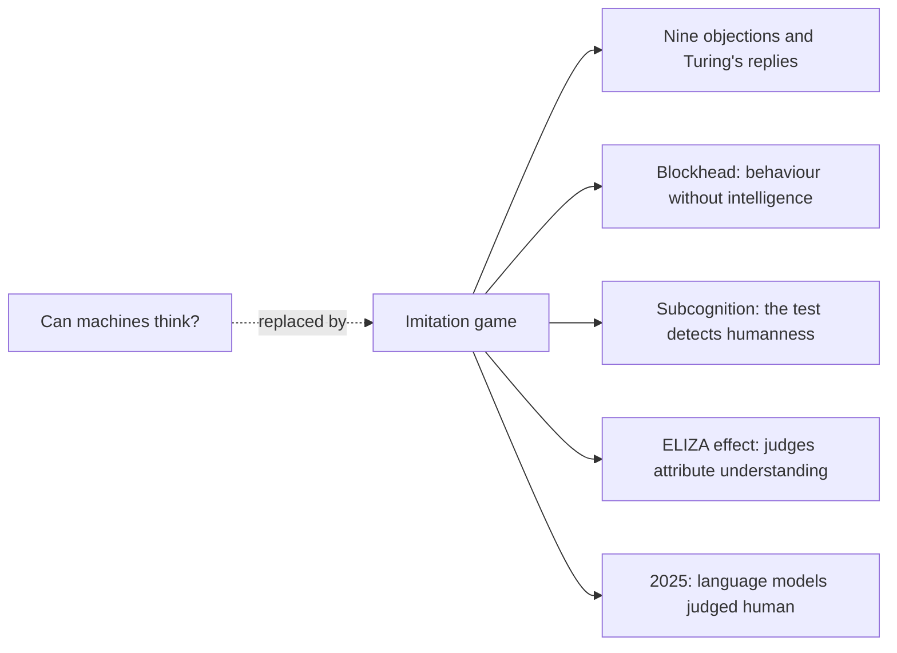
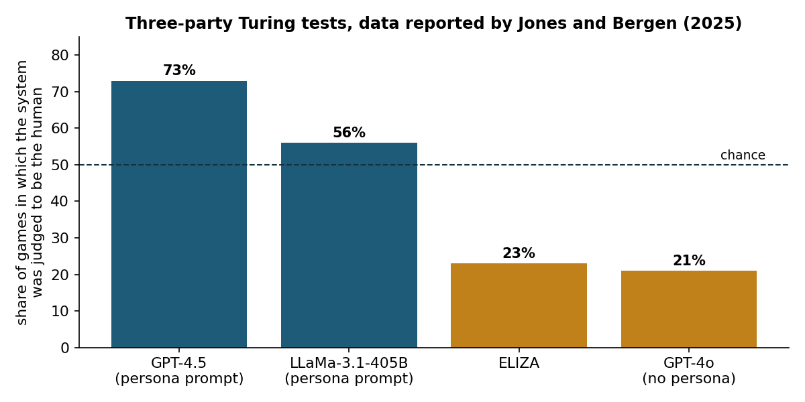
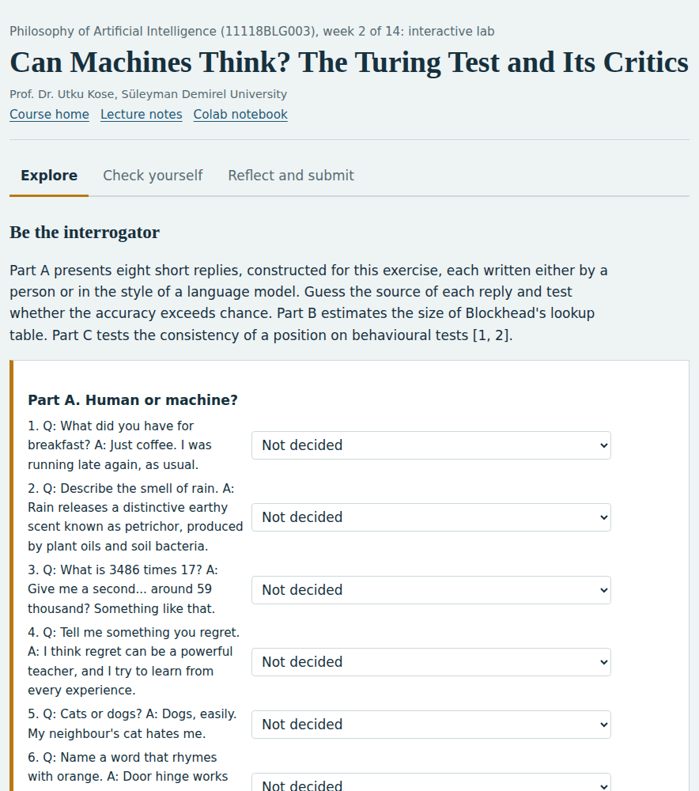
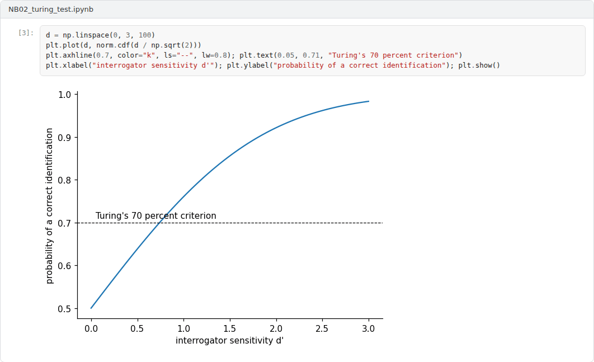

# Week 02: Can Machines Think? The Turing Test and Its Critics

**Philosophy of Artificial Intelligence (11118BLG003)**  
Prof. Dr. Utku Kose, Süleyman Demirel University

   

## Overview

In 1950, Alan Turing replaced the question of whether machines can think with a game of imitation. This week reconstructs his proposal and his replies to objections, examines critiques that target the sufficiency of behaviour, and interprets recent experiments in which language models were judged to be human [1, 2, 3].

**Estimated study time:** 6 to 8 hours.

## Learning outcomes

By the end of the week, students are expected to describe the imitation game and Turing's prediction, to evaluate at least three of the objections he considered, to explain why Blockhead and subcognitive questions challenge behavioural tests, and to interpret the results of recent three-party Turing tests with appropriate statistical care.

## Study path

| Step | Activity | Suggested time |
|---|---|---|
| 1 | Read the lecture below or the [PDF version](Week02_Lecture_Notes.pdf) | 90 minutes |
| 2 | Explore the [interactive lab](https://utkukose.github.io/philosophy-of-ai-NB-lecture/weeks/week-02/lab.html) | 45 minutes |
| 3 | Work through the [Colab notebook](https://colab.research.google.com/github/utkukose/philosophy-of-ai-NB-lecture/blob/main/weeks/week-02/NB02_turing_test.ipynb) and its exercises | 2 to 3 hours |
| 4 | Take the self-assessment in the lab (tab: Check yourself) | 20 minutes |
| 5 | Write the reflection, export the learning log and complete the weekly task | 60 minutes |

## Week at a glance

## Lecture

### Replacing the question

Turing found the question of whether machines can think too vague to answer, so he proposed to replace it with a game [1]. An interrogator communicates in writing with two hidden witnesses, one human and one machine, and must decide which is which. If machines play the game so well that interrogators do no better than chance, the original question loses its point. Turing also made a prediction: that by about the end of the twentieth century, an average interrogator would have no more than a 70 percent chance of making the right identification after five minutes of questioning.

The proposal is behavioural and deliberately so. It sets aside the appearance of the machine and the material it is made of and focuses on verbal behaviour, which Turing treated as a sufficient basis for attributing thought, just as people attribute thought to one another.

<b>Check your understanding.</b> With what did Turing replace the question whether machines can think?

A. Whether a machine can prove theorems  
B. Whether a machine can play the imitation game well enough that an interrogator cannot reliably tell it from a human  
C. Whether a machine is conscious  
D. Whether a machine can pass a medical exam  

**Answer: B.** Turing proposed a behavioural test in place of a question he considered too vague to discuss.

### Objections and replies

Turing anticipated nine objections to his view: the theological objection, the heads-in-the-sand objection, the mathematical objection, the argument from consciousness, arguments from various disabilities, Lady Lovelace's objection, the argument from the continuity of the nervous system, the argument from the informality of behaviour and the argument from extrasensory perception [1]. Three of them return later in the course. The mathematical objection draws on Gödel's theorem and is examined in Week 9. The argument from consciousness, which holds that a machine must feel what it writes, is examined in Weeks 10 and 11. Lady Lovelace's objection, that a machine can only do what it is ordered to do, is examined in Week 13. To the argument from consciousness, Turing replied that it leads to solipsism, since the only way to be sure that a person thinks would be to be that person. Saygin, Cicekli and Akman reviewed the first fifty years of debate about the test and its variants [4].

<b>Check your understanding.</b> What does Lady Lovelace&#x27;s objection state?

A. Machines are too slow  
B. Machines cannot calculate  
C. A machine can only do what it is ordered to do and cannot originate anything  
D. Machines will become conscious  

**Answer: C.** Turing replied that machines can surprise their programmers and can learn.

### Is behaviour enough?

Critics have questioned whether passing the test is sufficient for thought. Block imagined a machine, later called Blockhead, that stores a sensible reply for every possible conversation up to the length of the test [2]. Such a lookup table would pass, yet it would be as unintelligent as a jukebox. Block concluded that intelligence depends on how behaviour is produced, not only on the behaviour itself, a position he called psychologism. The practical impossibility of the table does not answer the point, since the argument concerns what the test measures, not what can be built.

French argued that the test is too demanding in a different way [5]. Subcognitive questions, such as asking how good a made-up word would be as a name for a breakfast cereal, probe associations that only an entity with a human life history would share. The test may therefore detect humanness rather than intelligence. Weizenbaum's ELIZA showed a third problem from the opposite direction: A simple program that transformed user sentences with pattern-matching rules led some users to attribute understanding to it [6]. Human judges are not neutral instruments.

<b>Check your understanding.</b> What does Block&#x27;s Blockhead thought experiment suggest?

A. A lookup table could produce test-passing behaviour without intelligence, so behaviour alone may not suffice  
B. Every program is intelligent  
C. The Turing test is too hard  
D. Humans are lookup tables  

**Answer: A.** Block argues that how behaviour is produced matters for intelligence, a position called psychologism.

### The test in the age of language models

Jones and Bergen ran randomised, controlled and pre-registered three-party Turing tests in which interrogators held five-minute conversations simultaneously with a human and a machine [3]. When prompted to adopt a humanlike persona, GPT-4.5 was judged to be the human in 73 percent of the games, significantly more often than the real human participants. LLaMa-3.1-405B with the same prompt was judged human 56 percent of the time, while ELIZA and GPT-4o without a persona reached 23 and 21 percent. Figure 2.1 shows these reported rates.

The results meet Turing's operational criterion in its standard form. Whether they show that the systems think is exactly the question that Block and French raised. The results also depended strongly on the persona prompt, which suggests that the test measures skill at a particular social performance. The lab asks students to act as interrogators, to compute whether their own accuracy exceeds chance and to estimate the size of Blockhead's table.

> **Pause and reflect.** If a system passes the test only with a carefully written persona, who or what has passed the test: the model, the prompt writer or the combination?

*Figure 2.1. Share of games in which each system was judged to be the human in the three-party Turing tests reported by Jones and Bergen; the dashed line marks chance [3].*

<b>Check your understanding.</b> What did the three-party Turing tests reported in 2025 find for GPT-4.5 with a persona prompt?

A. It was never judged human  
B. It was judged human at chance level only  
C. It crashed during the tests  
D. It was judged human more often than the actual human participants  

**Answer: D.** The result revived the question of what passing the test does and does not show.

## Interactive lab

Part A presents eight short replies, constructed for this exercise, each written either by a person or in the style of a language model. Guess the source of each reply and test whether the accuracy exceeds chance. Part B estimates the size of Blockhead's lookup table. Part C tests the consistency of a position on behavioural tests [1, 2].

[Open the interactive lab](https://utkukose.github.io/philosophy-of-ai-NB-lecture/weeks/week-02/lab.html)

## Colab notebook

The notebook implements a small ELIZA-style program, models interrogators with signal detection theory to relate accuracy to Turing's 70 percent criterion, tests judge accuracy against chance and computes the size of Blockhead's table [1, 2, 6].

Screenshots of the executed notebook:

## Self-assessment and reflection

The lab contains a 6-question self-assessment with instant feedback and a confidence rating for each answer. A confident but wrong answer marks the first topic to revisit. The reflection prompts below are also available in the lab, where answers are saved in the browser and can be exported as a learning log.

1. How accurate were you in Part A, and what cues did you rely on? Would the same cues work against a persona-prompted model?
2. Does Blockhead refute behavioural tests of intelligence, or only show their limits? Defend your view.
3. Design a question that you believe a present language model would answer differently from a person. Explain why.

## Weekly task and submission

Write an argument analysis of about 500 words: Reconstruct Turing's argument as numbered premises and a conclusion, state which premise Block and French each attack, and evaluate whether the results of Jones and Bergen change the debate. Attach the notebook with both exercises completed.

The weekly task supports self-learning and builds a personal portfolio. When the course is followed with the instructor during an active semester, the task can be sent together with the exported learning log to utkukose@sdu.edu.tr or utkukose@gmail.com for evaluation.

## Research and report assignment (optional)

**The 2025 Turing test results and their critics.** Review the responses to the three-party Turing tests reported in 2025 and assess them with the arguments of Block and French [2, 3, 5].

This research assignment is optional and supports self-learning. When the related weeks are followed within the course during an active semester, the report can be sent to utkukose@sdu.edu.tr or utkukose@gmail.com for evaluation. Unless the assignment states otherwise, a report has 1500 to 2500 words, follows the structure of an academic paper, cites at least six scholarly or official sources in square brackets and ends with a reference list.

## References

[1] Turing, A. M. (1950). Computing machinery and intelligence. *Mind*, 59(236), 433-460. <https://doi.org/10.1093/mind/LIX.236.433>

[2] Block, N. (1981). Psychologism and behaviorism. *The Philosophical Review*, 90(1), 5-43. <https://doi.org/10.2307/2184371>

[3] Jones, C. R., & Bergen, B. K. (2025). Large language models pass the Turing test. arXiv preprint arXiv:2503.23674. <https://arxiv.org/abs/2503.23674>

[4] Saygin, A. P., Cicekli, I., & Akman, V. (2000). Turing test: 50 years later. *Minds and Machines*, 10(4), 463-518.

[5] French, R. M. (1990). Subcognition and the limits of the Turing test. *Mind*, 99(393), 53-65. <https://doi.org/10.1093/mind/XCIX.393.53>

[6] Weizenbaum, J. (1966). ELIZA: A computer program for the study of natural language communication between man and machine. *Communications of the ACM*, 9(1), 36-45. <https://doi.org/10.1145/365153.365168>

---

Philosophy of Artificial Intelligence. Prof. Dr. Utku Kose, Süleyman Demirel University. ORCID [0000-0002-9652-6415](https://orcid.org/0000-0002-9652-6415). Content licensed under CC BY 4.0. This course is updated in line with current developments in the field. Last update: September 2026.
