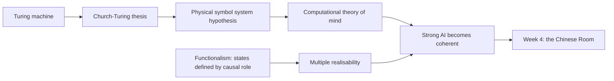
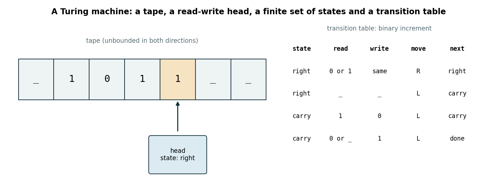
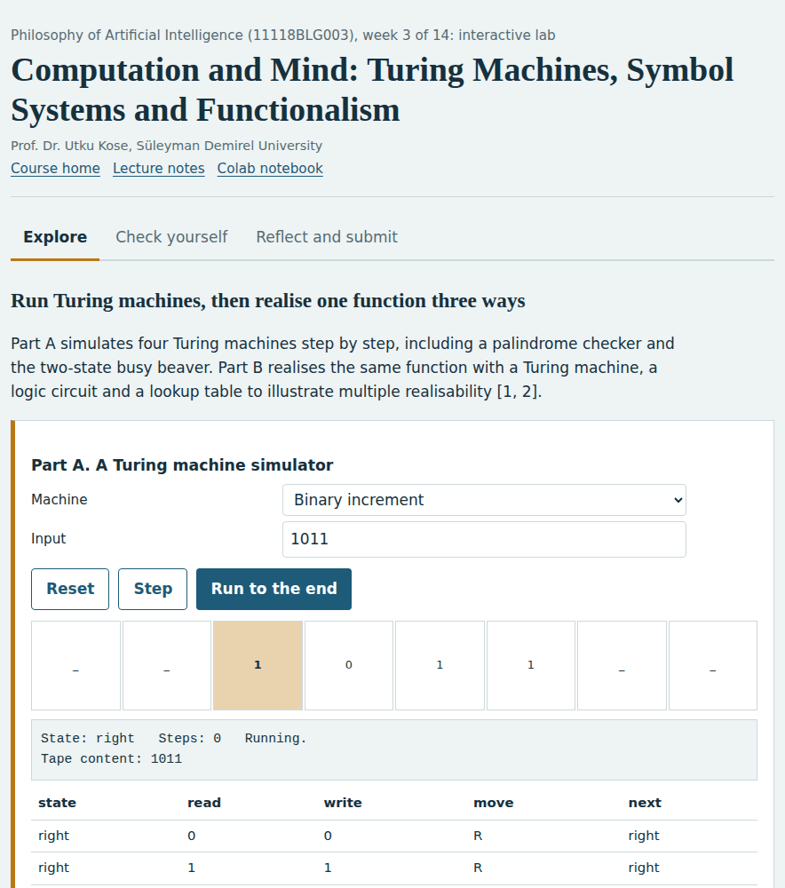
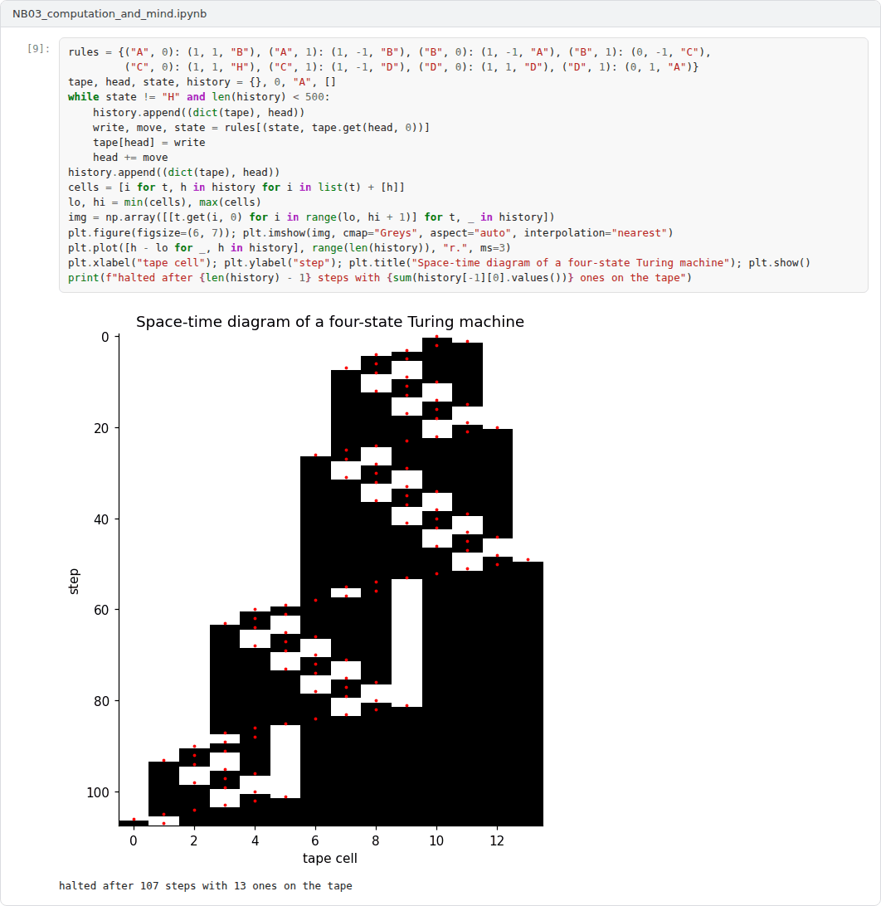

# Week 03: Computation and Mind: Turing Machines, Symbol Systems and Functionalism

**Philosophy of Artificial Intelligence (11118BLG003)**  
Prof. Dr. Utku Kose, Süleyman Demirel University

   

## Overview

The claim that machines could think rests on a view of what thinking is. This week introduces the theory of computation, the physical symbol system hypothesis and functionalism, the doctrines that together make strong AI a coherent possibility [1, 2, 3].

**Estimated study time:** 6 to 8 hours.

## Learning outcomes

By the end of the week, students are expected to describe a Turing machine and the Church-Turing thesis, to state the physical symbol system hypothesis and the computational theory of mind, to explain functionalism and multiple realisability, and to implement and test simple Turing machines.

## Study path

| Step | Activity | Suggested time |
|---|---|---|
| 1 | Read the lecture below or the [PDF version](Week03_Lecture_Notes.pdf) | 90 minutes |
| 2 | Explore the [interactive lab](https://utkukose.github.io/philosophy-of-ai-NB-lecture/weeks/week-03/lab.html) | 45 minutes |
| 3 | Work through the [Colab notebook](https://colab.research.google.com/github/utkukose/philosophy-of-ai-NB-lecture/blob/main/weeks/week-03/NB03_computation_and_mind.ipynb) and its exercises | 2 to 3 hours |
| 4 | Take the self-assessment in the lab (tab: Check yourself) | 20 minutes |
| 5 | Write the reflection, export the learning log and complete the weekly task | 60 minutes |

## Week at a glance

## Lecture

### What computation is

In 1936, Turing analysed what a human computer, a person carrying out a calculation by rule, can do, and captured it in an abstract machine [1]. A Turing machine has an unbounded tape divided into cells, a head that reads and writes one symbol at a time and moves left or right, a finite set of states and a transition table that fixes, for each state and symbol, what to write, where to move and which state comes next. Turing also described a universal machine that can simulate any other machine given its description, the idea behind the stored-program computer. Figure 3.1 shows a machine that adds one to a binary number.

In the same year, Church reached equivalent results with a different formalism [4]. The Church-Turing thesis states that every function that can be computed by an effective procedure can be computed by a Turing machine. It is a thesis rather than a theorem, because the notion of an effective procedure is informal, but every alternative formalism proposed since has turned out to be equivalent.

*Figure 3.1. A Turing machine for adding one to a binary number: the head moves to the right end, then propagates the carry to the left [1].*

<b>Check your understanding.</b> What does the Church-Turing thesis state?

A. Every function can be computed  
B. Every effectively calculable function is computable by a Turing machine  
C. Computers are conscious  
D. Turing machines are physical devices  

**Answer: B.** It is a thesis rather than a theorem, because the notion of an effective procedure is informal.

### Symbols, search and the language of thought

Newell and Simon turned computation into a hypothesis about intelligence [2]. Their physical symbol system hypothesis states that a physical symbol system has the necessary and sufficient means for general intelligent action. A physical symbol system is a machine that creates, copies, modifies and destroys symbol structures, and its symbols designate objects and processes. If the hypothesis is true, human intelligence is a form of symbol processing, and a suitably programmed computer can in principle be intelligent.

Fodor developed a related view in philosophy of mind, the computational theory of mind [5]. Thinking consists of computations over mental representations that have a language-like structure, a language of thought. The view explains how thought can be productive, since new thoughts are built from old parts, and it links the meaning of thoughts to their causal roles in reasoning.

<b>Check your understanding.</b> What does the physical symbol system hypothesis claim?

A. A physical symbol system has the necessary and sufficient means for general intelligent action  
B. Symbols have no role in intelligence  
C. Only neurons can think  
D. Search is impossible  

**Answer: A.** Newell and Simon proposed it as an empirical hypothesis about intelligence.

### Functionalism and multiple realisability

Putnam compared mental states with the logical states of a Turing machine [3]. A machine state is defined by its relations to inputs, outputs and other states, not by the hardware that realises it. Functionalism generalises the idea: A mental state such as pain is defined by its causal role, what causes it, what it causes and how it interacts with other states. It follows that the same mental state could be realised in very different substrates, such as neurons or silicon. This is multiple realisability, and it is the premise that makes strong AI coherent: If minds are defined by function, the right program on any capable hardware would have a mind.

The lab makes multiple realisability concrete. The same function, adding one to a number, is realised by a Turing machine, by a circuit of logic gates and by a lookup table. The three realisations agree on every input and differ completely in their internal operations.

<b>Check your understanding.</b> What is multiple realisability?

A. A mental state can occur only in a brain  
B. A program can run only on one machine  
C. The same mental state can be realised in different physical substrates  
D. Every state is realised twice  

**Answer: C.** Multiple realisability is a key motivation for functionalism.

### When does a physical system compute?

Functionalism faces a puzzle. If computing is merely a matter of mapping physical states onto computational states, almost any physical system could be said to compute almost anything, which would make computationalism trivially true. Piccinini proposed a mechanistic account in response: A physical system computes when it is a mechanism whose function is to process vehicles, such as digits, according to rules that are sensitive to properties of those vehicles [6]. The account separates genuine computers from rocks and walls and gives computationalism empirical content.

The doctrines of this week set up the next one. If thinking is computation and computation is substrate-independent, then running the right program suffices for a mind. Searle's Chinese Room argument, the topic of Week 4, targets exactly this inference.

> **Pause and reflect.** Is a thermostat a physical symbol system? Apply Newell and Simon's definition and Piccinini's criterion and compare the answers.

<b>Check your understanding.</b> What is the triviality worry about physical computation?

A. Computers are too trivial to be interesting  
B. Only digital systems compute  
C. Computation requires electricity  
D. Under a liberal mapping, almost any physical system implements almost any computation  

**Answer: D.** Mechanistic accounts respond by placing constraints on what counts as implementing a computation.

## Interactive lab

Part A simulates four Turing machines step by step, including a palindrome checker and the two-state busy beaver. Part B realises the same function with a Turing machine, a logic circuit and a lookup table to illustrate multiple realisability [1, 3].

[Open the interactive lab](https://utkukose.github.io/philosophy-of-ai-NB-lecture/weeks/week-03/lab.html)

## Colab notebook

The notebook implements a Turing machine simulator, verifies that the binary increment machine realises the same function as ordinary arithmetic, runs the two-state busy beaver and asks for two small machines to be analysed [1, 3].

Screenshots of the executed notebook:

## Self-assessment and reflection

The lab contains a 6-question self-assessment with instant feedback and a confidence rating for each answer. A confident but wrong answer marks the first topic to revisit. The reflection prompts below are also available in the lab, where answers are saved in the browser and can be exported as a learning log.

1. If functionalism is true, what would it take for a program to have your beliefs? What would be missing if it had only your input-output behaviour?
2. Which of the three realisations in the lab, if any, seems most like thinking? Why do intuitions differ between them?
3. Is the brain a physical symbol system? Give one consideration for and one against.

## Weekly task and submission

Write about 400 words explaining how the Church-Turing thesis, the physical symbol system hypothesis and functionalism combine to support strong AI. Identify the weakest link in the chain and defend your choice. Attach the notebook with both exercises completed.

The weekly task supports self-learning and builds a personal portfolio. When the course is followed with the instructor during an active semester, the task can be sent together with the exported learning log to utkukose@sdu.edu.tr or utkukose@gmail.com for evaluation.

## Research and report assignment (optional)

**Is the brain a computer?.** Compare the mechanistic account of physical computation with arguments that computation is observer-relative or trivial, and state which view supports functionalism best [3, 6, 7].

This research assignment is optional and supports self-learning. When the related weeks are followed within the course during an active semester, the report can be sent to utkukose@sdu.edu.tr or utkukose@gmail.com for evaluation. Unless the assignment states otherwise, a report has 1500 to 2500 words, follows the structure of an academic paper, cites at least six scholarly or official sources in square brackets and ends with a reference list.

## References

[1] Turing, A. M. (1936). On computable numbers, with an application to the Entscheidungsproblem. *Proceedings of the London Mathematical Society*, s2-42(1), 230-265. <https://doi.org/10.1112/plms/s2-42.1.230>

[2] Newell, A., & Simon, H. A. (1976). Computer science as empirical inquiry: Symbols and search. *Communications of the ACM*, 19(3), 113-126. <https://doi.org/10.1145/360018.360022>

[3] Putnam, H. (1960). Minds and machines. In S. Hook (Eds.), *Dimensions of Mind* (pp. 138-164). New York University Press.

[4] Church, A. (1936). An unsolvable problem of elementary number theory. *American Journal of Mathematics*, 58(2), 345-363. <https://doi.org/10.2307/2371045>

[5] Fodor, J. A. (1975). *The Language of Thought*. Thomas Y. Crowell.

[6] Piccinini, G. (2015). *Physical Computation: A Mechanistic Account*. Oxford University Press.

[7] Searle, J. R. (1990). Is the brain's mind a computer program?. *Scientific American*, 262(1), 26-31. <https://doi.org/10.1038/scientificamerican0190-26>

---

Philosophy of Artificial Intelligence. Prof. Dr. Utku Kose, Süleyman Demirel University. ORCID [0000-0002-9652-6415](https://orcid.org/0000-0002-9652-6415). Content licensed under CC BY 4.0. This course is updated in line with current developments in the field. Last update: September 2026.
