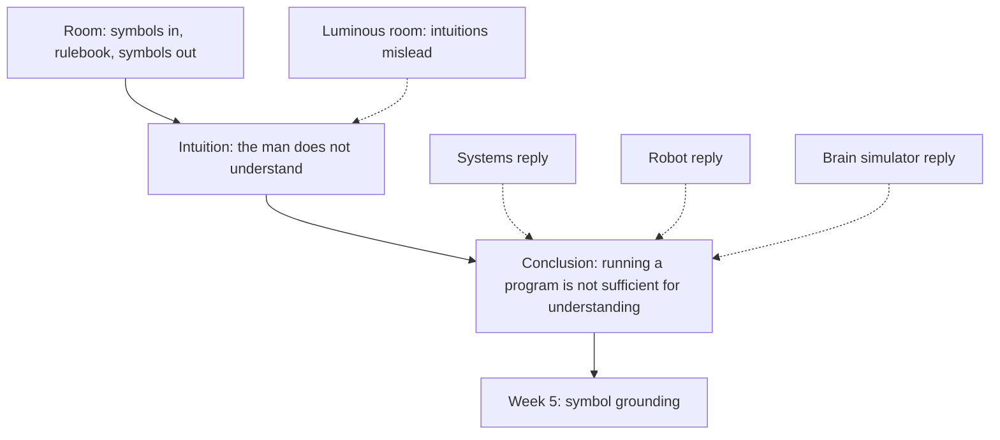
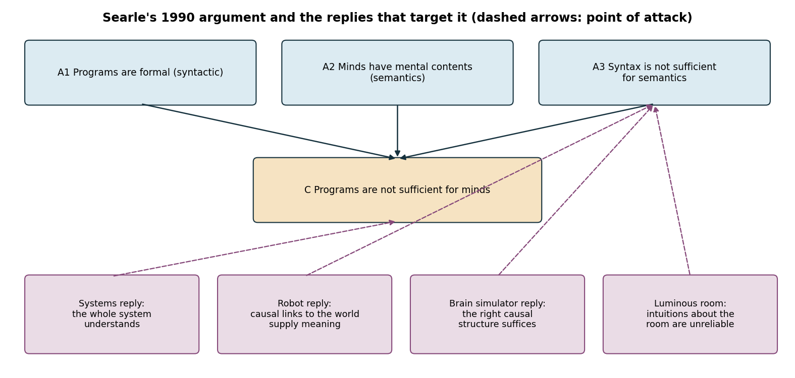
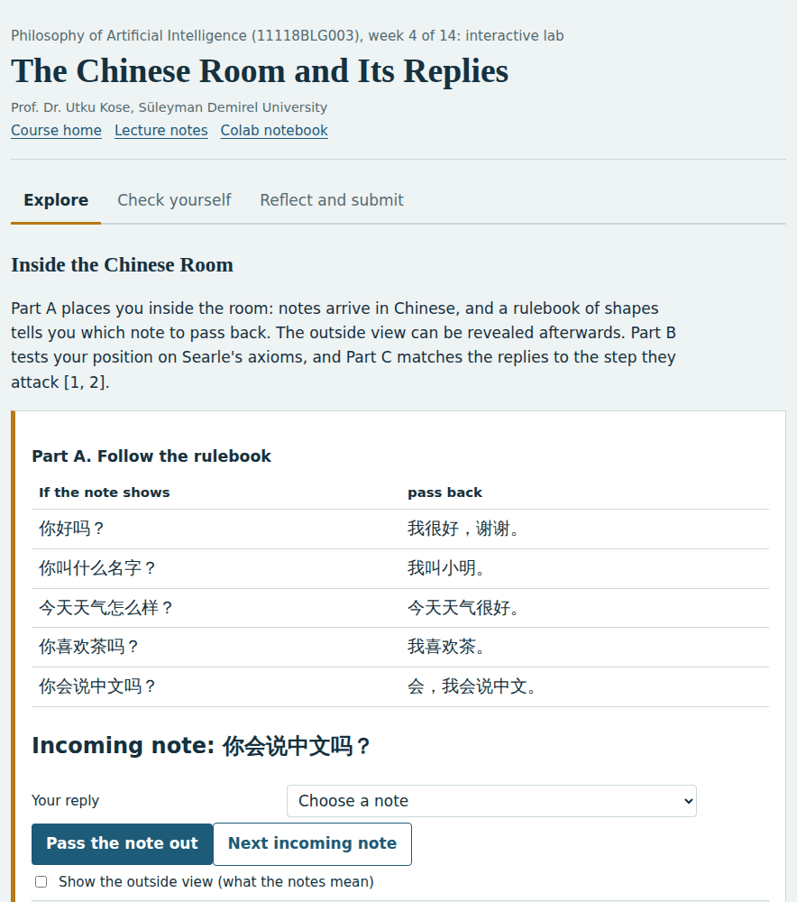
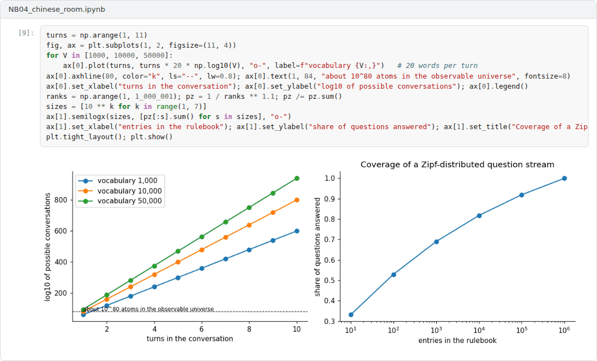

# Week 04: The Chinese Room and Its Replies

**Philosophy of Artificial Intelligence (11118BLG003)**  
Prof. Dr. Utku Kose, Süleyman Demirel University

   

## Overview

Searle's Chinese Room is the most discussed argument against strong AI. This week reconstructs the argument, examines the main replies and Searle's answers, and asks what the argument shows about present language models [1, 2, 3].

**Estimated study time:** 6 to 8 hours.

## Learning outcomes

By the end of the week, students are expected to reconstruct the Chinese Room argument and its later axiomatic form, to explain the systems, robot and brain simulator replies and Searle's answers, to assess the luminous room objection, and to state precisely which conclusion the argument supports.

## Study path

| Step | Activity | Suggested time |
|---|---|---|
| 1 | Read the lecture below or the [PDF version](Week04_Lecture_Notes.pdf) | 90 minutes |
| 2 | Explore the [interactive lab](https://utkukose.github.io/philosophy-of-ai-NB-lecture/weeks/week-04/lab.html) | 45 minutes |
| 3 | Work through the [Colab notebook](https://colab.research.google.com/github/utkukose/philosophy-of-ai-NB-lecture/blob/main/weeks/week-04/NB04_chinese_room.ipynb) and its exercises | 2 to 3 hours |
| 4 | Take the self-assessment in the lab (tab: Check yourself) | 20 minutes |
| 5 | Write the reflection, export the learning log and complete the weekly task | 60 minutes |

## Week at a glance

## Lecture

### The argument

Searle imagined himself locked in a room with a large rulebook written in English [1]. Batches of Chinese characters are passed in, and by following the rules, which relate shapes to shapes, he passes back other Chinese characters. The rules are so good that people outside, who read the answers, cannot tell them from those of a native speaker. Yet Searle understands no Chinese: He manipulates symbols by their shapes alone. Since a computer running a program does nothing more than Searle does in the room, running a program cannot be sufficient for understanding. The target is strong AI, not the usefulness of AI.

A decade later, Searle presented the reasoning as an argument from axioms [2]. Programs are formal, or syntactic. Minds have mental contents, or semantics. Syntax by itself is neither constitutive of nor sufficient for semantics. Therefore programs are neither constitutive of nor sufficient for minds. The lab of this week puts students inside the room and then asks them to test their position on these axioms.

<b>Check your understanding.</b> What does the person in the Chinese Room do?

A. Learns Chinese gradually  
B. Follows syntactic rules to produce correct Chinese answers without understanding Chinese  
C. Translates Chinese into English  
D. Refuses to answer  

**Answer: B.** The person manipulates symbols by their shape alone.

### The replies

Searle discussed several replies in the original article [1]. The systems reply grants that the man does not understand but holds that the whole system, man, rulebook and papers together, does. Searle answered that he could memorise the rules and do everything in his head and would still understand nothing. The robot reply proposes putting the program in a robot with cameras and motors, so that its symbols are connected to the world. Searle answered that the new inputs are just more symbols to him. The brain simulator reply proposes a program that simulates the firing of neurons in a Chinese speaker's brain. Searle answered that simulating the formal structure of neuron firings misses the brain's causal powers, and he illustrated the point with a system of water pipes and valves.

Churchland and Churchland argued that the third axiom is not self-evident but an empirical claim, and they offered an analogy [4]. A person waving a magnet in a dark room produces electromagnetic waves but no visible light; it would be a mistake to conclude that light is not electromagnetic radiation. Intuitions about slow and small cases can mislead about fast and large ones. Preston and Bishop collected later essays that continue the debate from many directions [3].

<b>Check your understanding.</b> What does the systems reply claim?

A. Understanding belongs to the whole system, not to the person alone  
B. The person understands after all  
C. Rulebooks cannot exist  
D. Only robots can understand  

**Answer: A.** Searle answered by imagining the person memorising the rulebook.

### What the argument shows and what it does not

Precision about the conclusion matters. The argument claims that running a program is not sufficient for understanding. It does not claim that machines cannot understand, since Searle held that a machine with causal powers equivalent to those of brains could think. It also leaves open what those causal powers are, which critics regard as a weakness. The argument relies on an intuition, that the man in the room does not understand, and on a step from the man to the system. Most replies attack that step or the reliability of the intuition, as Figure 4.1 shows. Harnad read the room as an illustration of a more specific problem, namely how symbols can be connected to what they mean, which is the topic of Week 5 [5].

*Figure 4.1. Searle's axiomatic argument and the points at which four replies attack it [2, 4].*

<b>Check your understanding.</b> What is Searle&#x27;s conclusion from the argument?

A. Machines can never think  
B. Brains are not machines  
C. Programs always understand  
D. Syntax is not by itself sufficient for semantics  

**Answer: D.** Searle allows that some machines, such as brains, think, but denies that running a program suffices.

### The room and language models

Large language models are trained on text alone and produce fluent text by transforming symbols, so the argument seems to apply to them directly. There are also differences. No person wrote their rules; the rules are learned statistical regularities distributed over billions of parameters. Defenders of the systems reply argue that whatever understanding exists would belong to the trained system as a whole, not to any component. Critics answer that learning the rules does not change their syntactic character. The notebook builds two rooms, one that only stores question-answer pairs and one that composes answers from a small model of a world, and compares how they handle new questions. Both only manipulate symbols, but they differ in how they generalise, which is one way of making the debate empirical.

> **Pause and reflect.** In the lab, did following the rulebook feel like understanding? Does your answer tell you anything about a system that follows billions of rules at high speed?

<b>Check your understanding.</b> How would a proponent of the argument view fluent text from a language model?

A. As proof of understanding  
B. As producing text by manipulating tokens, which does not by itself establish understanding  
C. As impossible  
D. As evidence of consciousness  

**Answer: B.** Critics answer that the room is a poor model of large learned systems.

## Interactive lab

Part A places you inside the room: notes arrive in Chinese, and a rulebook of shapes tells you which note to pass back. The outside view can be revealed afterwards. Part B tests your position on Searle's axioms, and Part C matches the replies to the step they attack [1, 2].

[Open the interactive lab](https://utkukose.github.io/philosophy-of-ai-NB-lecture/weeks/week-04/lab.html)

## Colab notebook

The notebook builds two rooms for a small symbolic world: one that stores question-answer pairs, like a pure rulebook, and one that composes answers from a model of the world. It measures how each handles questions it has never seen and computes the size of a complete rulebook [1, 6].

Screenshots of the executed notebook:

## Self-assessment and reflection

The lab contains a 6-question self-assessment with instant feedback and a confidence rating for each answer. A confident but wrong answer marks the first topic to revisit. The reflection prompts below are also available in the lab, where answers are saved in the browser and can be exported as a learning log.

1. Which reply do you find strongest, and what would Searle say in response? Write the exchange as a short dialogue.
2. Does the difference between the two rooms in the notebook matter for the argument? Why or why not?
3. Apply the argument to a language model assistant you use. Which premise would its defenders reject?

## Weekly task and submission

Write an argument analysis of about 600 words that reconstructs the Chinese Room argument in numbered form, evaluates the systems reply and the luminous room objection, and states whether the argument applies to present language models. Attach the notebook with both exercises completed.

The weekly task supports self-learning and builds a personal portfolio. When the course is followed with the instructor during an active semester, the task can be sent together with the exported learning log to utkukose@sdu.edu.tr or utkukose@gmail.com for evaluation.

## Research and report assignment (optional)

**The systems reply after four decades.** Survey the main defences and criticisms of the systems reply and decide whether the reply succeeds against the Chinese Room [1, 3].

This research assignment is optional and supports self-learning. When the related weeks are followed within the course during an active semester, the report can be sent to utkukose@sdu.edu.tr or utkukose@gmail.com for evaluation. Unless the assignment states otherwise, a report has 1500 to 2500 words, follows the structure of an academic paper, cites at least six scholarly or official sources in square brackets and ends with a reference list.

## References

[1] Searle, J. R. (1980). Minds, brains, and programs. *Behavioral and Brain Sciences*, 3(3), 417-424. <https://doi.org/10.1017/S0140525X00005756>

[2] Searle, J. R. (1990). Is the brain's mind a computer program?. *Scientific American*, 262(1), 26-31. <https://doi.org/10.1038/scientificamerican0190-26>

[3] Preston, J., & Bishop, M. (Eds.) (2002). *Views into the Chinese Room: New Essays on Searle and Artificial Intelligence*. Clarendon Press.

[4] Churchland, P. M., & Churchland, P. S. (1990). Could a machine think?. *Scientific American*, 262(1), 32-37. <https://doi.org/10.1038/scientificamerican0190-32>

[5] Harnad, S. (1990). The symbol grounding problem. *Physica D: Nonlinear Phenomena*, 42(1-3), 335-346. <https://doi.org/10.1016/0167-2789(90)90087-6>

[6] Block, N. (1981). Psychologism and behaviorism. *The Philosophical Review*, 90(1), 5-43. <https://doi.org/10.2307/2184371>

---

Philosophy of Artificial Intelligence. Prof. Dr. Utku Kose, Süleyman Demirel University. ORCID [0000-0002-9652-6415](https://orcid.org/0000-0002-9652-6415). Content licensed under CC BY 4.0. This course is updated in line with current developments in the field. Last update: September 2026.
