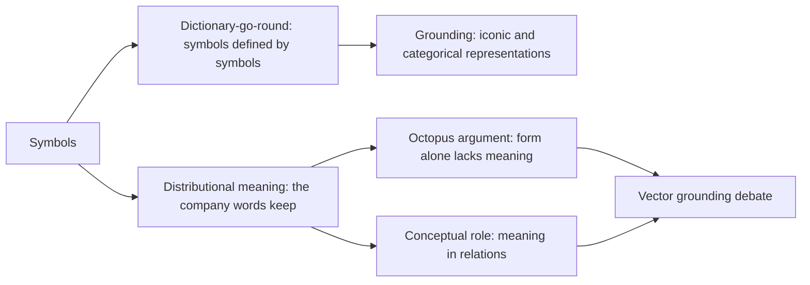
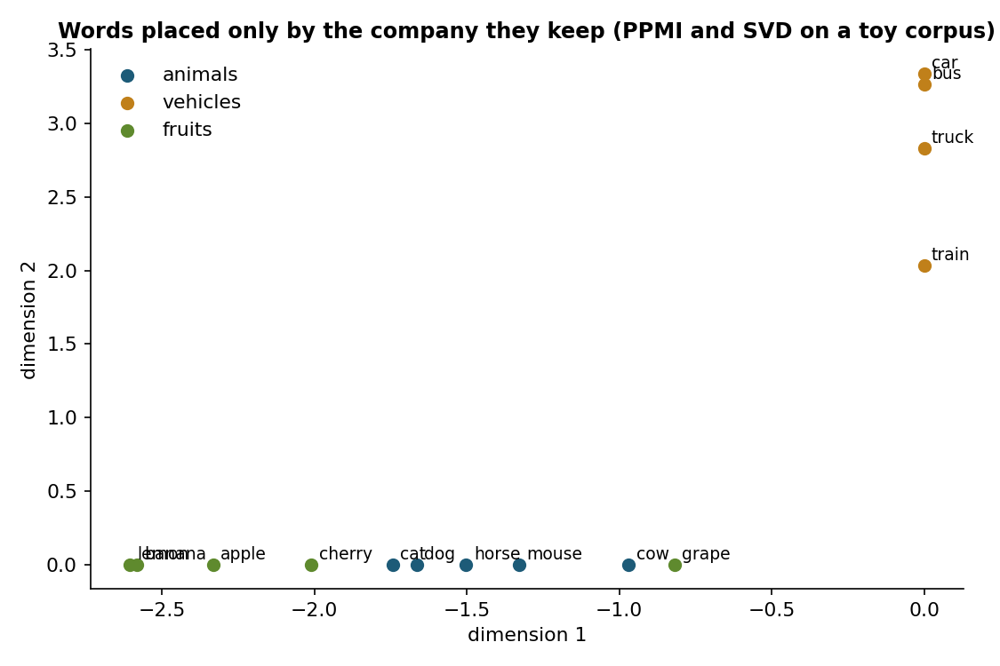
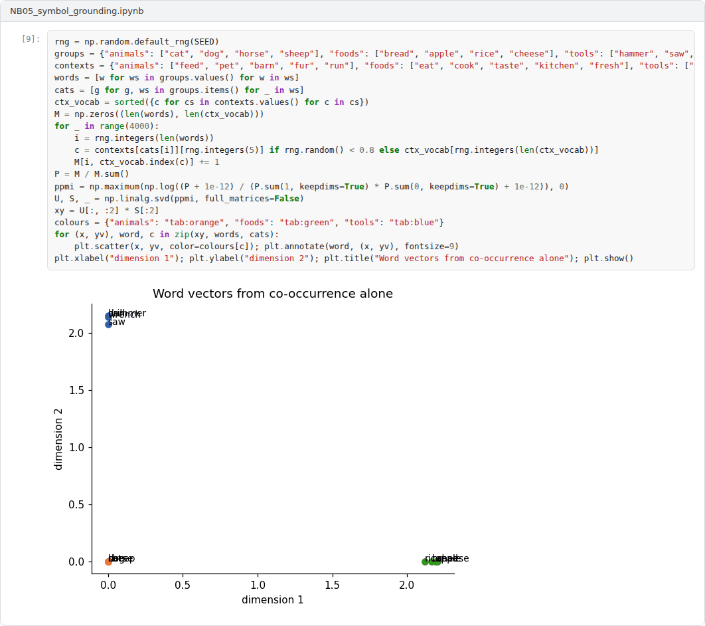

# Week 05: Symbol Grounding and Meaning

**Philosophy of Artificial Intelligence (11118BLG003)**  
Prof. Dr. Utku Kose, Süleyman Demirel University

   

## Overview

How can the symbols of a system mean anything to the system itself? This week examines the symbol grounding problem, the distributional view of meaning that underlies language models, the argument that form alone cannot yield meaning, and replies that locate meaning in conceptual roles or learned relations [1, 2, 3].

**Estimated study time:** 6 to 8 hours.

## Learning outcomes

By the end of the week, students are expected to state the symbol grounding problem and Harnad's proposed solution, to compute distributional word representations and interpret their similarities, to reconstruct the octopus argument of Bender and Koller, and to evaluate replies based on conceptual roles and vector grounding.

## Study path

| Step | Activity | Suggested time |
|---|---|---|
| 1 | Read the lecture below or the [PDF version](Week05_Lecture_Notes.pdf) | 90 minutes |
| 2 | Explore the [interactive lab](https://utkukose.github.io/philosophy-of-ai-NB-lecture/weeks/week-05/lab.html) | 45 minutes |
| 3 | Work through the [Colab notebook](https://colab.research.google.com/github/utkukose/philosophy-of-ai-NB-lecture/blob/main/weeks/week-05/NB05_symbol_grounding.ipynb) and its exercises | 2 to 3 hours |
| 4 | Take the self-assessment in the lab (tab: Check yourself) | 20 minutes |
| 5 | Write the reflection, export the learning log and complete the weekly task | 60 minutes |

## Week at a glance

## Lecture

### The grounding problem

Harnad asked how the meanings of symbols in a formal system can be intrinsic to the system rather than parasitic on the meanings in the heads of its users [1]. He illustrated the problem with a dictionary-go-round: Someone who knows no Chinese and tries to learn it from a Chinese-Chinese dictionary will pass from one meaningless string to another without end, because every definition consists of further undefined symbols. The Chinese Room of Week 4 can be read as a case of the same problem.

Harnad proposed a hybrid solution. Elementary symbols are grounded in two kinds of non-symbolic representation: iconic representations, which are analogues of sensory projections, and categorical representations, which are feature detectors that pick out the invariant properties of categories. Higher-level symbols are then composed from grounded ones, so that a new word such as zebra can inherit meaning from horse and stripes. Grounding, on this view, requires a causal connection between symbols and the things they are about.

<b>Check your understanding.</b> What is the symbol grounding problem?

A. How symbols can be stored efficiently  
B. How the meanings of symbols can be intrinsic to a system rather than borrowed from the minds of interpreters  
C. How to translate between languages  
D. How to compress text  

**Answer: B.** Harnad compared the situation to learning Chinese from a Chinese-Chinese dictionary alone.

### Meaning from distribution

A different tradition locates meaning in patterns of use. Harris proposed that words that occur in similar contexts tend to have similar meanings [2]. Modern vector semantics turns the idea into computation: Each word is represented by the contexts in which it occurs, often after weighting co-occurrence counts by positive pointwise mutual information and reducing their dimension. Figure 5.1 shows the result for a toy corpus: Animals, vehicles and fruits separate into regions, although the program has never seen an animal, a vehicle or a fruit. Large language models are distributional learners on an enormous scale, which is why the grounding problem has returned with new urgency.

*Figure 5.1. Toy corpus words positioned by their co-occurrence statistics alone. The categories separate even though the program has no access to animals, vehicles or fruits [2].*

<b>Check your understanding.</b> What does the distributional hypothesis state?

A. Words are distributed randomly  
B. Meaning comes only from perception  
C. Words that occur in similar contexts tend to have similar meanings  
D. Word frequency determines meaning  

**Answer: C.** The hypothesis underlies word embeddings and language models.

### Form and meaning

Bender and Koller argued that a system trained only on linguistic form cannot learn meaning, understood as the relation between form and something outside language, such as communicative intent [3]. Their thought experiment features a hyperintelligent octopus that taps an undersea cable between two people stranded on separate islands. The octopus learns the statistical patterns of their messages well enough to impersonate one of them. When the other asks for help to build a device from local materials or to escape a bear, the octopus fails, because it has never had access to what the words are about.

Others resist the conclusion. Piantadosi and Hill argued that meaning need not depend on reference, since in conceptual role theories the meaning of a concept is fixed by its relations to other concepts, and language models may capture such relations [4]. Mollo and Millière distinguished several senses of grounding and argued that the relevant sense for language models is referential grounding, whose conditions do not require multimodal input or embodiment [5]. The debate turns on what meaning is, not only on what the models do.

<b>Check your understanding.</b> What does Bender and Koller&#x27;s octopus argument claim?

A. Octopuses understand language  
B. A system trained only on linguistic form cannot learn meaning, understood as the relation between form and communicative intent  
C. Form and meaning are identical  
D. Language models are grounded by design  

**Answer: B.** The argument separates form from meaning and asks where meaning could come from.

### Grounding as a matter of degree

The positions can be compared by asking what connects symbols to the world in each case. For Harnad, the connection runs through perception. For distributional semantics, it runs through the texts that people wrote about the world, so it is indirect. For conceptual role theories, relations among concepts may carry part of the meaning even without reference. The lab makes the contrast concrete: One part computes similarities from co-occurrence alone, and another follows chains of definitions until they either loop or reach words marked as grounded in perception. The notebook then tests whether a mapping learned from a few grounded words transfers to others.

> **Pause and reflect.** When a language model describes the taste of a lemon, is it referring to lemons? What would have to be added for the answer to change?

<b>Check your understanding.</b> What does the view that grounding comes in degrees suggest?

A. Grounding is all or nothing  
B. Only humans are grounded  
C. Grounding requires consciousness  
D. Systems can be partly grounded through different routes, such as perception, action or relations to the world  

**Answer: D.** Graded views change the question from whether a system is grounded to how and how far.

## Interactive lab

Part A computes word similarities from a small corpus with a sliding context window. Part B follows the definitions of a toy dictionary: without grounded words the chains only return to other symbols, while marking some words as grounded in perception gives the chains an end [1, 2].

[Open the interactive lab](https://utkukose.github.io/philosophy-of-ai-NB-lecture/weeks/week-05/lab.html)

## Colab notebook

The notebook builds distributional word vectors from a generated corpus, inspects their neighbourhoods and then grounds a few words in simple perceptual features to test whether the grounding transfers to words that were never grounded [1, 2, 5].

Screenshots of the executed notebook:

## Self-assessment and reflection

The lab contains a 6-question self-assessment with instant feedback and a confidence rating for each answer. A confident but wrong answer marks the first topic to revisit. The reflection prompts below are also available in the lab, where answers are saved in the browser and can be exported as a learning log.

1. Which position on meaning from this week do you find most plausible for language models, and what evidence would change your mind?
2. The notebook transferred features from grounded to ungrounded words. Is that genuine grounding or a sophisticated dictionary-go-round?
3. Choose a technical term from your field. How did you come to understand it: through definitions, through use, through perception or through practice?

## Weekly task and submission

Write about 500 words comparing Harnad's grounding requirement with the conceptual role view of Piantadosi and Hill, applied to a language model answering questions in your field. Use the notebook results as evidence where appropriate and attach the completed notebook.

The weekly task supports self-learning and builds a personal portfolio. When the course is followed with the instructor during an active semester, the task can be sent together with the exported learning log to utkukose@sdu.edu.tr or utkukose@gmail.com for evaluation.

## Research and report assignment (optional)

**Do multimodal models ground their symbols?.** Examine whether models trained on images and text meet the conditions of the grounding requirement, contrasting Harnad's view with the vector grounding debate [1, 3, 5].

This research assignment is optional and supports self-learning. When the related weeks are followed within the course during an active semester, the report can be sent to utkukose@sdu.edu.tr or utkukose@gmail.com for evaluation. Unless the assignment states otherwise, a report has 1500 to 2500 words, follows the structure of an academic paper, cites at least six scholarly or official sources in square brackets and ends with a reference list.

## References

[1] Harnad, S. (1990). The symbol grounding problem. *Physica D: Nonlinear Phenomena*, 42(1-3), 335-346. <https://doi.org/10.1016/0167-2789(90)90087-6>

[2] Harris, Z. S. (1954). Distributional structure. *Word*, 10(2-3), 146-162. <https://doi.org/10.1080/00437956.1954.11659520>

[3] Bender, E. M., & Koller, A. (2020). Climbing towards NLU: On meaning, form, and understanding in the age of data. In *Proceedings of the 58th Annual Meeting of the Association for Computational Linguistics* (pp. 5185-5198). <https://doi.org/10.18653/v1/2020.acl-main.463>

[4] Piantadosi, S. T., & Hill, F. (2022). Meaning without reference in large language models. arXiv preprint arXiv:2208.02957. <https://arxiv.org/abs/2208.02957>

[5] Mollo, D. C., & Millière, R. (2023). The vector grounding problem. arXiv preprint arXiv:2304.01481. <https://arxiv.org/abs/2304.01481>

---

Philosophy of Artificial Intelligence. Prof. Dr. Utku Kose, Süleyman Demirel University. ORCID [0000-0002-9652-6415](https://orcid.org/0000-0002-9652-6415). Content licensed under CC BY 4.0. This course is updated in line with current developments in the field. Last update: September 2026.
