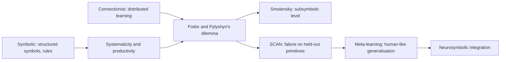
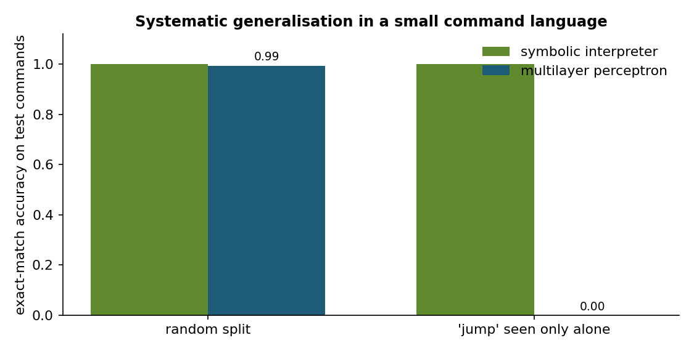
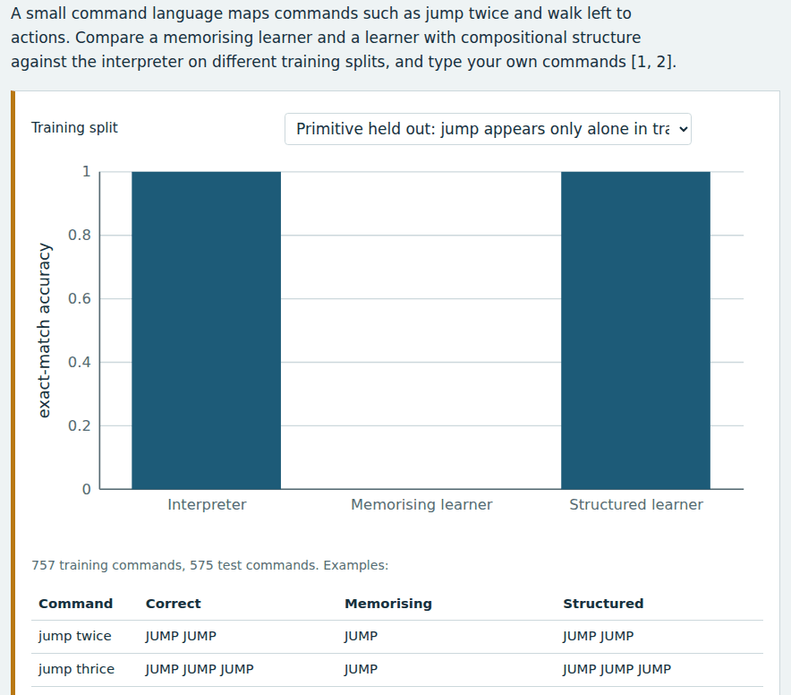
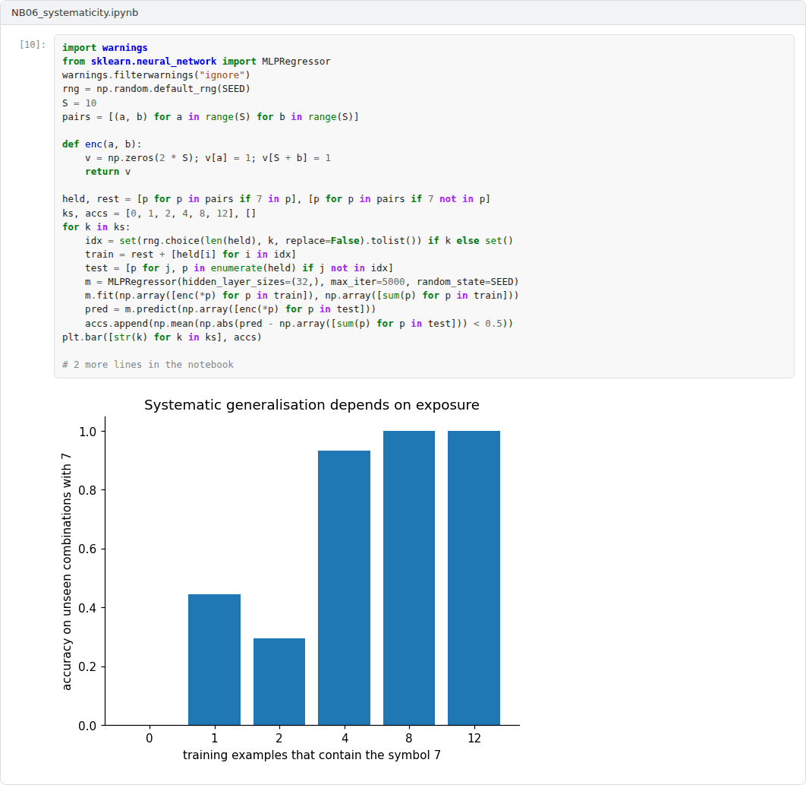

# Week 06: Symbolic and Connectionist AI: Systematicity and Compositionality

**Philosophy of Artificial Intelligence (11118BLG003)**  
Prof. Dr. Utku Kose, Süleyman Demirel University

   

## Overview

Two traditions have competed to explain intelligence: symbolic systems that manipulate structured representations and connectionist networks that learn distributed ones. This week examines their central dispute, whether networks can explain the systematicity of thought, and the empirical tests that now bear on it [1, 2, 3].

**Estimated study time:** 6 to 8 hours.

## Learning outcomes

By the end of the week, students are expected to contrast symbolic and connectionist architectures, to reconstruct the systematicity argument of Fodor and Pylyshyn and Smolensky's reply, to explain why compositional generalisation tests such as SCAN bear on the argument, and to evaluate recent evidence and neurosymbolic proposals.

## Study path

| Step | Activity | Suggested time |
|---|---|---|
| 1 | Read the lecture below or the [PDF version](Week06_Lecture_Notes.pdf) | 90 minutes |
| 2 | Explore the [interactive lab](https://utkukose.github.io/philosophy-of-ai-NB-lecture/weeks/week-06/lab.html) | 45 minutes |
| 3 | Work through the [Colab notebook](https://colab.research.google.com/github/utkukose/philosophy-of-ai-NB-lecture/blob/main/weeks/week-06/NB06_systematicity.ipynb) and its exercises | 2 to 3 hours |
| 4 | Take the self-assessment in the lab (tab: Check yourself) | 20 minutes |
| 5 | Write the reflection, export the learning log and complete the weekly task | 60 minutes |

## Week at a glance

## Lecture

### Two traditions

Symbolic AI treats intelligence as the manipulation of structured symbols by rules, in the tradition of the physical symbol system hypothesis from Week 3. Connectionism treats it as the result of learning in networks of simple units whose knowledge is stored in the strengths of their connections. The volumes on parallel distributed processing by Rumelhart, McClelland and colleagues made connectionism a serious rival in the 1980s by showing that networks could learn, generalise and degrade gracefully [4]. Present deep learning systems, including language models, descend from this tradition.

<b>Check your understanding.</b> How does connectionism model cognition?

A. With networks of simple units and distributed representations  
B. With explicit rules only  
C. With lookup tables  
D. With formal logic proofs  

**Answer: A.** The classical tradition instead uses structured symbolic representations.

### The systematicity argument

Fodor and Pylyshyn argued that human thought has two properties that a cognitive architecture must explain [1]. Thought is productive: People can think indefinitely many new thoughts. Thought is systematic: Anyone who can think that John loves Mary can also think that Mary loves John. Classical architectures explain both properties, because their representations have a combinatorial syntax and semantics: the same parts are recombined by the same rules. Connectionist networks, they argued, face a dilemma. Either they implement a classical architecture, in which case they offer no new theory of cognition, or they do not, in which case they fail to explain systematicity.

Smolensky replied that connectionist models work at a subsymbolic level, below the level of concepts, and that structured representations can be encoded in distributed patterns of activity [2]. On his proposal, symbolic descriptions are approximations of the underlying dynamics rather than the mechanism itself. The dispute therefore concerns explanation as well as performance: whether systematicity is guaranteed by the architecture or merely possible after suitable training.

<b>Check your understanding.</b> What is systematicity?

A. Thinking faster than others  
B. The ability to think John loves Mary goes with the ability to think Mary loves John  
C. Memorising long lists  
D. Speaking many languages  

**Answer: B.** Fodor and Pylyshyn argued that connectionism either fails to explain systematicity or merely implements a classical architecture.

### Empirical tests

Lake and Baroni turned the argument into an experiment [3]. Their SCAN benchmark maps commands such as jump twice and walk left to action sequences. Sequence-to-sequence networks generalised well when test commands were drawn at random, but failed when a primitive such as jump had been seen only in isolation during training and had to be combined with modifiers at test time. People, by contrast, generalise from a single example. Marcus used such results in a broader critique that listed the limitations of deep learning, including limited transfer and the absence of hierarchical structure [5].

Later work complicated the picture. Lake and Baroni showed that a standard neural network trained with meta-learning for compositionality, across many tasks that each required systematic generalisation, reached human-like performance on new instruction-learning tasks [6]. Systematicity, on this evidence, is achievable by networks but depends on how they are trained. Figure 6.1 reproduces the original contrast on a small command language.

*Figure 6.1. Exact-match accuracy of a symbolic interpreter and a multilayer perceptron on a random split and on a split in which the primitive jump appears only alone during training [3].*

<b>Check your understanding.</b> What did SCAN-style tests find for standard sequence models?

A. They fail on random splits  
B. They generalise perfectly in all cases  
C. They generalise well on random splits but fail when a primitive appears in new combinations  
D. They cannot be trained  

**Answer: C.** The gap between random and systematic splits revived the systematicity debate.

### Hybrid prospects

d'Avila Garcez and Lamb described neurosymbolic AI as a third wave that integrates learning with reasoning over structured representations [7]. For philosophy of mind, the lesson of the debate is that systematicity has become an empirical and architecture-sensitive question. The lab compares three systems on the same command language: a hand-written interpreter, a learner that memorises examples and a learner that acquires word meanings but composes them with fixed grammatical rules. The pattern of their successes and failures shows what compositional structure contributes.

> **Pause and reflect.** If a network becomes systematic only after training on many systematic tasks, has it explained systematicity or inherited it from its training?

<b>Check your understanding.</b> What did meta-learning for compositionality show in 2023?

A. Networks can never generalise systematically  
B. Symbolic rules are unnecessary for anything  
C. Only large models generalise  
D. A standard network trained by meta-learning can reach human-like systematic generalisation  

**Answer: D.** The result suggests that systematicity can be learned, given the right training regime.

## Interactive lab

A small command language maps commands such as jump twice and walk left to actions. Compare a memorising learner and a learner with compositional structure against the interpreter on different training splits, and type your own commands [1, 3].

[Open the interactive lab](https://utkukose.github.io/philosophy-of-ai-NB-lecture/weeks/week-06/lab.html)

## Colab notebook

The notebook generates all commands of the small language, trains a multilayer perceptron that predicts the action at every output position, and compares its exact-match accuracy with a symbolic interpreter on a random split and on the held-out primitive split [1, 3].

Screenshots of the executed notebook:

## Self-assessment and reflection

The lab contains a 6-question self-assessment with instant feedback and a confidence rating for each answer. A confident but wrong answer marks the first topic to revisit. The reflection prompts below are also available in the lab, where answers are saved in the browser and can be exported as a learning log.

1. Which system in the lab behaves most like a person learning a new verb? What does that suggest about the architecture of human cognition?
2. Does the success of meta-learning answer Fodor and Pylyshyn's dilemma, or does it choose its first horn?
3. Describe a compositional generalisation that matters in your field and how you would test a model for it.

## Weekly task and submission

Write about 500 words evaluating the systematicity argument in the light of the notebook results and the evidence of Lake and Baroni. State which horn of the dilemma present neural networks fall under, if any. Attach the notebook with both exercises completed.

The weekly task supports self-learning and builds a personal portfolio. When the course is followed with the instructor during an active semester, the task can be sent together with the exported learning log to utkukose@sdu.edu.tr or utkukose@gmail.com for evaluation.

## Research and report assignment (optional)

**Neurosymbolic systems and the systematicity challenge.** Review how neurosymbolic and meta-learning approaches respond to the systematicity argument and assess which horn of the dilemma they choose [1, 6, 7].

This research assignment is optional and supports self-learning. When the related weeks are followed within the course during an active semester, the report can be sent to utkukose@sdu.edu.tr or utkukose@gmail.com for evaluation. Unless the assignment states otherwise, a report has 1500 to 2500 words, follows the structure of an academic paper, cites at least six scholarly or official sources in square brackets and ends with a reference list.

## References

[1] Fodor, J. A., & Pylyshyn, Z. W. (1988). Connectionism and cognitive architecture: A critical analysis. *Cognition*, 28(1-2), 3-71. <https://doi.org/10.1016/0010-0277(88)90031-5>

[2] Smolensky, P. (1988). On the proper treatment of connectionism. *Behavioral and Brain Sciences*, 11(1), 1-23. <https://doi.org/10.1017/S0140525X00052432>

[3] Lake, B., & Baroni, M. (2018). Generalization without systematicity: On the compositional skills of sequence-to-sequence recurrent networks. In *Proceedings of the 35th International Conference on Machine Learning, PMLR 80* (pp. 2873-2882). <https://arxiv.org/abs/1711.00350>

[4] Rumelhart, D. E., McClelland, J. L., & the PDP Research Group (1986). *Parallel Distributed Processing: Explorations in the Microstructure of Cognition, Volume 1: Foundations*. MIT Press.

[5] Marcus, G. (2018). Deep learning: A critical appraisal. arXiv preprint arXiv:1801.00631. <https://arxiv.org/abs/1801.00631>

[6] Lake, B. M., & Baroni, M. (2023). Human-like systematic generalization through a meta-learning neural network. *Nature*, 623(7985), 115-121. <https://doi.org/10.1038/s41586-023-06668-3>

[7] d'Avila Garcez, A., & Lamb, L. C. (2023). Neurosymbolic AI: The 3rd wave. *Artificial Intelligence Review*, 56(11), 12387-12406. <https://doi.org/10.1007/s10462-023-10448-w>

---

Philosophy of Artificial Intelligence. Prof. Dr. Utku Kose, Süleyman Demirel University. ORCID [0000-0002-9652-6415](https://orcid.org/0000-0002-9652-6415). Content licensed under CC BY 4.0. This course is updated in line with current developments in the field. Last update: September 2026.
