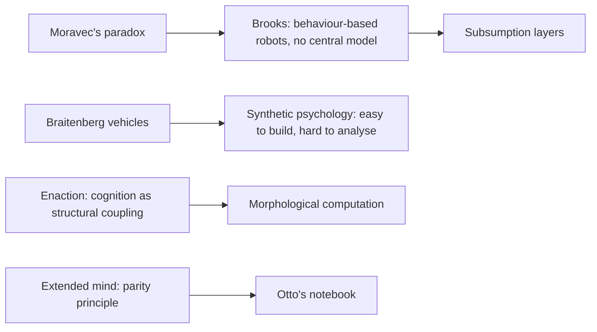
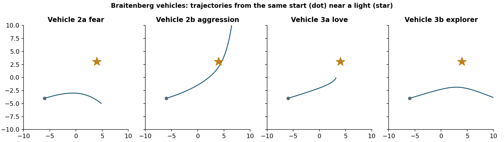
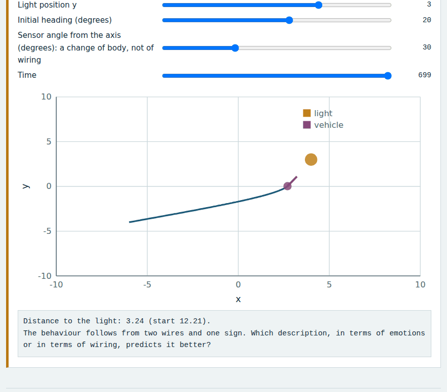
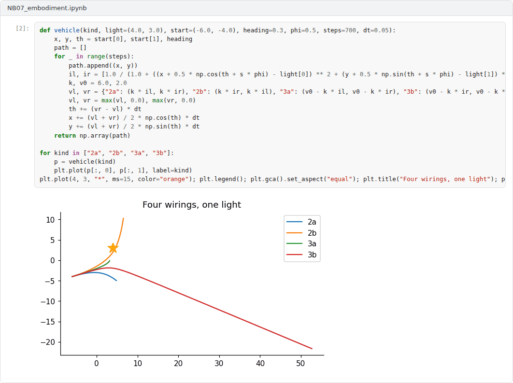

# Week 07: Embodiment, Situatedness and the Extended Mind

**Philosophy of Artificial Intelligence (11118BLG003)**  
Prof. Dr. Utku Kose, Süleyman Demirel University

   

## Overview

Classical AI treated intelligence as reasoning over internal representations. This week examines the alternative that intelligence arises from bodies acting in environments: behaviour-based robotics, Braitenberg's synthetic psychology, enactivism and the thesis that the mind extends beyond the skull [1, 2, 3].

**Estimated study time:** 6 to 8 hours.

## Learning outcomes

By the end of the week, students are expected to explain Brooks's case against central representation and the subsumption architecture, to derive the behaviour of Braitenberg vehicles from their wiring, to describe the enactive and morphological views of cognition, and to evaluate the parity argument for the extended mind.

## Study path

| Step | Activity | Suggested time |
|---|---|---|
| 1 | Read the lecture below or the [PDF version](Week07_Lecture_Notes.pdf) | 90 minutes |
| 2 | Explore the [interactive lab](https://utkukose.github.io/philosophy-of-ai-NB-lecture/weeks/week-07/lab.html) | 45 minutes |
| 3 | Work through the [Colab notebook](https://colab.research.google.com/github/utkukose/philosophy-of-ai-NB-lecture/blob/main/weeks/week-07/NB07_embodiment.ipynb) and its exercises | 2 to 3 hours |
| 4 | Take the self-assessment in the lab (tab: Check yourself) | 20 minutes |
| 5 | Write the reflection, export the learning log and complete the weekly task | 60 minutes |

## Week at a glance

## Lecture

### Intelligence without representation

Brooks argued that AI had focused on the wrong problems [1]. Instead of building disembodied reasoners with central world models, researchers should build complete creatures that act in the real world, starting with simple behaviours and adding layers. In his subsumption architecture, each layer connects perception directly to action, such as avoiding obstacles or wandering, and higher layers can suppress or override lower ones. The robots used the world itself as their source of information instead of maintaining detailed internal models.

Moravec observed a related asymmetry, often called Moravec's paradox [4]. Tasks that people find intellectually hard, such as chess, turned out to be comparatively easy for computers, while tasks that people find effortless, such as perceiving and moving, turned out to be very hard. Evolution spent far longer refining sensorimotor skills than abstract reasoning.

<b>Check your understanding.</b> What characterises Brooks&#x27;s subsumption architecture?

A. A central world model and a planner  
B. Layers of simple behaviours coupled directly to sensing and acting, without a central world model  
C. Symbolic theorem proving  
D. Pure reinforcement learning  

**Answer: B.** Brooks argued that the world is its own best model.

### Synthetic psychology

Braitenberg described a series of imaginary vehicles, each with sensors connected to motors by simple wiring [2]. A vehicle with two light sensors, each driving the wheel on its own side more strongly when light is brighter, turns away from light and seems to fear it. Crossing the wires makes it turn towards the light and rush at it, as if aggressive. Making the connections inhibitory produces a vehicle that approaches the light and slows down, facing it as if in love, or one that approaches and then turns away, like an explorer. Figure 7.1 shows these trajectories.

Braitenberg drew a methodological moral, the law of uphill analysis and downhill invention: It is easier to build a mechanism that produces a behaviour than to infer the mechanism from the behaviour. Observers readily attribute emotions and intentions to the vehicles, even though the mechanism is transparent to the designer. The lab lets students rewire the vehicles and change their morphology, and Week 14 returns to the attribution of intentions.

*Figure 7.1. Trajectories of four Braitenberg vehicles that differ only in whether their sensor-motor connections are crossed and whether they excite or inhibit [2].*

<b>Check your understanding.</b> What is Braitenberg&#x27;s law of uphill analysis and downhill invention?

A. Analysis is always easier than synthesis  
B. Vehicles should drive downhill  
C. Behaviour cannot be analysed  
D. It is easier to build a mechanism that produces behaviour than to infer the mechanism from the behaviour  

**Answer: D.** Simple wiring can produce behaviour that observers describe in rich psychological terms.

### The embodied and enactive mind

Varela, Thompson and Rosch proposed that cognition is enaction: the bringing forth of a world through the history of structural coupling between an organism and its environment, grounded in sensorimotor capacities [5]. Cognition, on this view, is not the representation of a pre-given world by a pre-given mind. Pfeifer and Bongard developed the engineering side of the idea and argued that the shape and material of a body take over part of the work that would otherwise require computation, a phenomenon they called morphological computation [6]. A change in the angle of a vehicle's sensors, as in the lab, can change its behaviour as much as a change in its wiring.

<b>Check your understanding.</b> What does enactivism claim?

A. Cognition arises from the dynamic interaction of an embodied agent with its environment  
B. Cognition is computation over internal symbols  
C. The body is irrelevant to the mind  
D. Only language matters  

**Answer: A.** Enactivism emphasises sense-making in activity rather than internal representation.

### The extended mind

Clark and Chalmers asked where the mind stops and the rest of the world begins [3]. Their example contrasts Inga, who remembers the address of a museum, with Otto, who has a memory impairment and consults a notebook he always carries. They proposed a parity principle: If a part of the world functions as a process that we would call cognitive if it occurred in the head, then that part of the world is part of the cognitive process. Otto's notebook, on this view, is part of his memory.

The thesis raises questions about AI systems that rely on external tools and stores, and about people who rely on AI systems. Critics object that the notebook lacks the integration and automatic trust that mark biological memory. The notebook of this week simulates agents with limited internal memory that can consult an external store, which makes the parity principle a question about performance and cost.

> **Pause and reflect.** Is a search engine you consult daily part of your memory in the sense of Clark and Chalmers? Which of their conditions does it meet?

<b>Check your understanding.</b> According to the extended mind thesis, when can a notebook be part of a cognitive process?

A. Never  
B. Only if it is digital  
C. When it is reliably available and trusted and plays the role memory would play  
D. Only for experts  

**Answer: C.** Clark and Chalmers argued from the parity between Otto's notebook and biological memory.

## Interactive lab

Choose the wiring of a two-sensor vehicle, move the light and change the angle of the sensors. Scrub through time to follow the vehicle. The label on each wiring is the emotion that Braitenberg suggested an observer would attribute [2, 6].

[Open the interactive lab](https://utkukose.github.io/philosophy-of-ai-NB-lecture/weeks/week-07/lab.html)

## Colab notebook

The notebook simulates Braitenberg vehicles, builds a small subsumption controller whose layers can be switched on and off, and models an agent with limited internal memory that can consult an external store, in the spirit of the parity principle [1, 2, 3].

Screenshots of the executed notebook:

## Self-assessment and reflection

The lab contains a 6-question self-assessment with instant feedback and a confidence rating for each answer. A confident but wrong answer marks the first topic to revisit. The reflection prompts below are also available in the lab, where answers are saved in the browser and can be exported as a learning log.

1. Which Braitenberg vehicle surprised you most, and which descriptions came to mind before you checked the wiring?
2. Could a language model without a body be intelligent in the sense of Brooks or the enactivists? Give their likely answers and your own.
3. Identify a tool in your research practice that might count as part of your extended mind. Which conditions of Clark and Chalmers does it meet?

## Weekly task and submission

Write about 500 words that apply the embodied and extended views of cognition to an AI system of your choice. Use results from the lab or the notebook as examples and state whether the system's intelligence is located in the model, the body, the environment or their coupling. Attach the notebook with both exercises completed.

The weekly task supports self-learning and builds a personal portfolio. When the course is followed with the instructor during an active semester, the task can be sent together with the exported learning log to utkukose@sdu.edu.tr or utkukose@gmail.com for evaluation.

## Research and report assignment (optional)

**Embodiment in the age of foundation models.** Evaluate whether robots controlled by large pretrained models vindicate or challenge the embodied and enactive views of cognition [1, 5, 6].

This research assignment is optional and supports self-learning. When the related weeks are followed within the course during an active semester, the report can be sent to utkukose@sdu.edu.tr or utkukose@gmail.com for evaluation. Unless the assignment states otherwise, a report has 1500 to 2500 words, follows the structure of an academic paper, cites at least six scholarly or official sources in square brackets and ends with a reference list.

## Midterm capstone

This week closes the first half of the course with the [Midterm Capstone: Machines, Tests and Meaning](../../exams/midterm/README.md).

This capstone also supports self-learning and can be completed at any pace. When the course is taught actively in a semester, the midterm capstone is sent by e-mail to utkukose@sdu.edu.tr or utkukose@gmail.com no later than 23:53 (Türkiye time) on the last Sunday of Week 7, with the report and all code files attached or linked.

## References

[1] Brooks, R. A. (1991). Intelligence without representation. *Artificial Intelligence*, 47(1-3), 139-159. <https://doi.org/10.1016/0004-3702(91)90053-M>

[2] Braitenberg, V. (1984). *Vehicles: Experiments in Synthetic Psychology*. MIT Press.

[3] Clark, A., & Chalmers, D. (1998). The extended mind. *Analysis*, 58(1), 7-19. <https://doi.org/10.1093/analys/58.1.7>

[4] Moravec, H. (1988). *Mind Children: The Future of Robot and Human Intelligence*. Harvard University Press.

[5] Varela, F. J., Thompson, E., & Rosch, E. (1991). *The Embodied Mind: Cognitive Science and Human Experience*. MIT Press.

[6] Pfeifer, R., & Bongard, J. (2006). *How the Body Shapes the Way We Think: A New View of Intelligence*. MIT Press.

---

Philosophy of Artificial Intelligence. Prof. Dr. Utku Kose, Süleyman Demirel University. ORCID [0000-0002-9652-6415](https://orcid.org/0000-0002-9652-6415). Content licensed under CC BY 4.0. This course is updated in line with current developments in the field. Last update: September 2026.
