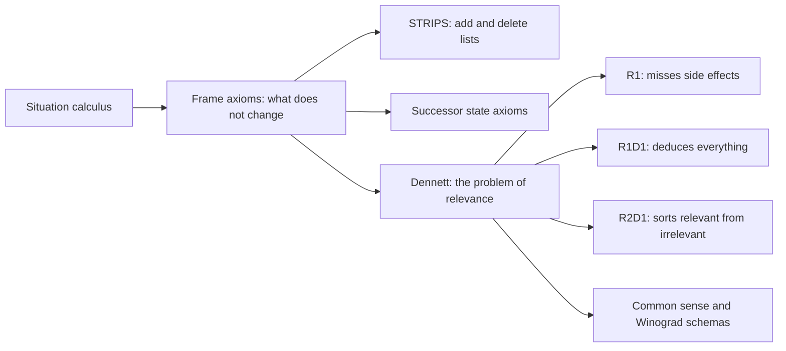
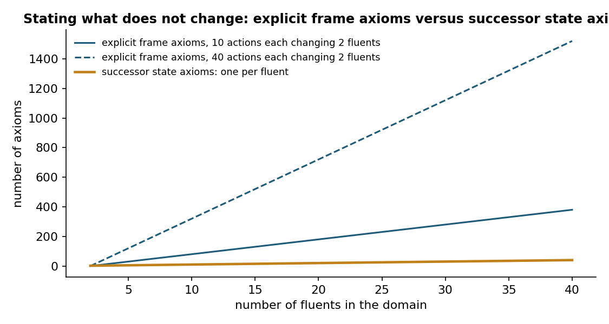
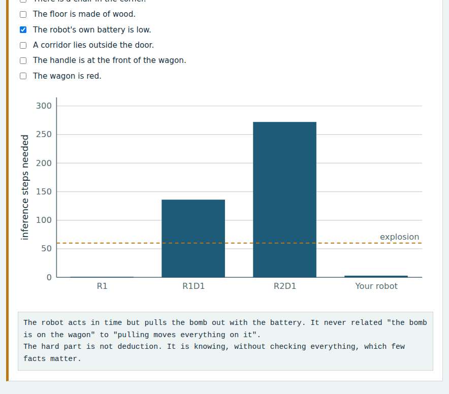
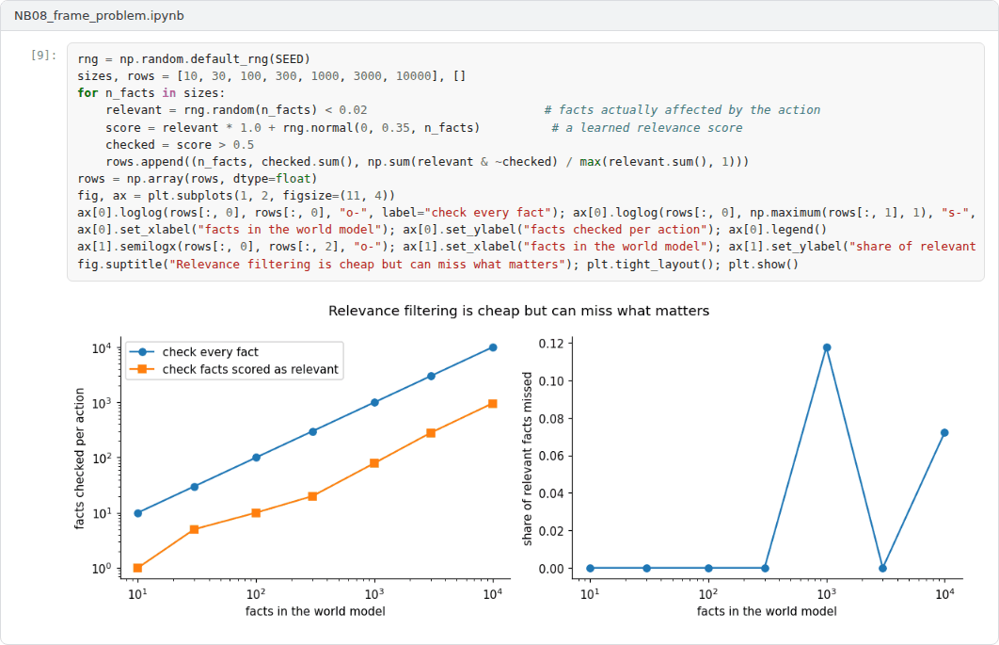

# Week 08: The Frame Problem and Common Sense

**Philosophy of Artificial Intelligence (11118BLG003)**  
Prof. Dr. Utku Kose, Süleyman Demirel University

   

## Overview

An intelligent agent must know what changes when it acts and what stays the same, and it must recognise which of its countless beliefs matter. This week traces the frame problem from its logical origin to its philosophical generalisation as a problem of relevance, and connects it with the challenge of common sense [1, 2, 3].

**Estimated study time:** 6 to 8 hours.

## Learning outcomes

By the end of the week, students are expected to distinguish the representational frame problem from the general problem of relevance, to explain STRIPS and successor state axioms as solutions to the former, to reconstruct Dennett's robot story, and to explain why Winograd schemas test common sense.

## Study path

| Step | Activity | Suggested time |
|---|---|---|
| 1 | Read the lecture below or the [PDF version](Week08_Lecture_Notes.pdf) | 90 minutes |
| 2 | Explore the [interactive lab](https://utkukose.github.io/philosophy-of-ai-NB-lecture/weeks/week-08/lab.html) | 45 minutes |
| 3 | Work through the [Colab notebook](https://colab.research.google.com/github/utkukose/philosophy-of-ai-NB-lecture/blob/main/weeks/week-08/NB08_frame_problem.ipynb) and its exercises | 2 to 3 hours |
| 4 | Take the self-assessment in the lab (tab: Check yourself) | 20 minutes |
| 5 | Write the reflection, export the learning log and complete the weekly task | 60 minutes |

## Week at a glance

## Lecture

### A logical problem

McCarthy and Hayes introduced the situation calculus to represent actions and their effects in logic, and noticed a difficulty [1]. To reason that painting a block does not move it, the system needs an explicit axiom saying so, and the same holds for every pair of an action and a property it does not affect. The number of these frame axioms grows with the product of actions and properties, called fluents. Figure 8.1 shows the growth. They named this the frame problem.

Two classic answers address the representational side. The STRIPS planner of Fikes and Nilsson represented each action by lists of facts it adds and deletes and assumed that everything else persists [4]. Reiter later showed how to compile all frame axioms into one successor state axiom per fluent, which states exactly when the fluent is true after an action [5]. Shanahan presented a detailed treatment of such solutions based on a common sense law of inertia [6]. In the logical sense, the frame problem is largely solved.

*Figure 8.1. Explicit frame axioms grow with the product of actions and fluents, while successor state axioms grow with the number of fluents [1, 5].*

<b>Check your understanding.</b> What was the original frame problem?

A. How to represent what does not change when an action is performed, without endless frame axioms  
B. How to draw frames around images  
C. How to build robot frames  
D. How to speed up search  

**Answer: A.** McCarthy and Hayes identified it as a problem of logical representation.

### A problem of relevance

Dennett told a story that turned the frame problem into a general problem of cognition [2]. A robot, R1, must fetch its spare battery from a room in which a bomb is timed to go off. The battery is on a wagon, and so is the bomb. R1 pulls the wagon out, knowing that the battery is on it, but does not notice that the bomb comes along too. Its designers build R1D1, which deduces the implications of its actions, and it is still deducing irrelevant consequences, such as that pulling the wagon would not change the colour of the walls, when the bomb explodes. The next model, R2D1, is taught to ignore irrelevant implications, but it is busy classifying thousands of them as irrelevant when time runs out.

The moral is that the difficulty lies not in representing change but in determining relevance quickly, without considering everything. People do this effortlessly, and no one knows how. Dreyfus, whose critique is examined in Week 9, saw in the problem evidence that intelligence rests on background coping rather than on rules.

<b>Check your understanding.</b> What do Dennett&#x27;s robots R1, R1D1 and R2D1 illustrate?

A. That robots cannot move  
B. That relevance cannot be decided without considering consequences, yet considering all of them is impossible  
C. That robots should not carry bombs  
D. That batteries are unreliable  

**Answer: B.** The robots fail either by ignoring a relevant side effect or by computing irrelevant ones.

### Common sense

Davis and Marcus surveyed the challenge of commonsense reasoning and argued that it remains a central obstacle for AI [3]. Commonsense knowledge is vast, mostly unstated and used without effort: that objects fall when dropped, that containers hold things smaller than themselves, that people act on their beliefs. Levesque, Davis and Morgenstern proposed the Winograd schema challenge as a test [7]. Each item is a pair of sentences that differ in one word, which flips the referent of a pronoun. In the pair about a trophy that does not fit into a suitcase because it is too large or too small, the pronoun refers to the trophy in one case and to the suitcase in the other. Surface statistics that ignore the special word can do no better than chance.

<b>Check your understanding.</b> What do Winograd schemas test?

A. Arithmetic  
B. Spelling  
C. Pronoun resolution that requires common sense and resists simple statistical cues  
D. Translation speed  

**Answer: C.** A small change of one word switches the correct referent.

### Relevance in present systems

Large language models answer many Winograd-style questions correctly, which shows that statistics over vast text capture much commonsense knowledge. Whether they solve the relevance problem or sidestep it is debated: A model that has absorbed enormous numbers of situations may retrieve the relevant pattern without ever facing Dennett's explosion, but it may also fail on situations that its training did not cover. The lab reconstructs Dennett's robots with an adjustable time budget, and the notebook counts frame axioms and tests surface heuristics on Winograd-style pairs.

> **Pause and reflect.** When you decide what to check before leaving home, how do you avoid considering irrelevant facts? Could that procedure be written down?

<b>Check your understanding.</b> How is relevance handled in many present systems?

A. It is ignored completely  
B. With explicit frame axioms  
C. By asking a human every time  
D. With learned statistics and retrieval, which raises the question whether the problem is solved or hidden  

**Answer: D.** Performance on benchmarks does not settle how relevance is determined.

## Interactive lab

A robot must pull a wagon carrying its battery out of a room before a bomb explodes; the bomb is also on the wagon. Choose a strategy or pick the facts that the robot considers, then set the time before the explosion. Each inference costs one unit of time [2].

[Open the interactive lab](https://utkukose.github.io/philosophy-of-ai-NB-lecture/weeks/week-08/lab.html)

## Colab notebook

The notebook grounds a blocks world in STRIPS operators, counts the frame axioms that an explicit situation calculus encoding would need, and tests two surface heuristics on Winograd-style sentence pairs [4, 5, 7].

Screenshots of the executed notebook:

## Self-assessment and reflection

The lab contains a 6-question self-assessment with instant feedback and a confidence rating for each answer. A confident but wrong answer marks the first topic to revisit. The reflection prompts below are also available in the lab, where answers are saved in the browser and can be exported as a learning log.

1. In the lab, how did you know which facts to tick? Could that knowledge be written as rules?
2. Do large language models solve the relevance problem, sidestep it or merely hide it? Give an example that supports your answer.
3. Describe a failure of common sense that you have seen in an AI system and explain it with the ideas of this week.

## Weekly task and submission

Write about 500 words distinguishing the logical frame problem from the problem of relevance, using the lab and the notebook as examples, and assess whether present language models face the second problem. Attach the notebook with both exercises completed.

The weekly task supports self-learning and builds a personal portfolio. When the course is followed with the instructor during an active semester, the task can be sent together with the exported learning log to utkukose@sdu.edu.tr or utkukose@gmail.com for evaluation.

## Research and report assignment (optional)

**Commonsense benchmarks after Winograd.** Review what happened to Winograd-style benchmarks once language models approached human scores, and what this shows about common sense and relevance [2, 3, 7].

This research assignment is optional and supports self-learning. When the related weeks are followed within the course during an active semester, the report can be sent to utkukose@sdu.edu.tr or utkukose@gmail.com for evaluation. Unless the assignment states otherwise, a report has 1500 to 2500 words, follows the structure of an academic paper, cites at least six scholarly or official sources in square brackets and ends with a reference list.

## References

[1] McCarthy, J., & Hayes, P. J. (1969). Some philosophical problems from the standpoint of artificial intelligence. In B. Meltzer & D. Michie (Eds.), *Machine Intelligence 4* (pp. 463-502). Edinburgh University Press.

[2] Dennett, D. C. (1984). Cognitive wheels: The frame problem of AI. In C. Hookway (Eds.), *Minds, Machines and Evolution* (pp. 129-151). Cambridge University Press.

[3] Davis, E., & Marcus, G. (2015). Commonsense reasoning and commonsense knowledge in artificial intelligence. *Communications of the ACM*, 58(9), 92-103. <https://doi.org/10.1145/2701413>

[4] Fikes, R. E., & Nilsson, N. J. (1971). STRIPS: A new approach to the application of theorem proving to problem solving. *Artificial Intelligence*, 2(3-4), 189-208. <https://doi.org/10.1016/0004-3702(71)90010-5>

[5] Reiter, R. (2001). *Knowledge in Action: Logical Foundations for Specifying and Implementing Dynamical Systems*. MIT Press.

[6] Shanahan, M. (1997). *Solving the Frame Problem: A Mathematical Investigation of the Common Sense Law of Inertia*. MIT Press.

[7] Levesque, H. J., Davis, E., & Morgenstern, L. (2012). The Winograd schema challenge. In *Proceedings of the 13th International Conference on Principles of Knowledge Representation and Reasoning (KR 2012)* (pp. 552-561). AAAI Press.

---

Philosophy of Artificial Intelligence. Prof. Dr. Utku Kose, Süleyman Demirel University. ORCID [0000-0002-9652-6415](https://orcid.org/0000-0002-9652-6415). Content licensed under CC BY 4.0. This course is updated in line with current developments in the field. Last update: September 2026.
