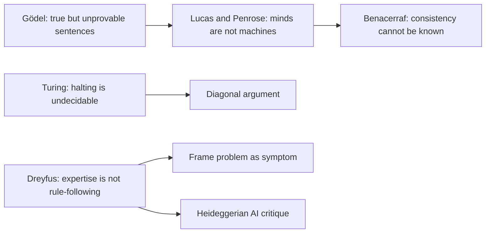
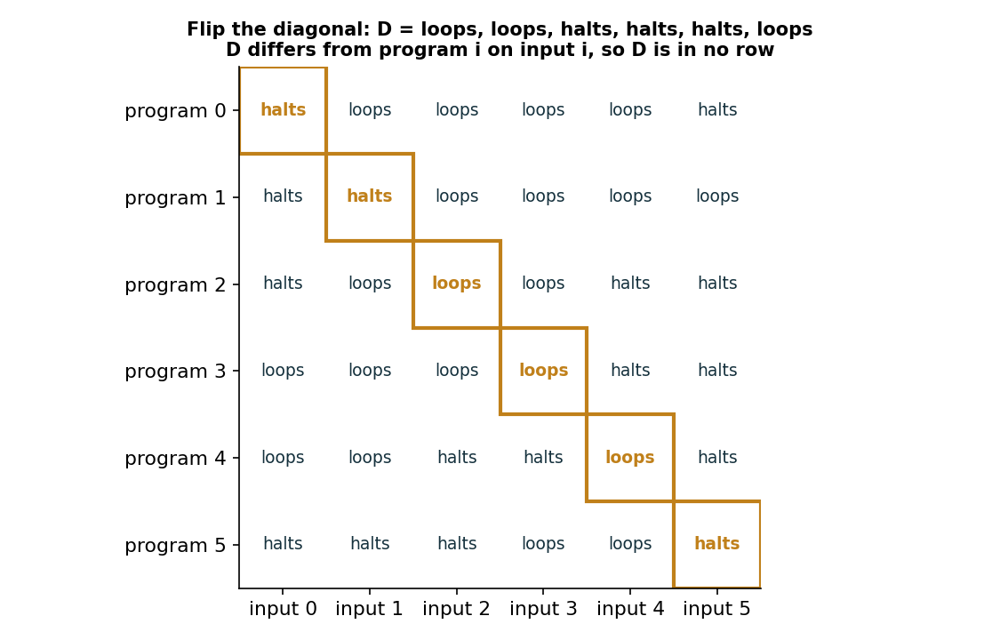
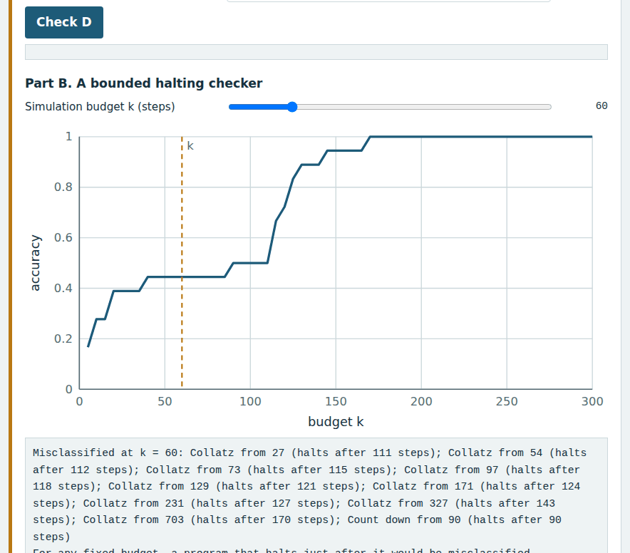
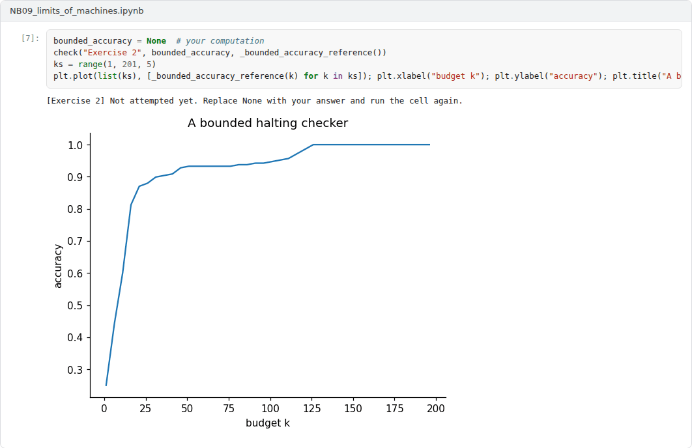

# Week 09: Limits of Machines: Gödelian Arguments and Dreyfus's Critique

**Philosophy of Artificial Intelligence (11118BLG003)**  
Prof. Dr. Utku Kose, Süleyman Demirel University

   

## Overview

Two very different arguments claim that minds can do something that machines cannot. One appeals to Gödel's incompleteness theorems, the other to the phenomenology of skilled human activity. This week reconstructs both, examines the replies and asks which limits of machines are real [1, 2, 3].

**Estimated study time:** 6 to 8 hours.

## Learning outcomes

By the end of the week, students are expected to state the incompleteness theorem and the undecidability of the halting problem informally, to construct a diagonal argument, to reconstruct the Lucas-Penrose argument and the consistency objection, and to explain Dreyfus's critique of rule-based AI and its relation to later developments.

## Study path

| Step | Activity | Suggested time |
|---|---|---|
| 1 | Read the lecture below or the [PDF version](Week09_Lecture_Notes.pdf) | 90 minutes |
| 2 | Explore the [interactive lab](https://utkukose.github.io/philosophy-of-ai-NB-lecture/weeks/week-09/lab.html) | 45 minutes |
| 3 | Work through the [Colab notebook](https://colab.research.google.com/github/utkukose/philosophy-of-ai-NB-lecture/blob/main/weeks/week-09/NB09_limits_of_machines.ipynb) and its exercises | 2 to 3 hours |
| 4 | Take the self-assessment in the lab (tab: Check yourself) | 20 minutes |
| 5 | Write the reflection, export the learning log and complete the weekly task | 60 minutes |

## Week at a glance

## Lecture

### Incompleteness and undecidability

Gödel proved in 1931 that any consistent formal system that can express elementary arithmetic contains statements that are true but cannot be proved within the system [1]. The construction uses self-reference: a sentence that, in effect, says of itself that it is not provable. If the system is consistent, the sentence is unprovable and therefore true. Turing reached a related result for machines [4]. No Turing machine can decide, for every program and input, whether the program halts. The proof is a diagonal argument: Given any claimed decider, one can build a program that asks the decider about itself and does the opposite. Figure 9.1 shows the idea as a table in which the flipped diagonal differs from every row.

*Figure 9.1. A diagonal argument: flipping the diagonal of any table of programs and inputs yields a behaviour that differs from every program in the table [4].*

<b>Check your understanding.</b> What does Gödel&#x27;s first incompleteness theorem state?

A. Every true statement is provable  
B. Any consistent formal system that includes enough arithmetic contains true statements it cannot prove  
C. Mathematics is inconsistent  
D. Computers cannot do arithmetic  

**Answer: B.** The theorem concerns formal systems, and its application to minds is disputed.

### The Lucas-Penrose argument

Lucas argued that the incompleteness theorem shows that minds are not machines [2]. For any machine that proves arithmetic, there is a Gödel sentence that the machine cannot prove, but a human mathematician can see that the sentence is true. So the mathematician can do something that the machine cannot, and no machine can be an adequate model of the mind. Penrose developed a version of the argument and concluded that human mathematical insight is not computable, which led him to speculate about new physics in the brain [5, 6].

The central objection concerns consistency. A human sees that the Gödel sentence of a machine is true only if the human knows that the machine is consistent. Benacerraf argued that the argument establishes at most a disjunction: Either the mind is not a machine, or it is a machine whose program it cannot know or whose consistency it cannot prove [7]. Since people are not known to be consistent, and cannot prove their own consistency, the argument does not reach its conclusion. Most logicians and philosophers regard the Gödelian argument as unsuccessful, though it continues to be refined and debated.

<b>Check your understanding.</b> What is the standard objection to the Lucas-Penrose argument?

A. Humans cannot know that their own reasoning system is consistent, so they cannot see the truth of its Gödel sentence  
B. Gödel made a mistake  
C. Machines can prove all truths  
D. The argument is too short  

**Answer: A.** Seeing the truth of a Gödel sentence requires knowing the consistency of the system.

### Dreyfus's phenomenological critique

Dreyfus argued that the programme of symbolic AI rested on assumptions that were false [3, 8]. It assumed that the brain processes information in discrete operations, that the mind follows rules over symbols, that all knowledge can be formalised and that the world consists of independent facts. Drawing on Heidegger and Merleau-Ponty, he argued that human expertise is not rule-following. Experts respond directly to situations that show up as already meaningful against a background of practices, and this know-how cannot be captured in explicit rules. The frame problem of Week 8 was, for Dreyfus, a symptom of this mistake.

Later, Dreyfus examined attempts to build Heideggerian AI, including behaviour-based robotics, and argued that they had not gone far enough [9]. Brooks's robots, in his view, responded to fixed features of the world rather than to changing significance, and a truly Heideggerian AI would need a body with needs that makes situations matter to it.

<b>Check your understanding.</b> What did Dreyfus argue?

A. Computers will soon be conscious  
B. Logic explains all of cognition  
C. Chess is impossible for computers  
D. Human expertise rests on embodied, situated know-how that explicit rules cannot capture  

**Answer: D.** Later critics noted that learning systems changed the target of the critique.

### Which limits are real?

The two arguments differ in kind. The Gödelian argument claims an in-principle limit on any machine. It fails, according to most critics, because the same limits apply to humans. Dreyfus's critique targeted a particular approach, symbolic AI, and much of it has been vindicated by the shift to learning systems that acquire skills from experience rather than from explicit rules. What remains open is whether learned systems escape his deeper point about significance and embodiment. The undecidability of halting remains a genuine limit, but it binds every computing system, including brains, if they compute.

> **Pause and reflect.** The lab shows that a bounded halting checker is always wrong about some programs. Are you, as a human reasoner, subject to the same limit?

<b>Check your understanding.</b> What does the undecidability of the halting problem imply?

A. No algorithm decides for every program and input whether the program halts  
B. Every program halts  
C. Programs cannot loop  
D. Humans can decide halting for every program  

**Answer: A.** The limit applies to any agent that decides by following an algorithm.

## Interactive lab

Part A asks you to build the program D by flipping the diagonal of a table and to confirm that D appears in no row. Part B runs a halting checker that simulates each program for k steps. Part C tests Lucas's argument [2, 4, 7].

[Open the interactive lab](https://utkukose.github.io/philosophy-of-ai-NB-lecture/weeks/week-09/lab.html)

## Colab notebook

The notebook builds a table of programs and inputs from simple iterated maps, constructs the diagonal program, evaluates bounded halting checkers and detects cycles exactly where possible [1, 4].

Screenshots of the executed notebook:

## Self-assessment and reflection

The lab contains a 6-question self-assessment with instant feedback and a confidence rating for each answer. A confident but wrong answer marks the first topic to revisit. The reflection prompts below are also available in the lab, where answers are saved in the browser and can be exported as a learning log.

1. Does undecidability limit human reasoners as well as machines? Explain how you would argue either way.
2. Which parts of Dreyfus's critique were vindicated by machine learning, and which remain challenges for present systems?
3. Choose a skill you possess that you could not reduce to rules. What does that suggest about the systems you build?

## Weekly task and submission

Write about 500 words reconstructing the Lucas-Penrose argument, presenting the consistency objection and assessing whether any version of the argument survives. Use the diagonal construction from the notebook in your explanation. Attach the notebook with both exercises completed.

The weekly task supports self-learning and builds a personal portfolio. When the course is followed with the instructor during an active semester, the task can be sent together with the exported learning log to utkukose@sdu.edu.tr or utkukose@gmail.com for evaluation.

## Research and report assignment (optional)

**Gödelian arguments today.** Review contemporary defences and critiques of the Lucas-Penrose argument and assess whether any version survives the consistency objection [2, 6, 7].

This research assignment is optional and supports self-learning. When the related weeks are followed within the course during an active semester, the report can be sent to utkukose@sdu.edu.tr or utkukose@gmail.com for evaluation. Unless the assignment states otherwise, a report has 1500 to 2500 words, follows the structure of an academic paper, cites at least six scholarly or official sources in square brackets and ends with a reference list.

## References

[1] Gödel, K. (1931). Über formal unentscheidbare Sätze der Principia Mathematica und verwandter Systeme I. *Monatshefte für Mathematik und Physik*, 38(1), 173-198. <https://doi.org/10.1007/BF01700692>

[2] Lucas, J. R. (1961). Minds, machines and Gödel. *Philosophy*, 36(137), 112-127. <https://doi.org/10.1017/S0031819100057983>

[3] Dreyfus, H. L. (1992). *What Computers Still Can't Do: A Critique of Artificial Reason*. MIT Press.

[4] Turing, A. M. (1936). On computable numbers, with an application to the Entscheidungsproblem. *Proceedings of the London Mathematical Society*, s2-42(1), 230-265. <https://doi.org/10.1112/plms/s2-42.1.230>

[5] Penrose, R. (1989). *The Emperor's New Mind: Concerning Computers, Minds, and the Laws of Physics*. Oxford University Press.

[6] Penrose, R. (1994). *Shadows of the Mind: A Search for the Missing Science of Consciousness*. Oxford University Press.

[7] Benacerraf, P. (1967). God, the devil, and Gödel. *The Monist*, 51(1), 9-32. <https://doi.org/10.5840/monist196751112>

[8] Dreyfus, H. L. (1972). *What Computers Can't Do: A Critique of Artificial Reason*. Harper & Row.

[9] Dreyfus, H. L. (2007). Why Heideggerian AI failed and how fixing it would require making it more Heideggerian. *Philosophical Psychology*, 20(2), 247-268. <https://doi.org/10.1080/09515080701239510>

---

Philosophy of Artificial Intelligence. Prof. Dr. Utku Kose, Süleyman Demirel University. ORCID [0000-0002-9652-6415](https://orcid.org/0000-0002-9652-6415). Content licensed under CC BY 4.0. This course is updated in line with current developments in the field. Last update: September 2026.
