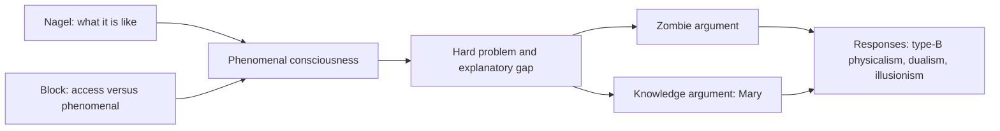
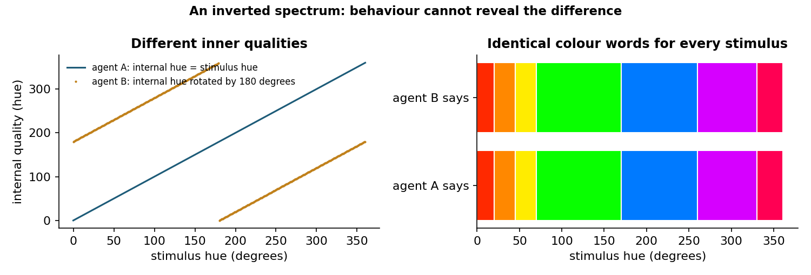
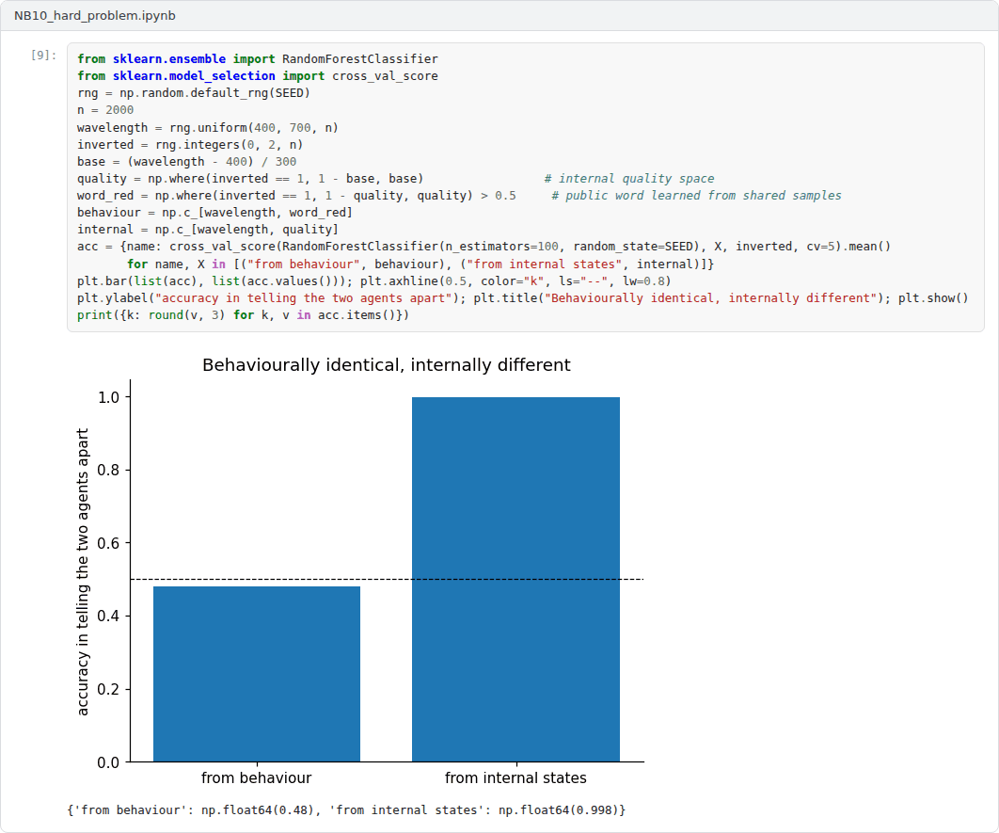

# Week 10: Consciousness: The Hard Problem

**Philosophy of Artificial Intelligence (11118BLG003)**  
Prof. Dr. Utku Kose, Süleyman Demirel University

   

## Overview

Even a complete account of what a system does may leave open whether there is something it is like to be that system. This week introduces the concept of phenomenal consciousness, the arguments that it resists physical explanation and the main positions in the debate [1, 2, 3].

**Estimated study time:** 6 to 8 hours.

## Learning outcomes

By the end of the week, students are expected to distinguish phenomenal from access consciousness, to state the hard problem and the explanatory gap, to reconstruct the zombie and knowledge arguments and test their validity, and to characterise physicalist, dualist and illusionist responses.

## Study path

| Step | Activity | Suggested time |
|---|---|---|
| 1 | Read the lecture below or the [PDF version](Week10_Lecture_Notes.pdf) | 90 minutes |
| 2 | Explore the [interactive lab](https://utkukose.github.io/philosophy-of-ai-NB-lecture/weeks/week-10/lab.html) | 45 minutes |
| 3 | Work through the [Colab notebook](https://colab.research.google.com/github/utkukose/philosophy-of-ai-NB-lecture/blob/main/weeks/week-10/NB10_hard_problem.ipynb) and its exercises | 2 to 3 hours |
| 4 | Take the self-assessment in the lab (tab: Check yourself) | 20 minutes |
| 5 | Write the reflection, export the learning log and complete the weekly task | 60 minutes |

## Week at a glance

## Lecture

### What it is like

Nagel argued that an organism has conscious mental states if and only if there is something it is like to be that organism [1]. A bat perceives through echolocation, and however much is learned about its neurophysiology, it seems impossible to know what it is like for the bat. The subjective character of experience appears to escape the objective descriptions of science. Block distinguished two concepts that are often run together [4]. Access consciousness concerns information that is available for reasoning, report and the control of action. Phenomenal consciousness concerns experience itself, what it is like. Much of the confusion about machine consciousness comes from moving between the two.

<b>Check your understanding.</b> What is Nagel&#x27;s criterion of conscious experience?

A. The ability to speak  
B. There is something it is like to be the organism  
C. A large brain  
D. Passing the Turing test  

**Answer: B.** The bat example shows that such subjective character may escape objective description.

### The hard problem and the explanatory gap

Chalmers separated the easy problems of consciousness from the hard problem [2]. The easy problems concern functions: discrimination, integration of information, report, attention and the control of behaviour. They are easy only in the sense that it is clear what an explanation would look like, namely a mechanism that performs the function. The hard problem is why the performance of these functions is accompanied by experience at all. Levine had described the same difficulty as an explanatory gap: Even if pain is correlated with a neural process, nothing in the process makes it intelligible why it should feel the way it does [5].

Chalmers argued that the hard problem shows consciousness to be a fundamental feature not reducible to physical processes [6]. His main argument concerns zombies: beings physically identical to people but without experience. If zombies are conceivable, they are possible, and if they are possible, physicalism is false. Jackson's knowledge argument makes a parallel case [3]. Mary, a scientist who knows all physical facts about colour vision but has lived in a black-and-white room, learns something new when she first sees red, so there are facts that are not physical.

<b>Check your understanding.</b> What is the hard problem of consciousness?

A. Explaining attention and memory  
B. Building faster computers  
C. Explaining why and how physical processes give rise to subjective experience  
D. Measuring brain activity  

**Answer: C.** The easy problems concern functions. The hard problem concerns experience itself.

### Responses

Physicalists answer in several ways. Some deny that zombies are genuinely conceivable once the physical facts are fully understood. Others accept conceivability but deny that it implies possibility, holding that phenomenal concepts pick out physical states in a special way, so that Mary gains a new concept or ability rather than knowledge of a new fact. Dennett offered a more radical response [7]. On his view, the idea of an inner theatre in which experiences are presented to a self is an illusion, and once all functional facts are explained, nothing further remains to be explained. This line of thought, now often called illusionism, treats the hard problem as a problem about why people believe in phenomenal properties. The lab asks students to state their own position and tests it for consistency with the arguments.

<b>Check your understanding.</b> What does illusionism hold?

A. Phenomenal consciousness as it seems to us does not exist, and what needs explaining is why it seems to exist  
B. Consciousness is an illusion created by computers  
C. Only machines are conscious  
D. Experience is the only reality  

**Answer: A.** Illusionists replace the hard problem with the illusion problem.

### Why the debate matters for AI

If consciousness is a matter of function, a machine that performs the right functions is conscious. If it is not, no amount of functional similarity settles the question. The inverted spectrum, shown in Figure 10.1, makes the point vivid: Two agents could name every colour in the same way while their inner qualities differ, and no behavioural test would reveal the difference. Critics have argued that the structure of human colour space makes such an undetectable inversion impossible, but the thought experiment shows why behavioural evidence underdetermines claims about experience. Week 11 turns to scientific theories that try to bridge the gap.

> **Pause and reflect.** Is the difference between access and phenomenal consciousness something you can detect in your own experience, or only a distinction between concepts?

*Figure 10.1. An inverted spectrum: agent B's inner qualities are rotated relative to agent A's, yet both use the same colour words for every stimulus, so behaviour cannot reveal the difference.*

<b>Check your understanding.</b> Why does the debate about consciousness matter for AI?

A. It determines processor speed  
B. It has no practical consequences  
C. It decides copyright law  
D. If systems could be conscious, their treatment raises moral questions, and false attributions have costs too  

**Answer: D.** Both overattribution and underattribution have ethical costs.

## Interactive lab

Part A and Part B check the zombie and knowledge arguments against your judgements. Part C compares your answers with the typical commitments of several positions. Part D shows an inverted spectrum in which two agents behave identically [3, 6].

[Open the interactive lab](https://utkukose.github.io/philosophy-of-ai-NB-lecture/weeks/week-10/lab.html)

## Colab notebook

The notebook checks the validity and consistency of the zombie and knowledge arguments by truth tables and simulates two agents with rotated inner colour codes whose behaviour is identical [3, 6].

Screenshots of the executed notebook:

## Self-assessment and reflection

The lab contains a 6-question self-assessment with instant feedback and a confidence rating for each answer. A confident but wrong answer marks the first topic to revisit. The reflection prompts below are also available in the lab, where answers are saved in the browser and can be exported as a learning log.

1. Which premise of the zombie argument do you find weakest, and what would it take to convince you otherwise?
2. If illusionism is right, what exactly would a machine need in order to be conscious in the only sense that exists?
3. Does the inverted spectrum threaten the use of behavioural tests for machine consciousness more than for human consciousness? Why?

## Weekly task and submission

Write about 500 words that reconstruct one argument of this week, identify the premise you reject or accept most doubtfully, and explain what your position implies for the possibility of conscious AI. Attach the notebook with both exercises completed.

The weekly task supports self-learning and builds a personal portfolio. When the course is followed with the instructor during an active semester, the task can be sent together with the exported learning log to utkukose@sdu.edu.tr or utkukose@gmail.com for evaluation.

## Research and report assignment (optional)

**Illusionism about consciousness.** Present the case for and against illusionism and discuss what it would imply for the question of conscious machines [5, 6, 7].

This research assignment is optional and supports self-learning. When the related weeks are followed within the course during an active semester, the report can be sent to utkukose@sdu.edu.tr or utkukose@gmail.com for evaluation. Unless the assignment states otherwise, a report has 1500 to 2500 words, follows the structure of an academic paper, cites at least six scholarly or official sources in square brackets and ends with a reference list.

## References

[1] Nagel, T. (1974). What is it like to be a bat?. *The Philosophical Review*, 83(4), 435-450. <https://doi.org/10.2307/2183914>

[2] Chalmers, D. J. (1995). Facing up to the problem of consciousness. *Journal of Consciousness Studies*, 2(3), 200-219.

[3] Jackson, F. (1982). Epiphenomenal qualia. *The Philosophical Quarterly*, 32(127), 127-136. <https://doi.org/10.2307/2960077>

[4] Block, N. (1995). On a confusion about a function of consciousness. *Behavioral and Brain Sciences*, 18(2), 227-247. <https://doi.org/10.1017/S0140525X00038188>

[5] Levine, J. (1983). Materialism and qualia: The explanatory gap. *Pacific Philosophical Quarterly*, 64(4), 354-361. <https://doi.org/10.1111/j.1468-0114.1983.tb00207.x>

[6] Chalmers, D. J. (1996). *The Conscious Mind: In Search of a Fundamental Theory*. Oxford University Press.

[7] Dennett, D. C. (1991). *Consciousness Explained*. Little, Brown and Company.

---

Philosophy of Artificial Intelligence. Prof. Dr. Utku Kose, Süleyman Demirel University. ORCID [0000-0002-9652-6415](https://orcid.org/0000-0002-9652-6415). Content licensed under CC BY 4.0. This course is updated in line with current developments in the field. Last update: September 2026.
