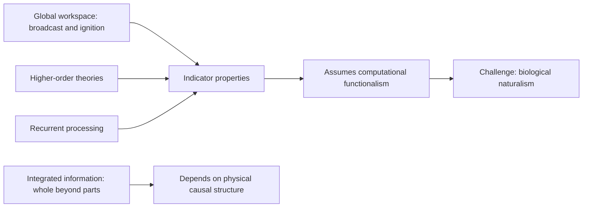
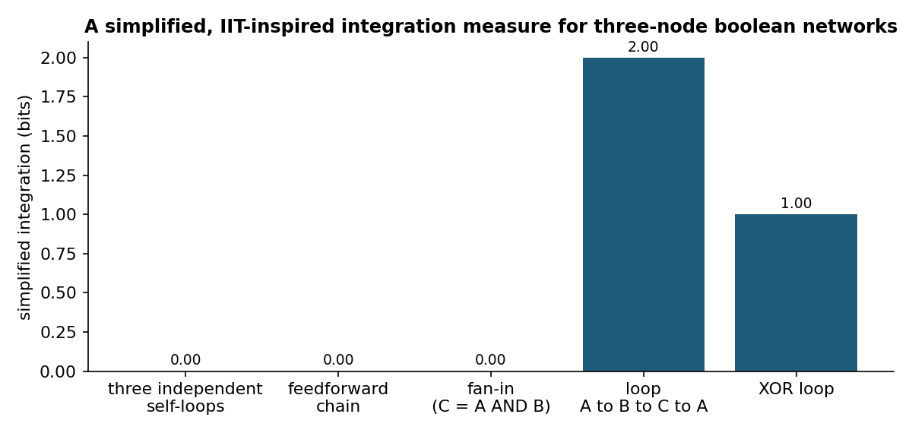
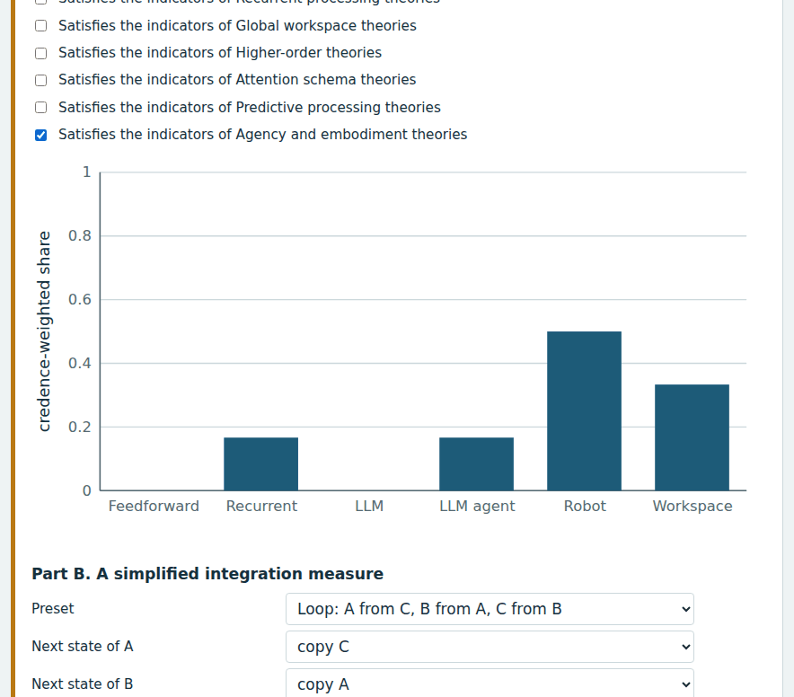
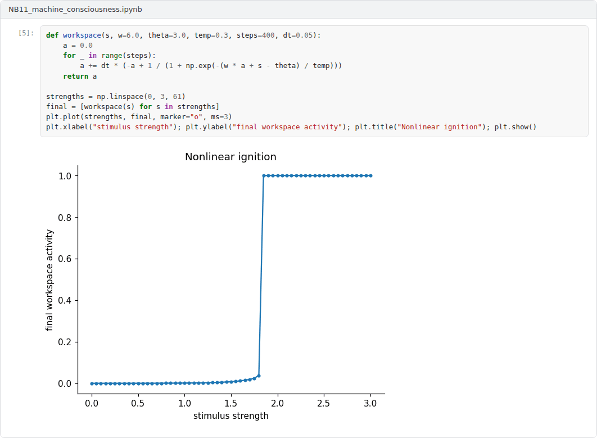

# Week 11: Machine Consciousness: Theories and Indicator Properties

**Philosophy of Artificial Intelligence (11118BLG003)**  
Prof. Dr. Utku Kose, Süleyman Demirel University

   

## Overview

Scientific theories of consciousness make claims about the mechanisms that give rise to experience. This week examines the global workspace, integrated information, higher-order and recurrent processing theories, and a recent method that derives indicator properties from them to assess AI systems [1, 2, 3].

**Estimated study time:** 6 to 8 hours.

## Learning outcomes

By the end of the week, students are expected to describe four major theories of consciousness and what each implies for machines, to compute a simplified integration measure for small networks, to explain the indicator property method and its assumption of computational functionalism, and to state the main disagreements about conscious AI.

## Study path

| Step | Activity | Suggested time |
|---|---|---|
| 1 | Read the lecture below or the [PDF version](Week11_Lecture_Notes.pdf) | 90 minutes |
| 2 | Explore the [interactive lab](https://utkukose.github.io/philosophy-of-ai-NB-lecture/weeks/week-11/lab.html) | 45 minutes |
| 3 | Work through the [Colab notebook](https://colab.research.google.com/github/utkukose/philosophy-of-ai-NB-lecture/blob/main/weeks/week-11/NB11_machine_consciousness.ipynb) and its exercises | 2 to 3 hours |
| 4 | Take the self-assessment in the lab (tab: Check yourself) | 20 minutes |
| 5 | Write the reflection, export the learning log and complete the weekly task | 60 minutes |

## Week at a glance

## Lecture

### Global workspace theories

Baars proposed that consciousness corresponds to a global workspace: a limited-capacity stage on which information is broadcast to many specialised, unconscious processors [1]. Only content that wins the competition for the workspace becomes conscious and available for report and flexible use. Dehaene and Naccache developed a neuronal version in which conscious access involves a sudden, self-sustaining ignition of activity in long-range cortical networks [4]. On this family of theories, a machine with specialised modules, a limited workspace and global broadcast would satisfy the central conditions. The notebook simulates ignition, a nonlinear transition from local to global activity as stimulus strength increases.

<b>Check your understanding.</b> According to global workspace theory, which contents are conscious?

A. Contents broadcast widely to many specialised processes through a limited-capacity workspace  
B. All contents processed by the brain  
C. Only visual contents  
D. Contents stored in long-term memory  

**Answer: A.** Ignition of the workspace makes information globally available.

### Integrated information theory

Tononi proposed that consciousness corresponds to integrated information, the extent to which a system as a whole generates information over and above its parts [2]. The theory was later formulated from axioms about the essential properties of experience, from which it derives requirements for its physical substrate [5, 6]. Its measure, Φ, is defined over the cause-effect structure of a system, and purely feedforward systems have zero Φ, whatever they compute. Integrated information theory therefore implies that a conventional digital computer running any program might have very little consciousness, because the relevant quantity depends on the physical causal structure, not on the software.

The lab and the notebook compute a much simpler quantity: how much the whole system's past predicts its future beyond what the best split into two parts predicts. Figure 11.1 shows that this simplified measure is zero for independent or feedforward networks and positive for recurrent loops, which mirrors one qualitative claim of the theory without reproducing its formal machinery.

*Figure 11.1. A simplified integration measure, whole-system information minus the information of the best split into parts, for five three-node boolean networks. It is inspired by, but not equal to, Φ of integrated information theory [2, 6].*

<b>Check your understanding.</b> How does integrated information theory characterise consciousness?

A. As a verbal report  
B. As integrated information, a property of a system's causal structure  
C. As attention  
D. As global broadcast  

**Answer: B.** On this theory, purely feedforward systems have no integrated information.

### Higher-order and recurrent processing theories

Higher-order theories hold that a mental state is conscious when the subject is aware of being in it, for example through a higher-order thought about the state [7]. A machine would need to represent some of its own states as its own. Recurrent processing theory holds that consciousness arises when feedback from higher to lower visual areas produces sustained recurrent activity, even without global broadcast [8]. The theories disagree about where consciousness begins, which matters for machines because different architectures satisfy different conditions.

<b>Check your understanding.</b> What does recurrent processing theory emphasise?

A. Feedforward sweeps only  
B. Language  
C. Recurrent, feedback processing in sensory areas  
D. Motor output  

**Answer: C.** Lamme distinguishes an unconscious feedforward sweep from conscious recurrent processing.

### Indicator properties and the debate about AI

Butlin and colleagues proposed an empirical method for assessing AI systems [3]. Assuming computational functionalism as a working hypothesis, they derived indicator properties from several scientific theories, including recurrent processing, global workspace, higher-order, predictive processing and attention schema theories, together with agency and embodiment. They assessed several recent systems and concluded that no current AI system is conscious, but also that there are no obvious barriers to building systems that satisfy the indicators. Chalmers examined large language models and argued that they lack several features that many theories require, such as recurrent processing, a global workspace and unified agency, while such features could be added in future systems [9].

Others doubt the functionalist assumption. Seth argued for biological naturalism, the view that consciousness may depend on properties of living systems, such as the regulation of a living body, so that computation alone would not suffice [10]. The lab lets students weigh the theories by credence and see how the verdict about an architecture depends on those weights.

> **Pause and reflect.** Would you change how you treat a system if its indicator score rose? What does your answer reveal about the role of theory in such judgements?

<b>Check your understanding.</b> What does the indicator properties approach do?

A. It asks AI systems whether they are conscious  
B. It measures processor temperature  
C. It proves that AI systems are conscious  
D. It assesses systems for properties that scientific theories associate with consciousness, assuming computational functionalism  

**Answer: D.** The approach is theory-heavy and its conclusions depend on the theories it draws on.

## Interactive lab

Part A combines indicator properties with your credence in each theory to score six AI architectures. The indicator settings are illustrative starting points for discussion, not the assessments of the cited report. Part B computes a simplified integration measure for three-node networks that you design [2, 3].

[Open the interactive lab](https://utkukose.github.io/philosophy-of-ai-NB-lecture/weeks/week-11/lab.html)

## Colab notebook

The notebook implements the simplified integration measure for small boolean networks and simulates ignition in a single global workspace unit with self-excitation [2, 4].

Screenshots of the executed notebook:

## Self-assessment and reflection

The lab contains a 6-question self-assessment with instant feedback and a confidence rating for each answer. A confident but wrong answer marks the first topic to revisit. The reflection prompts below are also available in the lab, where answers are saved in the browser and can be exported as a learning log.

1. Set the credences in the lab to your own beliefs. Which architecture scores highest, and would you accept that verdict?
2. The simplified measure distinguishes loops from feedforward networks. Is that difference a plausible marker of consciousness? Why or why not?
3. Which theory of this week is most testable, and what experiment would you run on an AI system to test it?

## Weekly task and submission

Write about 600 words that assess one current AI system with the indicator method, using at least three theories, and discuss whether computational functionalism is a reasonable working assumption. Include the lab chart for your credences and attach the notebook with both exercises completed.

The weekly task supports self-learning and builds a personal portfolio. When the course is followed with the instructor during an active semester, the task can be sent together with the exported learning log to utkukose@sdu.edu.tr or utkukose@gmail.com for evaluation.

## Research and report assignment (optional)

**Methods for assessing AI consciousness.** Compare the theory-heavy indicator method with approaches based on behaviour and with biological naturalism, and identify what each would count as evidence [3, 9, 10].

This research assignment is optional and supports self-learning. When the related weeks are followed within the course during an active semester, the report can be sent to utkukose@sdu.edu.tr or utkukose@gmail.com for evaluation. Unless the assignment states otherwise, a report has 1500 to 2500 words, follows the structure of an academic paper, cites at least six scholarly or official sources in square brackets and ends with a reference list.

## References

[1] Baars, B. J. (1988). *A Cognitive Theory of Consciousness*. Cambridge University Press.

[2] Tononi, G. (2004). An information integration theory of consciousness. *BMC Neuroscience*, 5, 42. <https://doi.org/10.1186/1471-2202-5-42>

[3] Butlin, P., Long, R., Elmoznino, E., Bengio, Y., Birch, J., Constant, A., Deane, G., Fleming, S. M., Frith, C., Ji, X., Kanai, R., Klein, C., Lindsay, G., Michel, M., Mudrik, L., Peters, M. A. K., Schwitzgebel, E., Simon, J., & VanRullen, R. (2023). Consciousness in artificial intelligence: Insights from the science of consciousness. arXiv preprint arXiv:2308.08708. <https://arxiv.org/abs/2308.08708>

[4] Dehaene, S., & Naccache, L. (2001). Towards a cognitive neuroscience of consciousness: Basic evidence and a workspace framework. *Cognition*, 79(1-2), 1-37. <https://doi.org/10.1016/S0010-0277(00)00123-2>

[5] Tononi, G., Boly, M., Massimini, M., & Koch, C. (2016). Integrated information theory: From consciousness to its physical substrate. *Nature Reviews Neuroscience*, 17(7), 450-461. <https://doi.org/10.1038/nrn.2016.44>

[6] Albantakis, L., Barbosa, L., Findlay, G., et al. (2023). Integrated information theory (IIT) 4.0: Formulating the properties of phenomenal existence in physical terms. *PLOS Computational Biology*, 19(10), e1011465. <https://doi.org/10.1371/journal.pcbi.1011465>

[7] Rosenthal, D. M. (2005). *Consciousness and Mind*. Clarendon Press.

[8] Lamme, V. A. F. (2006). Towards a true neural stance on consciousness. *Trends in Cognitive Sciences*, 10(11), 494-501. <https://doi.org/10.1016/j.tics.2006.09.001>

[9] Chalmers, D. J. (2023). Could a large language model be conscious?. arXiv preprint arXiv:2303.07103. <https://arxiv.org/abs/2303.07103>

[10] Seth, A. K. (2025). Conscious artificial intelligence and biological naturalism. *Behavioral and Brain Sciences*. Published online 21 April 2025. <https://doi.org/10.1017/S0140525X25000032>

---

Philosophy of Artificial Intelligence. Prof. Dr. Utku Kose, Süleyman Demirel University. ORCID [0000-0002-9652-6415](https://orcid.org/0000-0002-9652-6415). Content licensed under CC BY 4.0. This course is updated in line with current developments in the field. Last update: September 2026.
