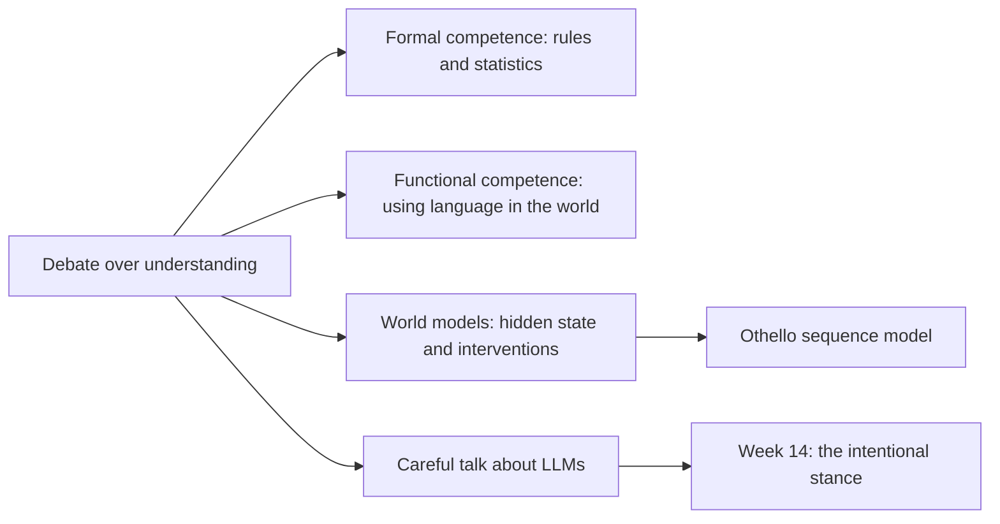
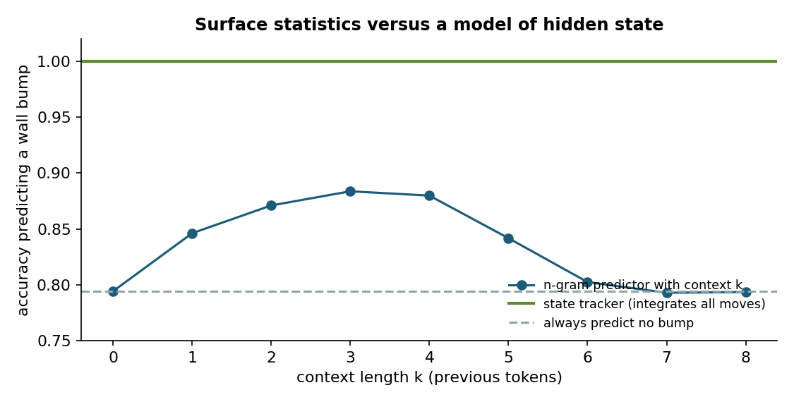
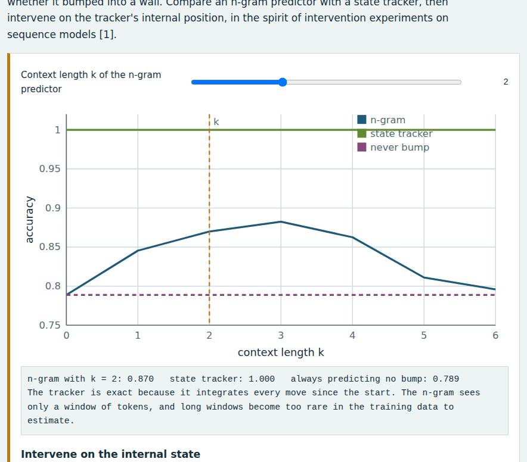
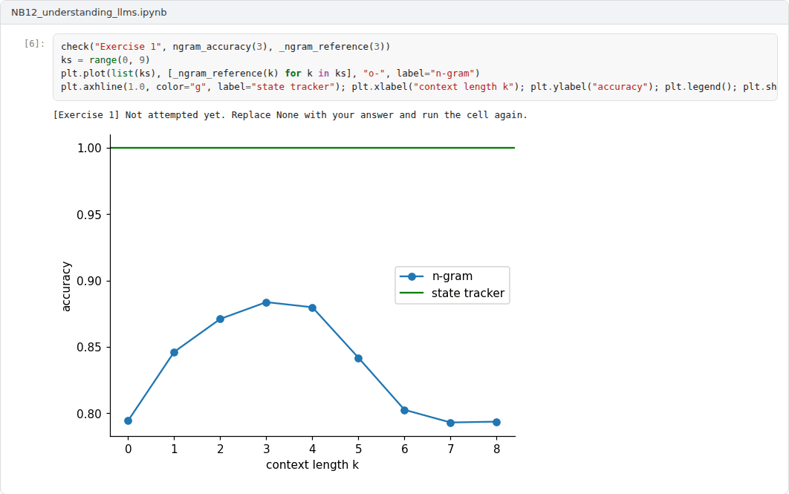

# Week 12: Understanding and World Models in Large Language Models

**Philosophy of Artificial Intelligence (11118BLG003)**  
Prof. Dr. Utku Kose, Süleyman Demirel University

   

## Overview

Large language models write fluent text on almost any topic. Whether they understand what they write is one of the most contested questions in AI today. This week examines the debate, the distinction between formal and functional linguistic competence, evidence for internal world models and the risks of anthropomorphic description [1, 2, 3].

**Estimated study time:** 6 to 8 hours.

## Learning outcomes

By the end of the week, students are expected to summarise the arguments for and against understanding in language models, to distinguish formal from functional linguistic competence, to explain what counts as evidence for a world model, including interventions on internal states, and to apply Shanahan's cautions to descriptions of these systems.

## Study path

| Step | Activity | Suggested time |
|---|---|---|
| 1 | Read the lecture below or the [PDF version](Week12_Lecture_Notes.pdf) | 90 minutes |
| 2 | Explore the [interactive lab](https://utkukose.github.io/philosophy-of-ai-NB-lecture/weeks/week-12/lab.html) | 45 minutes |
| 3 | Work through the [Colab notebook](https://colab.research.google.com/github/utkukose/philosophy-of-ai-NB-lecture/blob/main/weeks/week-12/NB12_understanding_llms.ipynb) and its exercises | 2 to 3 hours |
| 4 | Take the self-assessment in the lab (tab: Check yourself) | 20 minutes |
| 5 | Write the reflection, export the learning log and complete the weekly task | 60 minutes |

## Week at a glance

## Lecture

### The debate

Mitchell and Krakauer surveyed a heated debate in the AI research community on whether large pretrained language models can be said to understand language and the situations it describes [1]. Those who answer yes point to performance on demanding tasks, to abilities that appear with scale and to internal representations that track structure in the world. Those who answer no point to the lack of grounding discussed in Week 5, to brittleness on problems that differ slightly from familiar ones and to the possibility that fluent text can be produced by sophisticated pattern completion. Mitchell and Krakauer suggested that the debate may reflect distinct modes of understanding, and they called for an extended science of intelligence that could characterise them. Earlier, Floridi and Chiriatti had tested GPT-3 on mathematical, semantic and ethical questions and described it as a system that produces text without understanding it [4].

<b>Check your understanding.</b> What is the central disagreement about language models and understanding?

A. Whether they understand language or produce fluent text from statistical patterns  
B. Whether they use electricity  
C. Whether they are expensive  
D. Whether they can be downloaded  

**Answer: A.** Surveys of researchers show a community split on the question.

### Formal and functional competence

Mahowald and colleagues proposed a distinction that clarifies much of the disagreement [2]. Formal linguistic competence is knowledge of the rules and statistical regularities of a language: grammar, morphology and the patterns of word use. Functional linguistic competence is the ability to use language in the world, which draws on reasoning, world knowledge, situation modelling and social cognition. In the human brain, the two rely on different networks. Language models, they argued, have achieved impressive formal competence, while their functional competence is uneven and often depends on additional training or tools. On this view, fluent language is not a reliable sign of thought, a lesson that recalls the ELIZA effect of Week 2.

<b>Check your understanding.</b> How do formal and functional linguistic competence differ?

A. Formal competence concerns handwriting  
B. Formal competence is knowledge of linguistic rules and patterns, functional competence is using language to reason and act in the world  
C. They are the same  
D. Functional competence concerns grammar only  

**Answer: B.** The dissociation thesis holds that language models are stronger in the first than in the second.

### World models

A world model, in the sense relevant here, is an internal representation that tracks the hidden state of a domain and supports predictions under changes, including counterfactual ones. Li and colleagues trained a sequence model only on legal move sequences of the board game Othello, without any description of the board [3]. They found that the network's internal activations encoded the state of the board, and that intervening on these activations, changing the represented state, changed the model's predictions of legal moves accordingly. The intervention matters: A correlation between activations and board states could be incidental, but a causal role in prediction suggests that the representation is used.

The lab and the notebook reproduce the logic of such tests in a transparent setting. Tokens describe the moves of an agent in a small grid, and some moves bump into a wall. A predictor that uses only the last few tokens gains from a short context, loses accuracy when longer contexts become too rare to estimate from the data, and never reaches the accuracy of a predictor that tracks the hidden position, as Figure 12.1 shows. Intervening on the tracked position changes the tracker's predictions, while the n-gram predictor has no state to intervene on.

*Figure 12.1. Accuracy of predicting a wall bump in a small grid world: n-gram predictors gain from short contexts, lose accuracy when longer contexts become too rare to estimate, and remain below a predictor that tracks the hidden position.*

<b>Check your understanding.</b> What did studies of a sequence model trained on Othello moves show?

A. The model memorised all games  
B. The model could not predict legal moves  
C. Internal representations of the board state could be probed and intervened on, changing predictions  
D. The model understood the rules explicitly  

**Answer: C.** Interventions provide stronger evidence than correlations alone.

### Talking about language models

Shanahan warned against describing language models with words such as knows, believes and thinks without care [5]. A bare language model is a system that predicts the next token, and much of its apparent agency comes from the dialogue systems and prompts built around it. Anthropomorphic descriptions can be useful shorthand, but they may lead users to attribute beliefs and reliability that the system does not have. Bender and Koller's argument from Week 5 adds that fluency is not evidence of meaning [6]. Week 14 returns to the question of when attributing beliefs to a system is legitimate.

> **Pause and reflect.** What result would convince you that a language model understands a domain you know well? Would it be a behavioural test, an internal analysis or both?

<b>Check your understanding.</b> What does Shanahan advise about talking about language models?

A. Always use mentalistic language  
B. Never study them  
C. Treat them as people  
D. Use anthropomorphic terms with care, because the systems predict tokens and are embedded in larger systems  

**Answer: D.** Careful description avoids both inflated and dismissive claims.

## Interactive lab

An agent walks randomly in a 5 by 5 grid, and the token stream records each move and whether it bumped into a wall. Compare an n-gram predictor with a state tracker, then intervene on the tracker's internal position, in the spirit of intervention experiments on sequence models [3].

[Open the interactive lab](https://utkukose.github.io/philosophy-of-ai-NB-lecture/weeks/week-12/lab.html)

## Colab notebook

The notebook generates token streams from a hidden grid walk, fits n-gram predictors of increasing context length, compares them with a state tracker and performs an intervention on the tracker's state [1, 3].

Screenshots of the executed notebook:

## Self-assessment and reflection

The lab contains a 6-question self-assessment with instant feedback and a confidence rating for each answer. A confident but wrong answer marks the first topic to revisit. The reflection prompts below are also available in the lab, where answers are saved in the browser and can be exported as a learning log.

1. Which of the two competences does your own use of language models rely on most, and where has the other one failed you?
2. Is a representation that supports interventions sufficient for understanding, or only necessary? Argue your case.
3. Rewrite a sentence from a news report about AI that uses mental vocabulary, following Shanahan's advice.

## Weekly task and submission

Write about 500 words that evaluate whether a present language model understands one domain of your choice, using the distinctions of this week. Propose one behavioural and one internal test and explain what each could show. Attach the notebook with both exercises completed.

The weekly task supports self-learning and builds a personal portfolio. When the course is followed with the instructor during an active semester, the task can be sent together with the exported learning log to utkukose@sdu.edu.tr or utkukose@gmail.com for evaluation.

## Research and report assignment (optional)

**Interventions as evidence for world models.** Review studies that intervene on internal representations of sequence models and assess what such interventions show about understanding [1, 2, 3].

This research assignment is optional and supports self-learning. When the related weeks are followed within the course during an active semester, the report can be sent to utkukose@sdu.edu.tr or utkukose@gmail.com for evaluation. Unless the assignment states otherwise, a report has 1500 to 2500 words, follows the structure of an academic paper, cites at least six scholarly or official sources in square brackets and ends with a reference list.

## References

[1] Mitchell, M., & Krakauer, D. C. (2023). The debate over understanding in AI's large language models. *Proceedings of the National Academy of Sciences*, 120(13), e2215907120. <https://doi.org/10.1073/pnas.2215907120>

[2] Mahowald, K., Ivanova, A. A., Blank, I. A., Kanwisher, N., Tenenbaum, J. B., & Fedorenko, E. (2024). Dissociating language and thought in large language models. *Trends in Cognitive Sciences*, 28(6), 517-540. <https://doi.org/10.1016/j.tics.2024.01.011>

[3] Li, K., Hopkins, A. K., Bau, D., Viégas, F., Pfister, H., & Wattenberg, M. (2023). Emergent world representations: Exploring a sequence model trained on a synthetic task. In *International Conference on Learning Representations (ICLR)*. <https://arxiv.org/abs/2210.13382>

[4] Floridi, L., & Chiriatti, M. (2020). GPT-3: Its nature, scope, limits, and consequences. *Minds and Machines*, 30(4), 681-694. <https://doi.org/10.1007/s11023-020-09548-1>

[5] Shanahan, M. (2024). Talking about large language models. *Communications of the ACM*, 67(2), 68-79. <https://doi.org/10.1145/3624724>

[6] Bender, E. M., & Koller, A. (2020). Climbing towards NLU: On meaning, form, and understanding in the age of data. In *Proceedings of the 58th Annual Meeting of the Association for Computational Linguistics* (pp. 5185-5198). <https://doi.org/10.18653/v1/2020.acl-main.463>

---

Philosophy of Artificial Intelligence. Prof. Dr. Utku Kose, Süleyman Demirel University. ORCID [0000-0002-9652-6415](https://orcid.org/0000-0002-9652-6415). Content licensed under CC BY 4.0. This course is updated in line with current developments in the field. Last update: September 2026.
