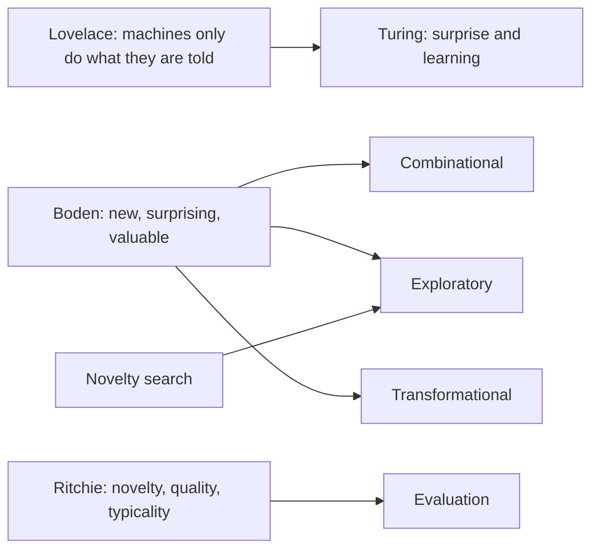
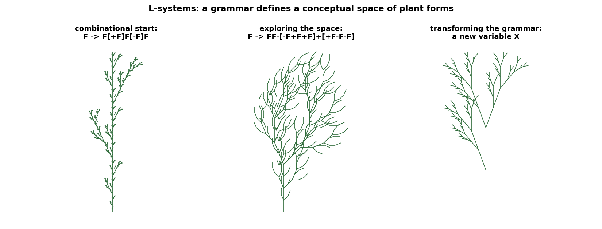
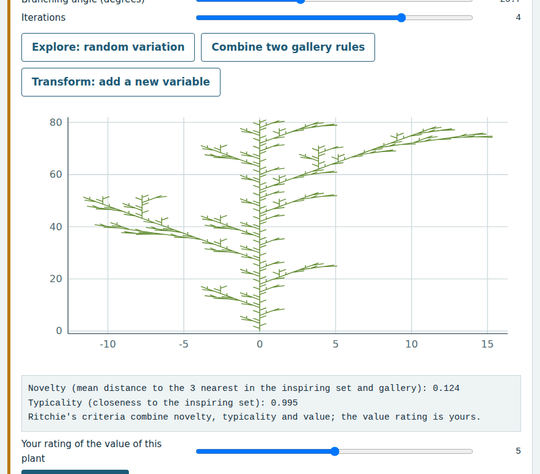
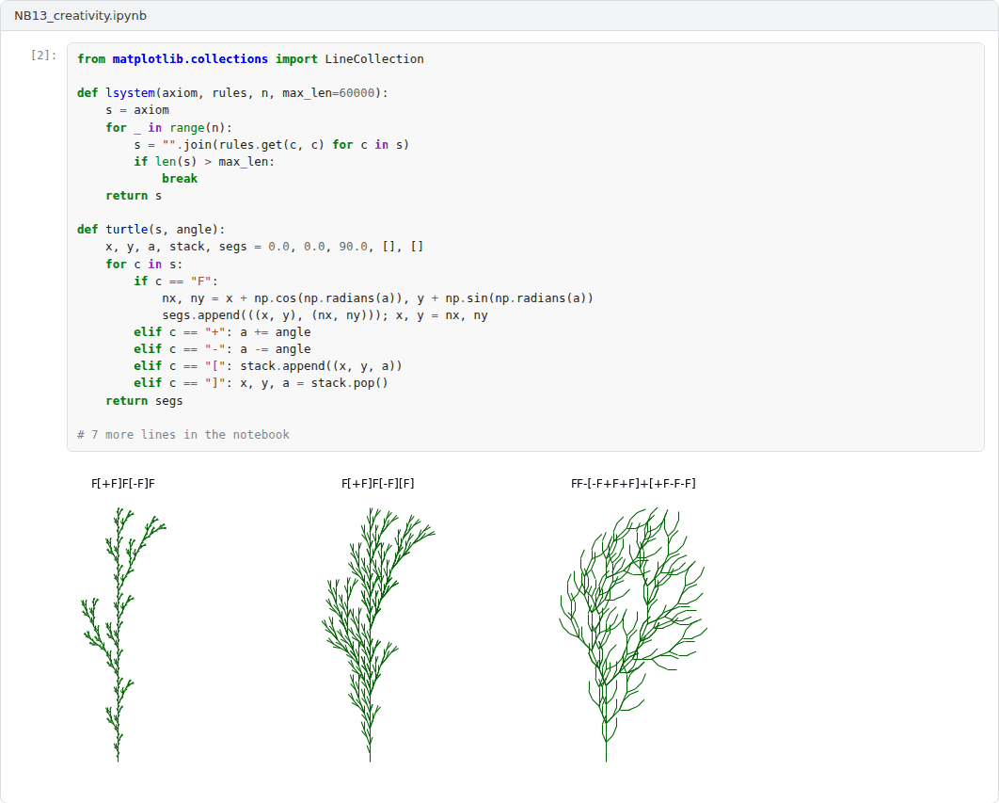

# Week 13: Creativity and Machines

**Philosophy of Artificial Intelligence (11118BLG003)**  
Prof. Dr. Utku Kose, Süleyman Demirel University

   

## Overview

Can a machine originate anything, or can it only do what it is told? This week examines Lovelace's objection and Turing's reply, Boden's analysis of creativity, criteria for attributing creativity to programs and search methods that reward novelty [1, 2, 3].

**Estimated study time:** 6 to 8 hours.

## Learning outcomes

By the end of the week, students are expected to state Lovelace's objection and Turing's reply, to distinguish combinational, exploratory and transformational creativity and P- from H-creativity, to apply the criteria of novelty, quality and typicality, and to explain how novelty search explores a conceptual space.

## Study path

| Step | Activity | Suggested time |
|---|---|---|
| 1 | Read the lecture below or the [PDF version](Week13_Lecture_Notes.pdf) | 90 minutes |
| 2 | Explore the [interactive lab](https://utkukose.github.io/philosophy-of-ai-NB-lecture/weeks/week-13/lab.html) | 45 minutes |
| 3 | Work through the [Colab notebook](https://colab.research.google.com/github/utkukose/philosophy-of-ai-NB-lecture/blob/main/weeks/week-13/NB13_creativity.ipynb) and its exercises | 2 to 3 hours |
| 4 | Take the self-assessment in the lab (tab: Check yourself) | 20 minutes |
| 5 | Write the reflection, export the learning log and complete the weekly task | 60 minutes |

## Week at a glance

## Lecture

### Lovelace's objection

In her notes on Babbage's Analytical Engine, Ada Lovelace wrote that the engine had no pretensions to originate anything and could do only whatever people knew how to order it to perform [1]. Turing called this Lady Lovelace's objection and replied in two ways [4]. Machines often take people by surprise, because the consequences of their programs are not obvious to those who wrote them. More fundamentally, learning machines acquire behaviour that their programmers did not specify. The question for this week is whether surprise and learning amount to creativity.

<b>Check your understanding.</b> What did Lovelace say about the Analytical Engine?

A. It has no pretensions to originate anything  
B. It will write poetry  
C. It is conscious  
D. It can only add  

**Answer: A.** The objection returns whenever generative systems are called creative.

### Three kinds of creativity

Boden analysed creativity as the production of ideas that are new, surprising and valuable, and distinguished three ways in which such ideas arise [2, 5]. Combinational creativity produces unfamiliar combinations of familiar ideas, as in poetic imagery or analogy. Exploratory creativity explores a structured conceptual space, such as a musical style, and finds possibilities that had not been realised. Transformational creativity changes the space itself, by altering one of its defining rules, so that ideas that were previously impossible become possible. Boden also distinguished psychological creativity, an idea new to the person who has it, from historical creativity, an idea new to anyone. She argued that computers can exhibit all three kinds, with transformational creativity the hardest to achieve and to evaluate.

L-systems, grammars introduced by Lindenmayer to model the development of organisms, give a concrete conceptual space [6, 7]. A rule such as replacing every segment with a branching pattern generates plant-like forms, as Figure 13.1 shows. Varying the angle or the number of iterations explores the space, while changing the grammar transforms it.

*Figure 13.1. Plant forms generated by L-systems. Changing parameters explores the space defined by a grammar, while changing the grammar transforms it [2, 6].*

<b>Check your understanding.</b> In Boden&#x27;s account, which kind of creativity changes the rules of a conceptual space?

A. Combinational creativity  
B. Exploratory creativity  
C. Transformational creativity  
D. Imitative creativity  

**Answer: C.** Combinational creativity joins familiar ideas. Exploratory creativity moves within a space.

### Evaluating creative systems

Ritchie proposed empirical criteria for attributing creativity to a program [3]. The central notions are novelty, the extent to which an output differs from existing examples, quality, the extent to which it is valued, and typicality, the extent to which it belongs to the intended genre. The criteria are relative to an inspiring set, the examples that guided the construction of the program. Wiggins formalised Boden's account in a creative systems framework that separates the conceptual space, the strategy for traversing it and the evaluation of results [8]. Colton and Wiggins described computational creativity as a field that studies systems that take on responsibilities in creative tasks, and noted that how a system's process is framed and perceived affects whether audiences regard it as creative [9].

<b>Check your understanding.</b> What do Ritchie&#x27;s criteria evaluate?

A. The internal code of a system  
B. The cost of a system  
C. The speed of generation  
D. Properties of a system's outputs, such as typicality, quality and novelty  

**Answer: D.** Output-based criteria make the evaluation of creative systems more systematic.

### Searching for novelty

Lehman and Stanley showed that search guided only by the novelty of behaviour, with no objective, can outperform objective-driven search in deceptive problems, in which the path to a good solution leads away from it at first [10]. Novelty search keeps an archive of past behaviours and rewards candidates that are far from them, which makes it a mechanism for exploratory creativity. The lab lets students combine, explore and transform L-system plants and computes novelty against a growing gallery. The notebook compares novelty search with a search that maximises one objective and measures how much of the space each covers.

> **Pause and reflect.** In the lab, which of your plants would you call creative, and was the judgement yours or the program's? Where does the creativity lie?

<b>Check your understanding.</b> What does novelty search reward?

A. Progress on the objective  
B. Behavioural novelty instead of progress on the objective  
C. Random actions  
D. Copying earlier solutions  

**Answer: B.** Ignoring the objective can avoid deceptive local optima.

## Interactive lab

Grow plants with an L-system. Explore by changing the angle and the number of iterations or by random variation, combine two gallery rules, or transform the grammar. Novelty is measured against the inspiring set and your gallery, and value is your own rating [2, 3].

[Open the interactive lab](https://utkukose.github.io/philosophy-of-ai-NB-lecture/weeks/week-13/lab.html)

## Colab notebook

The notebook implements L-systems and a turtle interpreter, describes each plant by a few features, and compares novelty search with objective-driven search in the same space of rules [6, 10].

Screenshots of the executed notebook:

## Self-assessment and reflection

The lab contains a 6-question self-assessment with instant feedback and a confidence rating for each answer. A confident but wrong answer marks the first topic to revisit. The reflection prompts below are also available in the lab, where answers are saved in the browser and can be exported as a learning log.

1. Which of your lab plants would you call H-creative, P-creative or not creative at all? Justify your judgements.
2. Does Turing's appeal to surprise answer Lovelace's objection? Consider who is surprised and why.
3. Identify a result in your field that you would call transformational. Could a present AI system have produced it?

## Weekly task and submission

Write about 500 words that assess whether one generative AI system is creative in each of Boden's three senses, using Ritchie's criteria. Support the assessment with an example from the lab or the notebook, and attach the notebook with both exercises completed.

The weekly task supports self-learning and builds a personal portfolio. When the course is followed with the instructor during an active semester, the task can be sent together with the exported learning log to utkukose@sdu.edu.tr or utkukose@gmail.com for evaluation.

## Research and report assignment (optional)

**Creativity of generative systems.** Apply Boden's three kinds of creativity and Ritchie's criteria to one current generative system and argue whether the system, its users or its developers are the creative agents [2, 3, 9].

This research assignment is optional and supports self-learning. When the related weeks are followed within the course during an active semester, the report can be sent to utkukose@sdu.edu.tr or utkukose@gmail.com for evaluation. Unless the assignment states otherwise, a report has 1500 to 2500 words, follows the structure of an academic paper, cites at least six scholarly or official sources in square brackets and ends with a reference list.

## References

[1] Lovelace, A. A. (1843). Notes by the translator, in L. F. Menabrea, Sketch of the Analytical Engine invented by Charles Babbage. *Scientific Memoirs*, 3, 666-731.

[2] Boden, M. A. (2004). *The Creative Mind: Myths and Mechanisms* (2nd ed.). Routledge.

[3] Ritchie, G. (2007). Some empirical criteria for attributing creativity to a computer program. *Minds and Machines*, 17(1), 67-99. <https://doi.org/10.1007/s11023-007-9066-2>

[4] Turing, A. M. (1950). Computing machinery and intelligence. *Mind*, 59(236), 433-460. <https://doi.org/10.1093/mind/LIX.236.433>

[5] Boden, M. A. (1998). Creativity and artificial intelligence. *Artificial Intelligence*, 103(1-2), 347-356. <https://doi.org/10.1016/S0004-3702(98)00055-1>

[6] Lindenmayer, A. (1968). Mathematical models for cellular interactions in development I. Filaments with one-sided inputs. *Journal of Theoretical Biology*, 18(3), 280-299. <https://doi.org/10.1016/0022-5193(68)90079-9>

[7] Prusinkiewicz, P., & Lindenmayer, A. (1990). *The Algorithmic Beauty of Plants*. Springer.

[8] Wiggins, G. A. (2006). A preliminary framework for description, analysis and comparison of creative systems. *Knowledge-Based Systems*, 19(7), 449-458. <https://doi.org/10.1016/j.knosys.2006.04.009>

[9] Colton, S., & Wiggins, G. A. (2012). Computational creativity: The final frontier?. In *Proceedings of the 20th European Conference on Artificial Intelligence (ECAI 2012)* (pp. 21-26). IOS Press.

[10] Lehman, J., & Stanley, K. O. (2011). Abandoning objectives: Evolution through the search for novelty alone. *Evolutionary Computation*, 19(2), 189-223. <https://doi.org/10.1162/EVCO_a_00025>

---

Philosophy of Artificial Intelligence. Prof. Dr. Utku Kose, Süleyman Demirel University. ORCID [0000-0002-9652-6415](https://orcid.org/0000-0002-9652-6415). Content licensed under CC BY 4.0. This course is updated in line with current developments in the field. Last update: September 2026.
