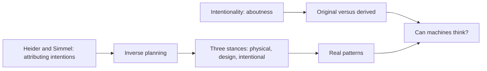
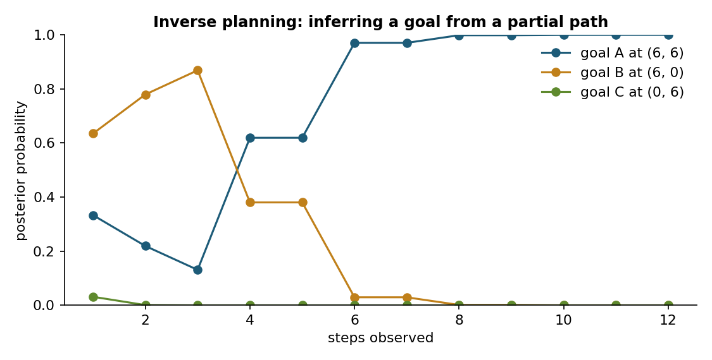
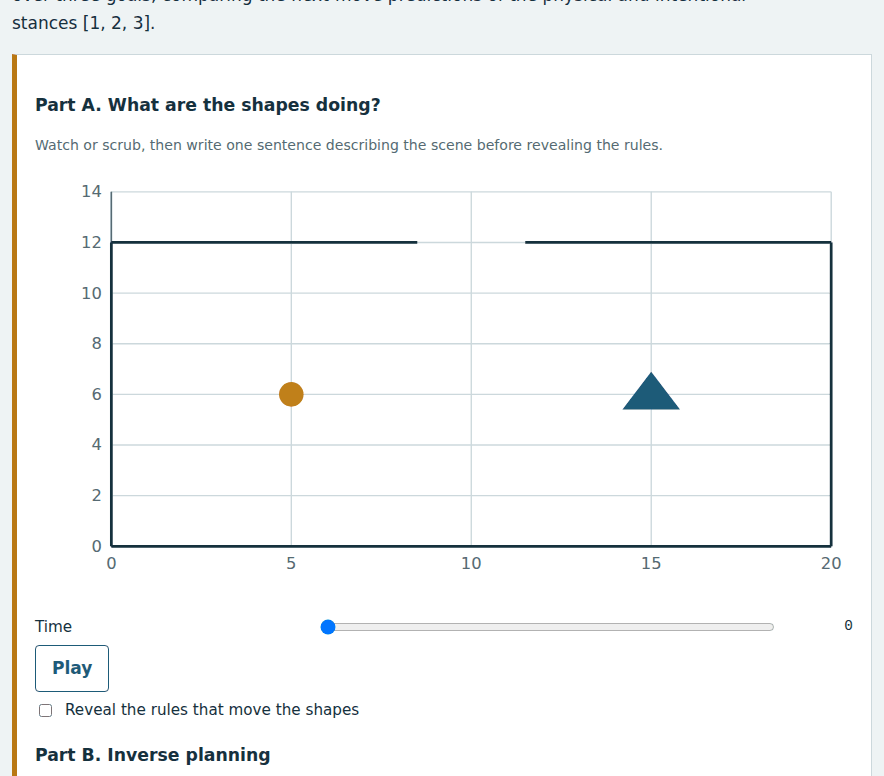
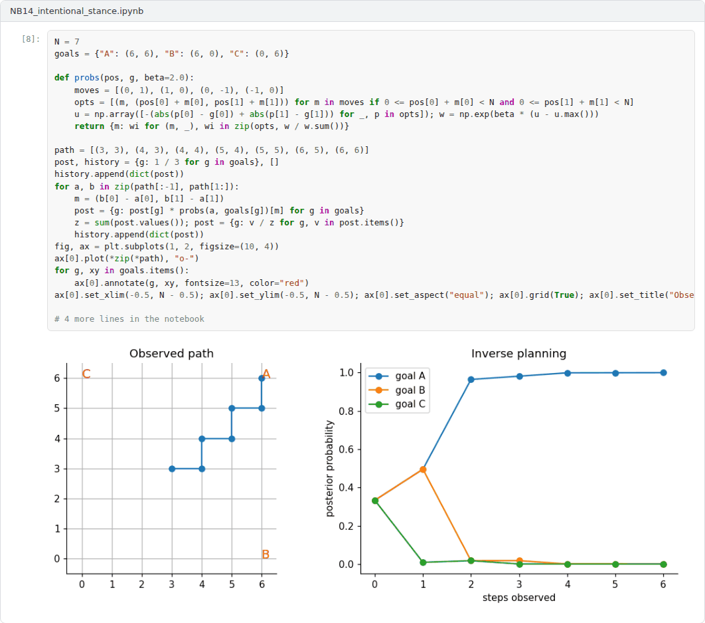

# Week 14: Intentionality, the Intentional Stance and Can Machines Think?

**Philosophy of Artificial Intelligence (11118BLG003)**  
Prof. Dr. Utku Kose, Süleyman Demirel University

   

## Overview

Mental states are about things: beliefs are about the world and desires are for outcomes. This week asks whether machines can have states with this aboutness, examines Dennett's intentional stance and its formalisation as inverse planning, and closes the course by returning to the question of whether machines can think [1, 2, 3].

**Estimated study time:** 6 to 8 hours.

## Learning outcomes

By the end of the week, students are expected to explain intentionality and the distinction between original and derived intentionality, to describe the physical, design and intentional stances, to compute a goal posterior by inverse planning, and to defend a reasoned position on whether machines can think that draws on the whole course.

## Study path

| Step | Activity | Suggested time |
|---|---|---|
| 1 | Read the lecture below or the [PDF version](Week14_Lecture_Notes.pdf) | 90 minutes |
| 2 | Explore the [interactive lab](https://utkukose.github.io/philosophy-of-ai-NB-lecture/weeks/week-14/lab.html) | 45 minutes |
| 3 | Work through the [Colab notebook](https://colab.research.google.com/github/utkukose/philosophy-of-ai-NB-lecture/blob/main/weeks/week-14/NB14_intentional_stance.ipynb) and its exercises | 2 to 3 hours |
| 4 | Take the self-assessment in the lab (tab: Check yourself) | 20 minutes |
| 5 | Write the reflection, export the learning log and complete the weekly task | 60 minutes |

## Week at a glance

## Lecture

### The mark of the mental

Brentano proposed that what distinguishes mental phenomena is their intentionality, their being directed at an object [1]. A belief is about something, a desire is for something and a fear is of something, even when the object does not exist. Searle distinguished original from derived intentionality [4]. The words on a page and the states of a computer have derived intentionality: They are about things only because people interpret them. Minds have original intentionality, which does not depend on interpretation. On Searle's view, the symbols of a program have only derived intentionality, which connects this week with the Chinese Room of Week 4.

<b>Check your understanding.</b> What does Brentano&#x27;s thesis identify as the mark of the mental?

A. Intentionality, being about something  
B. Speed of thought  
C. Language  
D. Emotion  

**Answer: A.** Mental states such as beliefs and desires are directed at objects or states of affairs.

### The intentional stance

Dennett proposed a different approach [2]. There are three stances from which the behaviour of a system can be predicted. The physical stance uses physics and the system's physical constitution. The design stance assumes that the system will behave as it was designed to behave. The intentional stance treats the system as a rational agent with beliefs and desires and predicts that it will act to further its goals in the light of its beliefs. A system is an intentional system if its behaviour is reliably and voluminously predictable from the intentional stance. Dennett argued that beliefs are real in the way that patterns are real: They capture regularities in behaviour that cannot be captured more economically from lower-level stances [5]. The view sits between the realism of Searle and the view that talk of beliefs is merely useful fiction.

<b>Check your understanding.</b> What is Dennett&#x27;s intentional stance?

A. Predicting behaviour from physics alone  
B. Predicting behaviour by treating a system as a rational agent with beliefs and desires  
C. Assuming systems are conscious  
D. Refusing to predict behaviour  

**Answer: B.** The stance is justified when it predicts well, whatever the system is made of.

### Attributing minds

People attribute intentions readily. Heider and Simmel showed participants a short film of geometric shapes moving around a box, and almost all described the film in terms of intentions and emotions, such as a large triangle bullying a small one [6]. Baker, Saxe and Tenenbaum formalised such attributions as inverse planning [3]. An observer assumes that an agent acts approximately rationally towards a goal and uses Bayesian inference to work backwards from observed actions to the most probable goal. The model predicted human judgements of goals closely in their experiments. Figure 14.1 shows how the posterior over three goals sharpens as more of a path is observed. The lab uses this model and compares the predictions of the intentional stance with those of a simple physical stance.

*Figure 14.1. Posterior probabilities of three possible goals as successive steps of a path are observed, computed by Bayesian inverse planning [3].*

<b>Check your understanding.</b> What did Heider and Simmel&#x27;s animation show?

A. People ignore moving shapes  
B. Shapes can learn  
C. Animation requires computers  
D. People spontaneously attribute goals and emotions to moving geometric shapes  

**Answer: D.** The tendency to attribute minds is strong and can mislead.

### Can machines think? The course in review

The intentional stance offers one answer to the question with which the course began. If adopting the stance towards a system yields reliable predictions, the system has beliefs and desires in the only sense that Dennett thinks matters, and many present AI systems qualify for a limited range of behaviour. Searle would reply that predictive usefulness does not create original intentionality, just as the Chinese Room produced appropriate behaviour without understanding. Shanahan's caution applies here too: The intentional stance towards a dialogue system may predict well while misleading about what the underlying model is [7].

The course has presented several ways to sharpen the question. Behavioural tests, such as Turing's, can be passed without settling it. Arguments about computation, grounding, systematicity, embodiment, relevance and limits bear on what thinking requires. Theories of consciousness address whether there is anything it is like to be the system. Studies of understanding, creativity and intentionality show where present systems succeed and where claims outrun evidence. The final essay asks each student to take a position and defend it with these tools.

> **Pause and reflect.** After fourteen weeks, has your answer to the question whether machines can think changed? Which week changed it most?

<b>Check your understanding.</b> Which distinction does Searle draw between kinds of intentionality?

A. Strong and weak intentionality  
B. Original intentionality of minds and derived intentionality conferred by users  
C. Fast and slow intentionality  
D. Human and animal intentionality only  

**Answer: B.** On this view, the meaning of words on a page or of a program's outputs is derived from minds.

## Interactive lab

Part A animates two shapes moved by very simple rules; describe what happens before revealing the rules. Part B lets you move an agent in a grid and computes the posterior over three goals, comparing the next-move predictions of the physical and intentional stances [2, 3, 6].

[Open the interactive lab](https://utkukose.github.io/philosophy-of-ai-NB-lecture/weeks/week-14/lab.html)

## Colab notebook

The notebook implements Bayesian inverse planning in a grid, simulates goal-directed agents and compares how well the physical and intentional stances predict their next moves [2, 3].

Screenshots of the executed notebook:

## Self-assessment and reflection

The lab contains a 6-question self-assessment with instant feedback and a confidence rating for each answer. A confident but wrong answer marks the first topic to revisit. The reflection prompts below are also available in the lab, where answers are saved in the browser and can be exported as a learning log.

1. Describe what you saw in Part A before revealing the rules. What does your description reveal about the intentional stance?
2. Do present AI assistants satisfy Dennett's criterion for intentional systems? For which behaviours, and where does the stance fail?
3. State and defend your final answer to the question whether machines can think, citing at least three weeks of the course.

## Weekly task and submission

Write the final essay of the course, of about 1500 words: Can machines think? Take a clear position, defend it with arguments from at least five weeks, address the strongest objection to your position and use at least one lab or notebook result as evidence. Cite all sources in square brackets and attach the notebook of this week with both exercises completed.

The weekly task supports self-learning and builds a personal portfolio. When the course is followed with the instructor during an active semester, the task can be sent together with the exported learning log to utkukose@sdu.edu.tr or utkukose@gmail.com for evaluation.

## Research and report assignment (optional)

**Do language model agents have beliefs?.** Evaluate whether it is correct, useful or misleading to attribute beliefs and desires to language model agents, drawing on Dennett, Searle and Shanahan [2, 4, 7].

This research assignment is optional and supports self-learning. When the related weeks are followed within the course during an active semester, the report can be sent to utkukose@sdu.edu.tr or utkukose@gmail.com for evaluation. Unless the assignment states otherwise, a report has 1500 to 2500 words, follows the structure of an academic paper, cites at least six scholarly or official sources in square brackets and ends with a reference list.

## Final capstone

This week closes the course with the [Final Capstone: Minds, Morals and Machines](../../exams/final/README.md).

This capstone also supports self-learning and can be completed at any pace. When the course is taught actively in a semester, the final capstone is sent by e-mail to utkukose@sdu.edu.tr or utkukose@gmail.com no later than 23:53 (Türkiye time) on the last Sunday of Week 14, with the report and all code files attached or linked.

## References

[1] Brentano, F. (1874). *Psychologie vom empirischen Standpunkte [Psychology from an Empirical Standpoint]*. Duncker & Humblot.

[2] Dennett, D. C. (1987). *The Intentional Stance*. MIT Press.

[3] Baker, C. L., Saxe, R., & Tenenbaum, J. B. (2009). Action understanding as inverse planning. *Cognition*, 113(3), 329-349. <https://doi.org/10.1016/j.cognition.2009.07.005>

[4] Searle, J. R. (1983). *Intentionality: An Essay in the Philosophy of Mind*. Cambridge University Press.

[5] Dennett, D. C. (1991). Real patterns. *The Journal of Philosophy*, 88(1), 27-51. <https://doi.org/10.2307/2027085>

[6] Heider, F., & Simmel, M. (1944). An experimental study of apparent behavior. *The American Journal of Psychology*, 57(2), 243-259. <https://doi.org/10.2307/1416950>

[7] Shanahan, M. (2024). Talking about large language models. *Communications of the ACM*, 67(2), 68-79. <https://doi.org/10.1145/3624724>

---

Philosophy of Artificial Intelligence. Prof. Dr. Utku Kose, Süleyman Demirel University. ORCID [0000-0002-9652-6415](https://orcid.org/0000-0002-9652-6415). Content licensed under CC BY 4.0. This course is updated in line with current developments in the field. Last update: September 2026.
